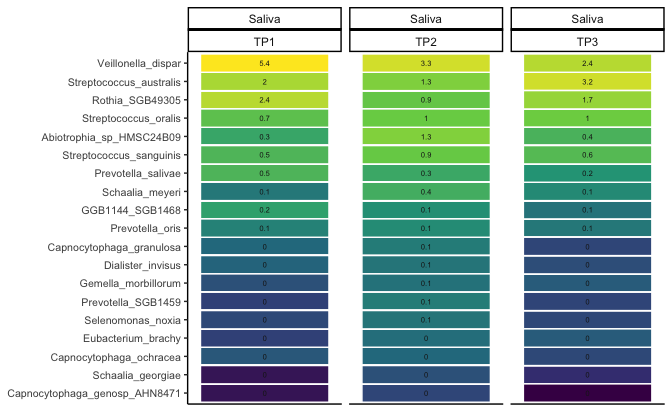

``` r
load(here::here("../../data/processed_data/metaphlan/01_data.Rdata"))
```


``` r
pd <- position_dodge(0.3)
```

# Explore proportion of the dominant taxa:


Source the function `phyloseq_top_heatmap_barplot`:


``` r
source("https://raw.githubusercontent.com/fconstancias/KU_Caroline/refs/heads/main/code/functions/phyloseq_functions.R")
```

below the Arguments of the function phyloseq_top_heatmap_barplot() + default values:


``` r
# parameters:

#' @param ps_up A phyloseq object containing microbiome data.
#' @param group_var Character string for the grouping variable (default: "Sample_Time").
#' @param tax_levels Character vector of taxonomic levels to include in plots (default: c("Phylum", "Family", "Genus", "Species")).
#' @param ntax Integer specifying the number of taxa to display at each level (default: 5).
#' @param ntax_species Integer specifying the number of species-level taxa to display (default: 14).
#' @param plot_heights Numeric vector for the heights of the plot panels (default: c(1.4, 1.5, 4)).
#' @param plot_x Character string for the x-axis label in bar plots (default: "Subject").
#' @param facet_by Character vector specifying variables to use for faceting in heatmaps (default: c("Sample_Type", "Time")).
#' @param group_by Character vector for grouping in heatmaps (default: c("Sample_Type", "Time")).
#' @param facet_heat Formula for faceting heatmap plots (default: "~ Sample_Type + Time").
#' @param facet_formula Formula for faceting bar plots (default: "Sample_Type ~ Time").
#' @param rm_unclassified Logical indicating if unclassified taxa should be removed (default: TRUE).
#' @param barplot_level Character string for taxonomic level in bar plots (default: "Species").
#' @param boxplot_main_group Character string for the main grouping variable in box plots (default: "Class").
```

Run the function:


``` r
ps_up %>% 
  phyloseq_top_heatmap_barplot(facet_formula = "Sample_Type ~ Time" , 
                               ntax = 5, ntax_species = 10, plot_heights = c(1.4, 1.4, 4),
                               boxplot_main_group = "Family") -> out
```

Output is a list which containts different objects:


``` r
ls(out)
```

```
## [1] "bar_plot"      "heat"          "heat_all"      "heat_legend"  
## [5] "most_ab_treat" "nested_legend" "p"             "ps_sub"
```


``` r
out$heat_all
```


``` r
out$bar_plot + 
  ggpubr::rotate_x_text(60)
```


``` r
out$p
```


``` r
out$nested_legend
```


``` r
out$ps_sub
```


``` r
out$ps_sub + facet_null() +
  facet_grid(rows = vars(Sample_Type), 
             cols = vars(cluster_Dtp2, Subject )) + theme(legend.position = "none") 
```


# Statistical test to find differential abundant (i.e., proporition) taxa:


Function `phyloseq_diff_abundance()` allows to run different methods, here are the arguments:


``` r
#' @title Differiential feature analyses wrapper for Microbiome analyses
#' @author Florentin Constancias
#' @description 
#' This script performs a comparative analysis of various approaches for microbiome studies, 
#' including metagenomics, metabarcoding, metabolomics, and transcriptomics. The script 
#' calculates the number of publications, environments analyzed, and the methods applied.
#' 
#' @param ps_tmp A phyloseq object. Defaults to saliva samples (`ps_up %>% subset_samples(Sample == "Saliva")`).
#' @param approach Character vector specifying the analysis approach. Options include:
#'   - "run_lefse": Linear discriminant analysis (LEfSe)
#'   - "run_ancom": Analysis of composition of microbiomes (ANCOM)
#'   - "ancombc2": ANCOMBC2 method for differential abundance
#'   - "maaslin3": Multivariate analysis using Maaslin3
#'   - "trans_diff_rf": Transformation-based Random Forest
#'   - "classifier_rf": Random Forest classifier
#' @param glom Taxonomic rank for agglomeration (e.g., "Species"). Set to `NULL` to skip agglomeration.
#' @param unclassified_name Name for unclassified taxa (default: "UNCLASSIFIED").
#' @param taxa_rank Taxonomic rank for differential abundance (default: "all").
#' @param density Density metric to normalize counts. Default is "Quant".
#' @param comp_group Grouping variable for comparison (e.g., "Time").
#' @param palette Color palette for plots.
#' @param pvalue_cutoff p-value cutoff for significance.
#' @param p_adjust Method for p-value adjustment (e.g., "BH" for Benjamini-Hochberg).
#' @param lefse_* Parameters specific to the LEfSe method.
#' @param maaslin3_* Parameters specific to Maaslin3 analysis.
#' @param ancombc2_* Parameters specific to ANCOMBC2 analysis.
#' @param linda_* Parameters specific to LINDA (if used in the future).
#' @param rf_* Parameters specific to Random Forest methods.
#' @param trans_diff_rf_MeanDecreaseGini_cutoff Gini index cutoff for feature importance in Random Forest.
```


# Statistical test to find differential abundant (i.e., proporition) taxa:


Function `phyloseq_diff_abundance()` allows to run different methods, here are the arguments:


``` r
#' @title Differiential feature analyses wrapper for Microbiome analyses
#' @author Florentin Constancias
#' @description 
#' This script performs a comparative analysis of various approaches for microbiome studies, 
#' including metagenomics, metabarcoding, metabolomics, and transcriptomics. The script 
#' calculates the number of publications, environments analyzed, and the methods applied.
#' 
#' @param ps_tmp A phyloseq object. Defaults to saliva samples (`ps_up %>% subset_samples(Sample == "Saliva")`).
#' @param approach Character vector specifying the analysis approach. Options include:
#'   - "run_lefse": Linear discriminant analysis (LEfSe)
#'   - "run_ancom": Analysis of composition of microbiomes (ANCOM)
#'   - "ancombc2": ANCOMBC2 method for differential abundance
#'   - "maaslin3": Multivariate analysis using Maaslin3
#'   - "trans_diff_rf": Transformation-based Random Forest
#'   - "classifier_rf": Random Forest classifier
#' @param glom Taxonomic rank for agglomeration (e.g., "Species"). Set to `NULL` to skip agglomeration.
#' @param unclassified_name Name for unclassified taxa (default: "UNCLASSIFIED").
#' @param taxa_rank Taxonomic rank for differential abundance (default: "all").
#' @param density Density metric to normalize counts. Default is "Quant".
#' @param comp_group Grouping variable for comparison (e.g., "Time").
#' @param palette Color palette for plots.
#' @param pvalue_cutoff p-value cutoff for significance.
#' @param p_adjust Method for p-value adjustment (e.g., "BH" for Benjamini-Hochberg).
#' @param lefse_* Parameters specific to the LEfSe method.
#' @param maaslin3_* Parameters specific to Maaslin3 analysis.
#' @param ancombc2_* Parameters specific to ANCOMBC2 analysis.
#' @param linda_* Parameters specific to LINDA (if used in the future).
#' @param rf_* Parameters specific to Random Forest methods.
#' @param trans_diff_rf_MeanDecreaseGini_cutoff Gini index cutoff for feature importance in Random Forest.
```

To test: https://github.com/yiluheihei/microbiomeMarker/issues/62 `compareDA`

## Test differences at Baseline between Saliva and Plaque microbiome:


``` r
ps_up %>% 
  subset_samples(Time == "TP1") %>% 
  phyloseq_diff_abundance(ps_tmp = .,
                          approach = c("run_lefse"),
                          glom = "Species",
                          taxa_rank = "all", 
                          comp_group = "Sample",
                          palette = sample_pal) -> lefse_TP1
```

```
## Loading required package: microbiomeMarker
```

```
## Registered S3 methods overwritten by 'proxy':
##   method               from    
##   print.registry_field registry
##   print.registry_entry registry
```

```
## Registered S3 method overwritten by 'gplots':
##   method         from     
##   reorder.factor DescTools
```

```
## 
## Attaching package: 'microbiomeMarker'
```

```
## The following object is masked from 'package:speedyseq':
## 
##     plot_heatmap
```

```
## The following object is masked from 'package:phyloseq':
## 
##     plot_heatmap
```

```
## Loading required package: magrittr
```

```
## 
## Attaching package: 'magrittr'
```

```
## The following object is masked from 'package:purrr':
## 
##     set_names
```

```
## The following object is masked from 'package:tidyr':
## 
##     extract
```

```
## Loading required package: ANCOMBC
```

```
## Loading required package: microeco
```

The output is a list, which contains different objects:


``` r
ls(lefse_TP1)
```

```
## [1] "mmlefse"     "mmlefse_abp" "mmlefse_df"  "mmlefse_p"
```

Dataframe with differentially abundant taxa:


``` r
lefse_TP1$mmlefse_df %>% 
  DT::datatable()
```

```{=html}
<div class="datatables html-widget html-fill-item" id="htmlwidget-4703998b0999a7246040" style="width:100%;height:auto;"></div>
<script type="application/json" data-for="htmlwidget-4703998b0999a7246040">{"x":{"filter":"none","vertical":false,"data":[["marker1","marker2","marker3","marker4","marker5","marker6","marker7","marker8","marker9","marker10","marker11","marker12","marker13","marker14","marker15","marker16","marker17","marker18","marker19","marker20","marker21","marker22","marker23","marker24","marker25","marker26","marker27","marker28","marker29","marker30","marker31","marker32","marker33","marker34","marker35","marker36","marker37","marker38","marker39","marker40","marker41","marker42","marker43","marker44","marker45","marker46","marker47","marker48","marker49","marker50","marker51","marker52","marker53","marker54","marker55","marker56","marker57","marker58","marker59","marker60","marker61","marker62","marker63","marker64","marker65","marker66","marker67","marker68","marker69","marker70","marker71","marker72","marker73","marker74","marker75","marker76","marker77","marker78","marker79","marker80","marker81","marker82","marker83","marker84","marker85","marker86","marker87","marker88","marker89","marker90","marker91","marker92","marker93","marker94","marker95","marker96","marker97","marker98","marker99","marker100","marker101","marker102","marker103","marker104","marker105","marker106","marker107","marker108","marker109","marker110","marker111","marker112","marker113","marker114","marker115","marker116","marker117","marker118","marker119","marker120","marker121","marker122","marker123","marker124","marker125","marker126","marker127","marker128","marker129","marker130","marker131","marker132","marker133","marker134","marker135","marker136","marker137","marker138","marker139","marker140","marker141","marker142","marker143","marker144","marker145","marker146","marker147","marker148","marker149","marker150","marker151","marker152","marker153","marker154","marker155","marker156","marker157","marker158","marker159","marker160","marker161","marker162","marker163","marker164","marker165","marker166","marker167","marker168","marker169","marker170","marker171","marker172","marker173","marker174","marker175","marker176","marker177","marker178","marker179","marker180","marker181","marker182","marker183","marker184","marker185","marker186","marker187","marker188","marker189","marker190","marker191","marker192","marker193","marker194","marker195","marker196","marker197","marker198","marker199","marker200","marker201","marker202","marker203","marker204","marker205","marker206","marker207","marker208","marker209","marker210","marker211","marker212","marker213","marker214","marker215","marker216","marker217","marker218","marker219","marker220","marker221","marker222","marker223","marker224","marker225","marker226","marker227","marker228","marker229","marker230","marker231","marker232","marker233","marker234","marker235","marker236","marker237","marker238","marker239","marker240","marker241","marker242","marker243","marker244","marker245","marker246","marker247","marker248","marker249","marker250","marker251","marker252","marker253","marker254","marker255","marker256","marker257","marker258","marker259","marker260","marker261","marker262","marker263","marker264","marker265","marker266","marker267","marker268","marker269","marker270","marker271","marker272","marker273","marker274","marker275","marker276","marker277","marker278","marker279","marker280","marker281","marker282","marker283","marker284","marker285","marker286","marker287","marker288","marker289","marker290","marker291","marker292","marker293","marker294","marker295","marker296","marker297","marker298","marker299","marker300","marker301","marker302","marker303","marker304","marker305","marker306","marker307","marker308","marker309","marker310","marker311","marker312","marker313","marker314","marker315","marker316"],["k__Bacteria|p__Firmicutes","k__Bacteria|p__Firmicutes|c__Bacilli","k__Bacteria|p__Firmicutes|c__Bacilli|o__Lactobacillales","k__Bacteria|p__Actinobacteria|c__Actinomycetia|o__Micrococcales|f__Micrococcaceae|g__Rothia|s__Rothia_mucilaginosa","k__Bacteria|p__Firmicutes|c__Bacilli|o__Lactobacillales|f__Streptococcaceae","k__Bacteria|p__Firmicutes|c__Bacilli|o__Lactobacillales|f__Streptococcaceae|g__Streptococcus","k__Bacteria|p__Bacteroidota|c__Bacteroidia|o__Bacteroidales|f__Prevotellaceae","k__Bacteria|p__Bacteroidota|c__Bacteroidia","k__Bacteria|p__Bacteroidota|c__Bacteroidia|o__Bacteroidales","k__Bacteria|p__Bacteroidota|c__Bacteroidia|o__Bacteroidales|f__Prevotellaceae|g__Prevotella","k__Bacteria|p__Actinobacteria|c__Actinomycetia|o__Micrococcales","k__Bacteria|p__Actinobacteria|c__Actinomycetia|o__Micrococcales|f__Micrococcaceae","k__Bacteria|p__Actinobacteria|c__Actinomycetia|o__Micrococcales|f__Micrococcaceae|g__Rothia","k__Bacteria|p__Firmicutes|c__Negativicutes|o__Veillonellales","k__Bacteria|p__Firmicutes|c__Negativicutes|o__Veillonellales|f__Veillonellaceae","k__Bacteria|p__Proteobacteria|c__Betaproteobacteria|o__Neisseriales|f__Neisseriaceae|g__Neisseria|s__Neisseria_subflava","k__Bacteria|p__Firmicutes|c__Negativicutes|o__Veillonellales|f__Veillonellaceae|g__Veillonella","k__Bacteria|p__Actinobacteria|c__Actinomycetia|o__Actinomycetales|f__Actinomycetaceae|g__Schaalia","k__Bacteria|p__Bacteroidota","k__Bacteria|p__Firmicutes|c__Negativicutes","k__Bacteria|p__Firmicutes|c__Negativicutes|o__Veillonellales|f__Veillonellaceae|g__Veillonella|s__Veillonella_dispar","k__Bacteria|p__Firmicutes|c__Bacilli|o__Lactobacillales|f__Streptococcaceae|g__Streptococcus|s__Streptococcus_salivarius","k__Bacteria|p__Bacteroidota|c__Bacteroidia|o__Bacteroidales|f__Prevotellaceae|g__Prevotella|s__Prevotella_melaninogenica","k__Bacteria|p__Firmicutes|c__Negativicutes|o__Veillonellales|f__Veillonellaceae|g__Veillonella|s__Veillonella_rogosae","k__Bacteria|p__Actinobacteria|c__Actinomycetia|o__Actinomycetales|f__Actinomycetaceae|g__Actinomyces|s__Actinomyces_sp_ICM47","k__Bacteria|p__Firmicutes|c__Bacilli|o__Lactobacillales|f__Streptococcaceae|g__Streptococcus|s__Streptococcus_parasanguinis","k__Bacteria|p__Actinobacteria|c__Actinomycetia|o__Actinomycetales|f__Actinomycetaceae|g__Actinomyces|s__Actinomyces_graevenitzii","k__Bacteria|p__Proteobacteria|c__Betaproteobacteria|o__Neisseriales|f__Neisseriaceae|g__Neisseria","k__Bacteria|p__Firmicutes|c__Negativicutes|o__Veillonellales|f__Veillonellaceae|g__Veillonella|s__Veillonella_atypica","k__Bacteria|p__Bacteroidota|c__Bacteroidia|o__Bacteroidales|f__Prevotellaceae|g__Prevotella|s__Prevotella_histicola","k__Bacteria|p__Firmicutes|c__Clostridia","k__Bacteria|p__Firmicutes|c__Clostridia|o__Eubacteriales","k__Bacteria|p__Actinobacteria|c__Actinomycetia|o__Actinomycetales|f__Actinomycetaceae|g__Schaalia|s__Schaalia_SGB17157","k__Bacteria|p__Firmicutes|c__Bacilli|o__Lactobacillales|f__Streptococcaceae|g__Streptococcus|s__Streptococcus_australis","k__Bacteria|p__Firmicutes|c__Bacilli|o__Lactobacillales|f__Streptococcaceae|g__Streptococcus|s__Streptococcus_mitis","k__Bacteria|p__Actinobacteria|c__Actinomycetia|o__Actinomycetales|f__Actinomycetaceae|g__Schaalia|s__Schaalia_odontolytica","k__Bacteria|p__Firmicutes|c__Bacilli|o__Lactobacillales|f__Carnobacteriaceae|g__Granulicatella|s__Granulicatella_SGB8255","k__Bacteria|p__Bacteroidota|c__Bacteroidia|o__Bacteroidales|f__Porphyromonadaceae|g__Porphyromonas|s__Porphyromonas_bobii","k__Bacteria|p__Firmicutes|c__Bacilli|o__Lactobacillales|f__Carnobacteriaceae","k__Bacteria|p__Firmicutes|c__Bacilli|o__Lactobacillales|f__Carnobacteriaceae|g__Granulicatella","k__Bacteria|p__Actinobacteria|c__Actinomycetia|o__Actinomycetales|f__Actinomycetaceae|g__Schaalia|s__Schaalia_SGB17168","k__Bacteria|p__Candidatus_Saccharibacteria|c__Candidatus_Saccharibacteria_unclassified|o__Candidatus_Saccharibacteria_unclassified|f__Candidatus_Saccharibacteria_unclassified|g__Candidatus_Saccharibacteria_unclassified|s__TM7_phylum_sp_oral_taxon_352","k__Bacteria|p__Firmicutes|c__Clostridia|o__Eubacteriales|f__Eubacteriales_Family_XIII_Incertae_Sedis","k__Bacteria|p__Bacteroidota|c__Bacteroidia|o__Bacteroidales|f__Prevotellaceae|g__Prevotella|s__Prevotella_nanceiensis","k__Bacteria|p__Bacteroidota|c__Bacteroidia|o__Bacteroidales|f__Prevotellaceae|g__Prevotella|s__Prevotella_pallens","k__Bacteria|p__Firmicutes|c__Clostridia|o__Eubacteriales|f__Eubacteriales_Family_XIII_Incertae_Sedis|g__Eubacteriales_Family_XIII_Incertae_Sedis_unclassified|s__Eubacterium_sulci","k__Bacteria|p__Firmicutes|c__Clostridia|o__Eubacteriales|f__Eubacteriales_Family_XIII_Incertae_Sedis|g__Eubacteriales_Family_XIII_Incertae_Sedis_unclassified","k__Bacteria|p__Actinobacteria|c__Actinomycetia|o__Actinomycetales|f__Actinomycetaceae|g__Schaalia|s__Schaalia_SGB17158","k__Bacteria|p__Firmicutes|c__Clostridia|o__Eubacteriales|f__Lachnospiraceae","k__Bacteria|p__Actinobacteria|c__Coriobacteriia|o__Coriobacteriales|f__Atopobiaceae|g__Lancefieldella|s__Lancefieldella_parvula","k__Bacteria|p__Actinobacteria|c__Coriobacteriia|o__Coriobacteriales|f__Atopobiaceae|g__Lancefieldella","k__Bacteria|p__Bacteroidota|c__Bacteroidia|o__Bacteroidales|f__Prevotellaceae|g__Prevotella|s__Prevotella_jejuni","k__Bacteria|p__Candidatus_Saccharibacteria|c__Candidatus_Saccharibacteria_unclassified|o__Candidatus_Saccharibacteria_unclassified|f__Candidatus_Saccharibacteria_unclassified|g__Candidatus_Saccharibacteria_unclassified","k__Bacteria|p__Actinobacteria|c__Actinomycetia|o__Actinomycetales|f__Actinomycetaceae|g__Schaalia|s__Schaalia_SGB17153","k__Bacteria|p__Actinobacteria|c__Coriobacteriia","k__Bacteria|p__Actinobacteria|c__Coriobacteriia|o__Coriobacteriales","k__Bacteria|p__Actinobacteria|c__Coriobacteriia|o__Coriobacteriales|f__Atopobiaceae","k__Bacteria|p__Candidatus_Saccharibacteria|c__Candidatus_Saccharibacteria_unclassified","k__Bacteria|p__Candidatus_Saccharibacteria|c__Candidatus_Saccharibacteria_unclassified|o__Candidatus_Saccharibacteria_unclassified","k__Bacteria|p__Candidatus_Saccharibacteria|c__Candidatus_Saccharibacteria_unclassified|o__Candidatus_Saccharibacteria_unclassified|f__Candidatus_Saccharibacteria_unclassified","k__Bacteria|p__Actinobacteria|c__Actinomycetia|o__Actinomycetales|f__Actinomycetaceae|g__Schaalia|s__Schaalia_SGB17154","k__Bacteria|p__Proteobacteria|c__Gammaproteobacteria|o__Pasteurellales|f__Pasteurellaceae|g__Haemophilus","k__Bacteria|p__Firmicutes|c__Negativicutes|o__Veillonellales|f__Veillonellaceae|g__Megasphaera","k__Bacteria|p__Firmicutes|c__Negativicutes|o__Veillonellales|f__Veillonellaceae|g__Megasphaera|s__Megasphaera_micronuciformis","k__Bacteria|p__Firmicutes|c__Clostridia|o__Eubacteriales|f__Lachnospiraceae|g__GGB3883","k__Bacteria|p__Firmicutes|c__Clostridia|o__Eubacteriales|f__Lachnospiraceae|g__GGB3883|s__GGB3883_SGB5266","k__Bacteria|p__Firmicutes|c__Clostridia|o__Eubacteriales|f__Lachnospiraceae|g__Oribacterium","k__Bacteria|p__Bacteroidota|c__Bacteroidia|o__Bacteroidales|f__Prevotellaceae|g__GGB1144","k__Bacteria|p__Bacteroidota|c__Bacteroidia|o__Bacteroidales|f__Prevotellaceae|g__Prevotella|s__Prevotella_salivae","k__Bacteria|p__Proteobacteria|c__Gammaproteobacteria|o__Pasteurellales|f__Pasteurellaceae|g__Haemophilus|s__Haemophilus_sputorum","k__Bacteria|p__Proteobacteria|c__Gammaproteobacteria|o__Pasteurellales|f__Pasteurellaceae|g__Haemophilus|s__Haemophilus_haemolyticus","k__Bacteria|p__Firmicutes|c__Bacilli|o__Lactobacillales|f__Streptococcaceae|g__Streptococcus|s__Streptococcus_infantis","k__Bacteria|p__Firmicutes|c__Clostridia|o__Eubacteriales|f__Lachnospiraceae|g__Oribacterium|s__Oribacterium_sinus","k__Bacteria|p__Actinobacteria|c__Actinomycetia|o__Actinomycetales|f__Actinomycetaceae|g__Actinomyces|s__Actinomyces_bouchesdurhonensis","k__Bacteria|p__Firmicutes|c__Clostridia|o__Eubacteriales|f__Eubacteriales_Family_XIII_Incertae_Sedis|g__Mogibacterium|s__Mogibacterium_diversum","k__Bacteria|p__Firmicutes|c__Bacilli|o__Lactobacillales|f__Streptococcaceae|g__Streptococcus|s__Streptococcus_sp_F0442","k__Bacteria|p__Bacteroidota|c__Bacteroidia|o__Bacteroidales|f__Prevotellaceae|g__Prevotella|s__Prevotella_vespertina","k__Bacteria|p__Firmicutes|c__Clostridia|o__Eubacteriales|f__Eubacteriales_Family_XIII_Incertae_Sedis|g__Mogibacterium","k__Bacteria|p__Actinobacteria|c__Actinomycetia|o__Actinomycetales|f__Actinomycetaceae|g__Actinomyces|s__Actinomyces_sp_ph3","k__Bacteria|p__Proteobacteria|c__Epsilonproteobacteria|o__Campylobacterales|f__Campylobacteraceae|g__Campylobacter|s__Campylobacter_concisus","k__Bacteria|p__Bacteroidota|c__Bacteroidia|o__Bacteroidales|f__Prevotellaceae|g__GGB1144|s__GGB1144_SGB1468","k__Bacteria|p__Bacteroidota|c__Bacteroidia|o__Bacteroidales|f__Prevotellaceae|g__Prevotella|s__Prevotella_shahii","k__Bacteria|p__Bacteroidota|c__Bacteroidia|o__Bacteroidales|f__Prevotellaceae|g__Alloprevotella","k__Bacteria|p__Candidatus_Saccharibacteria|c__Candidatus_Saccharimonadia|o__Candidatus_Nanosynbacterales|f__Candidatus_Nanosynbacteraceae|g__Candidatus_Nanosynbacter|s__Candidatus_Nanosynbacter_sp_HMT_352","k__Bacteria|p__Firmicutes|c__Negativicutes|o__Selenomonadales|f__Selenomonadaceae|g__Selenomonas|s__Selenomonas_SGB5880","k__Bacteria|p__Actinobacteria|c__Actinomycetia|o__Actinomycetales|f__Actinomycetaceae|g__Actinomyces|s__Actinomyces_SGB17132","k__Bacteria|p__Firmicutes|c__Bacilli|o__Bacillales|f__Bacillales_unclassified|g__Gemella|s__Gemella_sanguinis","k__Bacteria|p__Firmicutes|c__Negativicutes|o__Veillonellales|f__Veillonellaceae|g__Veillonella|s__Veillonella_tobetsuensis","k__Bacteria|p__Candidatus_Absconditabacteria|c__Candidatus_Absconditabacteria_unclassified|o__Candidatus_Absconditabacteria_unclassified|f__Candidatus_Absconditabacteria_unclassified|g__GGB4936|s__GGB4936_SGB6889","k__Bacteria|p__Candidatus_Absconditabacteria|c__Candidatus_Absconditabacteria_unclassified|o__Candidatus_Absconditabacteria_unclassified|f__Candidatus_Absconditabacteria_unclassified|g__GGB4936","k__Bacteria|p__Fusobacteria|c__Fusobacteriia|o__Fusobacteriales|f__Fusobacteriaceae|g__Fusobacterium|s__Fusobacterium_periodonticum","k__Bacteria|p__Bacteroidota|c__Bacteroidia|o__Bacteroidales|f__Prevotellaceae|g__GGB1144|s__GGB1144_SGB1469","k__Bacteria|p__Firmicutes|c__Bacilli|o__Lactobacillales|f__Aerococcaceae|g__Abiotrophia|s__Abiotrophia_sp_HMSC24B09","k__Bacteria|p__Firmicutes|c__Clostridia|o__Eubacteriales|f__Peptostreptococcaceae|g__Peptostreptococcus|s__Peptostreptococcus_SGB749","k__Bacteria|p__Candidatus_Saccharibacteria|c__Candidatus_Saccharimonadia|o__Candidatus_Nanosynbacterales","k__Bacteria|p__Candidatus_Saccharibacteria|c__Candidatus_Saccharimonadia|o__Candidatus_Nanosynbacterales|f__Candidatus_Nanosynbacteraceae","k__Bacteria|p__Candidatus_Saccharibacteria|c__Candidatus_Saccharimonadia|o__Candidatus_Nanosynbacterales|f__Candidatus_Nanosynbacteraceae|g__Candidatus_Nanosynbacter","k__Bacteria|p__Firmicutes|c__Clostridia|o__Eubacteriales|f__Peptostreptococcaceae|g__Peptostreptococcus","k__Bacteria|p__Firmicutes|c__Clostridia|o__Eubacteriales|f__Peptostreptococcaceae","k__Bacteria|p__Firmicutes|c__Erysipelotrichia|o__Erysipelotrichales|f__Erysipelotrichaceae|g__Solobacterium|s__Solobacterium_SGB6829","k__Bacteria|p__Firmicutes|c__Bacilli|o__Lactobacillales|f__Streptococcaceae|g__Streptococcus|s__Streptococcus_vestibularis","k__Bacteria|p__Firmicutes|c__Erysipelotrichia","k__Bacteria|p__Firmicutes|c__Erysipelotrichia|o__Erysipelotrichales","k__Bacteria|p__Firmicutes|c__Erysipelotrichia|o__Erysipelotrichales|f__Erysipelotrichaceae","k__Bacteria|p__Firmicutes|c__Erysipelotrichia|o__Erysipelotrichales|f__Erysipelotrichaceae|g__Solobacterium","k__Bacteria|p__Proteobacteria|c__Gammaproteobacteria|o__Pasteurellales|f__Pasteurellaceae|g__Haemophilus|s__Haemophilus_parahaemolyticus","k__Bacteria|p__Fusobacteria|c__Fusobacteriia|o__Fusobacteriales|f__Fusobacteriaceae","k__Bacteria|p__Fusobacteria|c__Fusobacteriia|o__Fusobacteriales|f__Fusobacteriaceae|g__Fusobacterium","k__Bacteria|p__Proteobacteria|c__Epsilonproteobacteria","k__Bacteria|p__Proteobacteria|c__Epsilonproteobacteria|o__Campylobacterales","k__Bacteria|p__Proteobacteria|c__Epsilonproteobacteria|o__Campylobacterales|f__Campylobacteraceae","k__Bacteria|p__Proteobacteria|c__Epsilonproteobacteria|o__Campylobacterales|f__Campylobacteraceae|g__Campylobacter","k__Bacteria|p__Proteobacteria|c__Gammaproteobacteria|o__Pasteurellales|f__Pasteurellaceae|g__Haemophilus|s__Haemophilus_paraphrohaemolyticus","k__Bacteria|p__Firmicutes|c__Bacilli|o__Bacillales","k__Bacteria|p__Firmicutes|c__Bacilli|o__Bacillales|f__Bacillales_unclassified","k__Bacteria|p__Firmicutes|c__Bacilli|o__Bacillales|f__Bacillales_unclassified|g__Gemella","k__Bacteria|p__Bacteroidota|c__Bacteroidia|o__Bacteroidales|f__Prevotellaceae|g__Prevotellaceae_unclassified|s__Prevotellaceae_bacterium_Marseille_P2826","k__Bacteria|p__Bacteroidota|c__Bacteroidia|o__Bacteroidales|f__Prevotellaceae|g__Prevotellaceae_unclassified","k__Bacteria|p__Bacteroidota|c__Bacteroidia|o__Bacteroidales|f__Prevotellaceae|g__Alloprevotella|s__Alloprevotella_SGB1463","k__Bacteria|p__Bacteroidota|c__Flavobacteriia|o__Flavobacteriales|f__Weeksellaceae","k__Bacteria|p__Firmicutes|c__Clostridia|o__Eubacteriales|f__Lachnospiraceae|g__Oribacterium|s__Oribacterium_parvum","k__Bacteria|p__Bacteroidota|c__Bacteroidia|o__Bacteroidales|f__Prevotellaceae|g__Alloprevotella|s__Alloprevotella_SGB1466","k__Bacteria|p__Bacteroidota|c__Flavobacteriia|o__Flavobacteriales|f__Weeksellaceae|g__GGB1844|s__GGB1844_SGB2532","k__Bacteria|p__Bacteroidota|c__Flavobacteriia|o__Flavobacteriales|f__Weeksellaceae|g__GGB1844","k__Bacteria|p__Firmicutes|c__Clostridia|o__Eubacteriales|f__Lachnospiraceae|g__Oribacterium|s__Oribacterium_asaccharolyticum","k__Bacteria|p__Firmicutes|c__Negativicutes|o__Veillonellales|f__Veillonellaceae|g__Veillonella|s__Veillonella_sp_3627","k__Bacteria|p__Bacteroidota|c__Bacteroidia|o__Bacteroidales|f__Prevotellaceae|g__Prevotella|s__Prevotella_scopos","k__Bacteria|p__Proteobacteria|c__Gammaproteobacteria|o__Pasteurellales|f__Pasteurellaceae|g__Haemophilus|s__Haemophilus_pittmaniae","k__Bacteria|p__Candidatus_Saccharibacteria|c__Candidatus_Nanosyncoccalia|o__Candidatus_Nanogingivales|f__Candidatus_Nanogingivalaceae|g__GGB12785|s__GGB12785_SGB19823","k__Bacteria|p__Firmicutes|c__CFGB1534|o__OFGB1534","k__Bacteria|p__Firmicutes|c__CFGB1534|o__OFGB1534|f__FGB1534|g__GGB3886|s__GGB3886_SGB5269","k__Bacteria|p__Firmicutes|c__CFGB1534|o__OFGB1534|f__FGB1534|g__GGB3886","k__Bacteria|p__Firmicutes|c__CFGB1534|o__OFGB1534|f__FGB1534","k__Bacteria|p__Firmicutes|c__CFGB1534","k__Bacteria|p__Firmicutes|c__Clostridia|o__Eubacteriales|f__Lachnospiraceae|g__Catonella","k__Bacteria|p__Firmicutes|c__Clostridia|o__Eubacteriales|f__Lachnospiraceae|g__Catonella|s__Catonella_massiliensis","k__Bacteria|p__Candidatus_Saccharibacteria|c__Candidatus_Saccharibacteria_unclassified|o__Candidatus_Saccharibacteria_unclassified|f__Candidatus_Saccharibacteria_unclassified|g__Candidatus_Saccharibacteria_unclassified|s__TM7_phylum_sp_oral_taxon_351","k__Bacteria|p__Proteobacteria|c__Betaproteobacteria|o__Neisseriales|f__Neisseriaceae|g__Neisseria|s__Neisseria_cinerea","k__Bacteria|p__Firmicutes|c__Clostridia|o__Eubacteriales|f__Lachnospiraceae|g__Oribacterium|s__Oribacterium_SGB5287","k__Bacteria|p__Bacteroidota|c__CFGB570|o__OFGB570|f__FGB570|g__GGB1203|s__GGB1203_SGB1568","k__Bacteria|p__Bacteroidota|c__CFGB570|o__OFGB570|f__FGB570|g__GGB1203","k__Bacteria|p__Candidatus_Saccharibacteria|c__Candidatus_Nanosyncoccalia|o__Candidatus_Nanogingivales|f__Candidatus_Nanogingivalaceae|g__GGB12785","k__Bacteria|p__Candidatus_Saccharibacteria|c__Candidatus_Nanosyncoccalia|o__Candidatus_Nanogingivales|f__Candidatus_Nanogingivalaceae","k__Bacteria|p__Candidatus_Saccharibacteria|c__Candidatus_Nanosyncoccalia","k__Bacteria|p__Candidatus_Saccharibacteria|c__Candidatus_Nanosyncoccalia|o__Candidatus_Nanogingivales","k__Bacteria|p__Bacteroidota|c__Bacteroidia|o__Bacteroidales|f__Prevotellaceae|g__Prevotella|s__Prevotella_sp_HJM029","k__Bacteria|p__Bacteroidota|c__CFGB497|o__OFGB497|f__FGB497","k__Bacteria|p__Bacteroidota|c__CFGB497|o__OFGB497","k__Bacteria|p__Bacteroidota|c__CFGB497|o__OFGB497|f__FGB497|g__GGB1026|s__GGB1026_SGB1321","k__Bacteria|p__Bacteroidota|c__CFGB497|o__OFGB497|f__FGB497|g__GGB1026","k__Bacteria|p__Bacteroidota|c__CFGB497","k__Bacteria|p__Bacteroidota|c__Flavobacteriia|o__Flavobacteriales|f__Weeksellaceae|g__GGB1843|s__GGB1843_SGB2524","k__Bacteria|p__Firmicutes|c__Clostridia|o__Eubacteriales|f__Lachnospiraceae|g__GGB3887|s__GGB3887_SGB5270","k__Bacteria|p__Firmicutes|c__Clostridia|o__Eubacteriales|f__Lachnospiraceae|g__GGB3887","k__Bacteria|p__Firmicutes|c__Bacilli|o__Lactobacillales|f__Carnobacteriaceae|g__Granulicatella|s__Granulicatella_SGB8239","k__Bacteria|p__Bacteroidota|c__Bacteroidia|o__Bacteroidales|f__Prevotellaceae|g__Alloprevotella|s__Alloprevotella_SGB1484","k__Bacteria|p__Candidatus_Saccharibacteria|c__Candidatus_Saccharibacteria_unclassified|o__Candidatus_Saccharibacteria_unclassified|f__Candidatus_Saccharibacteria_unclassified|g__GGB18703|s__GGB18703_SGB19793","k__Bacteria|p__Firmicutes|c__Clostridia|o__Eubacteriales|f__Lachnospiraceae|g__Lachnoanaerobaculum|s__Lachnoanaerobaculum_sp_ICM7","k__Bacteria|p__Proteobacteria|c__Betaproteobacteria|o__Neisseriales|f__Neisseriaceae|g__GGB6688|s__GGB6688_SGB9473","k__Bacteria|p__Proteobacteria|c__Betaproteobacteria|o__Neisseriales|f__Neisseriaceae|g__GGB6688","k__Bacteria|p__Bacteroidota|c__CFGB570|o__OFGB570|f__FGB570|g__GGB1202|s__GGB1202_SGB1567","k__Bacteria|p__Firmicutes|c__Bacilli|o__Bacillales|f__Bacillales_unclassified|g__Gemella|s__Gemella_SGB7284","k__Bacteria|p__Firmicutes|c__Clostridia|o__Eubacteriales|f__Lachnospiraceae|g__Lachnoanaerobaculum|s__Lachnoanaerobaculum_orale","k__Bacteria|p__Bacteroidota|c__Bacteroidia|o__Bacteroidales|f__Porphyromonadaceae|g__Porphyromonas|s__Porphyromonas_endodontalis","k__Bacteria|p__Proteobacteria|c__Alphaproteobacteria|o__Sphingomonadales|f__Sphingomonadaceae","k__Bacteria|p__Proteobacteria|c__Alphaproteobacteria|o__Sphingomonadales","k__Bacteria|p__Proteobacteria|c__Alphaproteobacteria|o__Sphingomonadales|f__Sphingomonadaceae|g__Sphingomonas","k__Bacteria|p__Bacteroidota|c__Bacteroidia|o__Bacteroidales|f__Porphyromonadaceae|g__GGB1088|s__GGB1088_SGB1395","k__Bacteria|p__Proteobacteria|c__Alphaproteobacteria","k__Bacteria|p__Proteobacteria|c__Alphaproteobacteria|o__Sphingomonadales|f__Sphingomonadaceae|g__Sphingomonas|s__Sphingomonas_sp_JXJ_CY_53","k__Bacteria|p__Fusobacteria|c__Fusobacteriia|o__Fusobacteriales|f__Leptotrichiaceae|g__Leptotrichia|s__Leptotrichia_sp_oral_taxon_215","k__Bacteria|p__Bacteroidota|c__Bacteroidia|o__Bacteroidales|f__Porphyromonadaceae|g__GGB1088","k__Bacteria|p__Bacteroidota|c__Bacteroidota_unclassified|o__Bacteroidota_unclassified","k__Bacteria|p__Bacteroidota|c__Bacteroidota_unclassified|o__Bacteroidota_unclassified|f__Bacteroidota_unclassified|g__Bacteroidota_unclassified","k__Bacteria|p__Bacteroidota|c__Bacteroidota_unclassified|o__Bacteroidota_unclassified|f__Bacteroidota_unclassified","k__Bacteria|p__Bacteroidota|c__Bacteroidota_unclassified|o__Bacteroidota_unclassified|f__Bacteroidota_unclassified|g__Bacteroidota_unclassified|s__Bacteroidetes_oral_taxon_274","k__Bacteria|p__Bacteroidota|c__Bacteroidota_unclassified","k__Bacteria|p__Proteobacteria|c__CFGB4196","k__Bacteria|p__Proteobacteria|c__CFGB4196|o__OFGB4196|f__FGB4196|g__GGB12441","k__Bacteria|p__Fusobacteria|c__Fusobacteriia|o__Fusobacteriales|f__Leptotrichiaceae|g__Leptotrichia|s__Leptotrichia_sp_oral_taxon_221","k__Bacteria|p__Proteobacteria|c__CFGB4196|o__OFGB4196","k__Bacteria|p__Proteobacteria|c__CFGB4196|o__OFGB4196|f__FGB4196","k__Bacteria|p__Proteobacteria|c__CFGB4196|o__OFGB4196|f__FGB4196|g__GGB12441|s__GGB12441_SGB19290","k__Bacteria|p__Firmicutes|c__Clostridia|o__Eubacteriales|f__Lachnospiraceae|g__Oribacterium|s__Oribacterium_SGB96486","k__Bacteria|p__Bacteroidota|c__Bacteroidia|o__Bacteroidales|f__Prevotellaceae|g__Alloprevotella|s__Alloprevotella_SGB1483","k__Bacteria|p__Firmicutes|c__Negativicutes|o__Veillonellales|f__Veillonellaceae|g__Veillonella|s__Veillonella_sp_3310","k__Bacteria|p__Actinobacteria|c__Actinomycetia","k__Bacteria|p__Actinobacteria","k__Bacteria|p__Actinobacteria|c__Actinomycetia|o__Actinomycetales","k__Bacteria|p__Actinobacteria|c__Actinomycetia|o__Actinomycetales|f__Actinomycetaceae","k__Bacteria|p__Actinobacteria|c__Actinomycetia|o__Actinomycetales|f__Actinomycetaceae|g__Actinomyces","k__Bacteria|p__Actinobacteria|c__Actinomycetia|o__Actinomycetales|f__Actinomycetaceae|g__Actinobaculum","k__Bacteria|p__Actinobacteria|c__Actinomycetia|o__Actinomycetales|f__Actinomycetaceae|g__Actinobaculum|s__Actinobaculum_sp_oral_taxon_183","k__Bacteria|p__Actinobacteria|c__Actinomycetia|o__Actinomycetales|f__Actinomycetaceae|g__Actinomyces|s__Actinomyces_sp_oral_taxon_448","k__Bacteria|p__Actinobacteria|c__Actinomycetia|o__Corynebacteriales","k__Bacteria|p__Actinobacteria|c__Actinomycetia|o__Corynebacteriales|f__Corynebacteriaceae","k__Bacteria|p__Actinobacteria|c__Actinomycetia|o__Corynebacteriales|f__Corynebacteriaceae|g__Corynebacterium","k__Bacteria|p__Actinobacteria|c__Actinomycetia|o__Corynebacteriales|f__Corynebacteriaceae|g__Corynebacterium|s__Corynebacterium_matruchotii","k__Bacteria|p__Actinobacteria|c__Actinomycetia|o__Actinomycetales|f__Actinomycetaceae|g__Actinomyces|s__Actinomyces_oris","k__Bacteria|p__Firmicutes|c__Negativicutes|o__Veillonellales|f__Veillonellaceae|g__Veillonella|s__Veillonella_parvula","k__Bacteria|p__Proteobacteria|c__Betaproteobacteria|o__Burkholderiales","k__Bacteria|p__Proteobacteria|c__Betaproteobacteria|o__Burkholderiales|f__Burkholderiaceae","k__Bacteria|p__Proteobacteria|c__Betaproteobacteria|o__Burkholderiales|f__Burkholderiaceae|g__Lautropia","k__Bacteria|p__Proteobacteria|c__Betaproteobacteria|o__Burkholderiales|f__Burkholderiaceae|g__Lautropia|s__Lautropia_dentalis","k__Bacteria|p__Bacteroidota|c__Flavobacteriia|o__Flavobacteriales|f__Flavobacteriaceae","k__Bacteria|p__Bacteroidota|c__Flavobacteriia|o__Flavobacteriales|f__Flavobacteriaceae|g__Capnocytophaga","k__Bacteria|p__Bacteroidota|c__Flavobacteriia","k__Bacteria|p__Bacteroidota|c__Flavobacteriia|o__Flavobacteriales","k__Bacteria|p__Actinobacteria|c__Actinomycetia|o__Actinomycetales|f__Actinomycetaceae|g__Actinomyces|s__Actinomyces_gerencseriae","k__Bacteria|p__Actinobacteria|c__Actinomycetia|o__Propionibacteriales","k__Bacteria|p__Actinobacteria|c__Actinomycetia|o__Propionibacteriales|f__Propionibacteriaceae","k__Bacteria|p__Actinobacteria|c__Actinomycetia|o__Propionibacteriales|f__Propionibacteriaceae|g__Arachnia","k__Bacteria|p__Actinobacteria|c__Actinomycetia|o__Actinomycetales|f__Actinomycetaceae|g__Actinomyces|s__Actinomyces_naeslundii","k__Bacteria|p__Actinobacteria|c__Actinomycetia|o__Propionibacteriales|f__Propionibacteriaceae|g__Arachnia|s__Arachnia_rubra","k__Bacteria|p__Firmicutes|c__Negativicutes|o__Selenomonadales","k__Bacteria|p__Firmicutes|c__Negativicutes|o__Selenomonadales|f__Selenomonadaceae","k__Bacteria|p__Firmicutes|c__Negativicutes|o__Selenomonadales|f__Selenomonadaceae|g__Selenomonas","k__Bacteria|p__Proteobacteria|c__Betaproteobacteria|o__Neisseriales|f__Neisseriaceae|g__Kingella","k__Bacteria|p__Actinobacteria|c__Actinomycetia|o__Actinomycetales|f__Actinomycetaceae|g__Actinomyces|s__Actinomyces_johnsonii","k__Bacteria|p__Actinobacteria|c__Actinomycetia|o__Actinomycetales|f__Actinomycetaceae|g__Actinomyces|s__Actinomyces_dentalis","k__Bacteria|p__Actinobacteria|c__Actinomycetia|o__Actinomycetales|f__Actinomycetaceae|g__Actinomyces|s__Actinomyces_massiliensis","k__Bacteria|p__Proteobacteria|c__Gammaproteobacteria","k__Bacteria|p__Firmicutes|c__Negativicutes|o__Selenomonadales|f__Selenomonadaceae|g__Selenomonas|s__Selenomonas_noxia","k__Bacteria|p__Proteobacteria|c__Gammaproteobacteria|o__Cardiobacteriales","k__Bacteria|p__Proteobacteria|c__Gammaproteobacteria|o__Cardiobacteriales|f__Cardiobacteriaceae","k__Bacteria|p__Proteobacteria|c__Gammaproteobacteria|o__Cardiobacteriales|f__Cardiobacteriaceae|g__Cardiobacterium","k__Bacteria|p__Candidatus_Saccharibacteria","k__Bacteria|p__Bacteroidota|c__Bacteroidia|o__Bacteroidales|f__Prevotellaceae|g__Prevotella|s__Prevotella_SGB1459","k__Bacteria|p__Firmicutes|c__Bacilli|o__Lactobacillales|f__Streptococcaceae|g__Streptococcus|s__Streptococcus_gordonii","k__Bacteria|p__Bacteroidota|c__Flavobacteriia|o__Flavobacteriales|f__Flavobacteriaceae|g__Capnocytophaga|s__Capnocytophaga_ochracea","k__Bacteria|p__Proteobacteria|c__Gammaproteobacteria|o__Pasteurellales|f__Pasteurellaceae|g__Aggregatibacter","k__Bacteria|p__Actinobacteria|c__Actinomycetia|o__Actinomycetales|f__Actinomycetaceae|g__Pauljensenia","k__Bacteria|p__Actinobacteria|c__Actinomycetia|o__Actinomycetales|f__Actinomycetaceae|g__Pauljensenia|s__Pauljensenia_hongkongensis","k__Bacteria|p__Proteobacteria|c__Gammaproteobacteria|o__Pasteurellales|f__Pasteurellaceae|g__Haemophilus|s__Haemophilus_parainfluenzae","k__Bacteria|p__Candidatus_Saccharibacteria|c__Candidatus_Saccharibacteria_unclassified|o__Candidatus_Saccharibacteria_unclassified|f__Candidatus_Saccharibacteria_unclassified|g__Candidatus_Saccharibacteria_unclassified|s__TM7_phylum_sp_oral_taxon_348","k__Bacteria|p__Bacteroidota|c__Flavobacteriia|o__Flavobacteriales|f__Flavobacteriaceae|g__Capnocytophaga|s__Capnocytophaga_gingivalis","k__Bacteria|p__Proteobacteria|c__Betaproteobacteria|o__Neisseriales|f__Neisseriaceae|g__Kingella|s__Kingella_bonacorsii","k__Bacteria|p__Bacteroidota|c__Flavobacteriia|o__Flavobacteriales|f__Flavobacteriaceae|g__Capnocytophaga|s__Capnocytophaga_granulosa","k__Bacteria|p__Bacteroidota|c__Bacteroidia|o__Bacteroidales|f__Tannerellaceae","k__Bacteria|p__Bacteroidota|c__Bacteroidia|o__Bacteroidales|f__Tannerellaceae|g__Tannerella","k__Bacteria|p__Bacteroidota|c__Bacteroidia|o__Bacteroidales|f__Tannerellaceae|g__Tannerella|s__Tannerella_serpentiformis","k__Bacteria|p__Proteobacteria|c__Gammaproteobacteria|o__Cardiobacteriales|f__Cardiobacteriaceae|g__Cardiobacterium|s__Cardiobacterium_hominis","k__Bacteria|p__Bacteroidota|c__Flavobacteriia|o__Flavobacteriales|f__Flavobacteriaceae|g__Capnocytophaga|s__Capnocytophaga_SGB2480","k__Bacteria|p__Proteobacteria|c__Gammaproteobacteria|o__Cardiobacteriales|f__Cardiobacteriaceae|g__Cardiobacterium|s__Cardiobacterium_SGB9419","k__Bacteria|p__Firmicutes|c__Bacilli|o__Lactobacillales|f__Streptococcaceae|g__Streptococcus|s__Streptococcus_cristatus","k__Bacteria|p__Actinobacteria|c__Actinomycetia|o__Actinomycetales|f__Actinomycetaceae|g__Schaalia|s__Schaalia_meyeri","k__Bacteria|p__Bacteroidota|c__Bacteroidia|o__Bacteroidales|f__Prevotellaceae|g__Prevotella|s__Prevotella_oulorum","k__Bacteria|p__Firmicutes|c__Negativicutes|o__Selenomonadales|f__Selenomonadaceae|g__Selenomonas|s__Selenomonas_SGB5897","k__Bacteria|p__Bacteroidota|c__Flavobacteriia|o__Flavobacteriales|f__Flavobacteriaceae|g__Capnocytophaga|s__Capnocytophaga_leadbetteri","k__Bacteria|p__Proteobacteria|c__Betaproteobacteria|o__Neisseriales|f__Neisseriaceae|g__Eikenella","k__Bacteria|p__Actinobacteria|c__Coriobacteriia|o__Coriobacteriales|f__Atopobiaceae|g__Olsenella","k__Bacteria|p__Actinobacteria|c__Coriobacteriia|o__Coriobacteriales|f__Atopobiaceae|g__Olsenella|s__Olsenella_sp_oral_taxon_807","k__Bacteria|p__Bacteroidota|c__Flavobacteriia|o__Flavobacteriales|f__Flavobacteriaceae|g__Capnocytophaga|s__Capnocytophaga_sputigena","k__Bacteria|p__Proteobacteria|c__Betaproteobacteria|o__Burkholderiales|f__Comamonadaceae","k__Bacteria|p__Proteobacteria|c__Betaproteobacteria|o__Burkholderiales|f__Comamonadaceae|g__Ottowia|s__Ottowia_sp_Marseille_P4747","k__Bacteria|p__Proteobacteria|c__Betaproteobacteria|o__Burkholderiales|f__Comamonadaceae|g__Ottowia","k__Bacteria|p__Firmicutes|c__Clostridia|o__Eubacteriales|f__Lachnospiraceae|g__Lachnospiraceae_unclassified|s__Lachnospiraceae_bacterium_oral_taxon_096","k__Bacteria|p__Firmicutes|c__Clostridia|o__Eubacteriales|f__Lachnospiraceae|g__Lachnospiraceae_unclassified","k__Bacteria|p__Bacteroidota|c__Flavobacteriia|o__Flavobacteriales|f__Flavobacteriaceae|g__Capnocytophaga|s__Capnocytophaga_genosp_AHN8471","k__Bacteria|p__Bacteroidota|c__Bacteroidia|o__Bacteroidales|f__Prevotellaceae|g__Prevotella|s__Prevotella_maculosa","k__Bacteria|p__Proteobacteria|c__Betaproteobacteria|o__Neisseriales|f__Neisseriaceae|g__Eikenella|s__Eikenella_corrodens","k__Bacteria|p__Firmicutes|c__Clostridia|o__Eubacteriales|f__Lachnospiraceae|g__Lachnoanaerobaculum|s__Lachnoanaerobaculum_saburreum","k__Bacteria|p__Firmicutes|c__Negativicutes|o__Selenomonadales|f__Selenomonadaceae|g__Selenomonas|s__Selenomonas_artemidis","k__Bacteria|p__Firmicutes|c__Negativicutes|o__Selenomonadales|f__Selenomonadaceae|g__Selenomonas|s__Selenomonas_felix","k__Bacteria|p__Firmicutes|c__Bacilli|o__Bacillales|f__Bacillales_unclassified|g__Gemella|s__Gemella_morbillorum","k__Bacteria|p__Firmicutes|c__Negativicutes|o__Selenomonadales|f__Selenomonadaceae|g__Selenomonas|s__Selenomonas_flueggei","k__Bacteria|p__Proteobacteria|c__Betaproteobacteria|o__Neisseriales|f__Neisseriaceae|g__Eikenella|s__Eikenella_halliae","k__Bacteria|p__Firmicutes|c__Negativicutes|o__Selenomonadales|f__Selenomonadaceae|g__Selenomonas|s__Selenomonas_infelix","k__Bacteria|p__Proteobacteria|c__Gammaproteobacteria|o__Cardiobacteriales|f__Cardiobacteriaceae|g__Cardiobacterium|s__Cardiobacterium_sp_Marseille_Q4385","k__Bacteria|p__Actinobacteria|c__Actinomycetia|o__Propionibacteriales|f__Propionibacteriaceae|g__Arachnia|s__Arachnia_propionica","k__Bacteria|p__Firmicutes|c__Negativicutes|o__Selenomonadales|f__Selenomonadaceae|g__Selenomonas|s__Selenomonas_SGB5891","k__Bacteria|p__Bacteroidota|c__Bacteroidia|o__Bacteroidales|f__Prevotellaceae|g__Alloprevotella|s__Alloprevotella_tannerae","k__Bacteria|p__Spirochaetes|c__Spirochaetia","k__Bacteria|p__Spirochaetes|c__Spirochaetia|o__Spirochaetales|f__Treponemataceae|g__Treponema","k__Bacteria|p__Spirochaetes","k__Bacteria|p__Spirochaetes|c__Spirochaetia|o__Spirochaetales","k__Bacteria|p__Spirochaetes|c__Spirochaetia|o__Spirochaetales|f__Treponemataceae","k__Bacteria|p__Bacteroidota|c__CFGB570|o__OFGB570|f__FGB570|g__GGB1202|s__GGB1202_SGB1566","k__Bacteria|p__Firmicutes|c__Clostridia|o__Eubacteriales|f__Lachnospiraceae|g__Oribacterium|s__Oribacterium_sp_oral_taxon_078","k__Bacteria|p__Bacteroidota|c__CFGB494|o__OFGB494|f__FGB494|g__GGB1022","k__Bacteria|p__Bacteroidota|c__CFGB494|o__OFGB494|f__FGB494|g__GGB1022|s__GGB1022_SGB1315","k__Bacteria|p__Bacteroidota|c__CFGB494","k__Bacteria|p__Bacteroidota|c__CFGB494|o__OFGB494","k__Bacteria|p__Bacteroidota|c__CFGB494|o__OFGB494|f__FGB494","k__Bacteria|p__Fusobacteria|c__Fusobacteriia|o__Fusobacteriales|f__Leptotrichiaceae","k__Bacteria|p__Actinobacteria|c__Coriobacteriia|o__Coriobacteriales|f__Atopobiaceae|g__Lancefieldella|s__Lancefieldella_rimae","k__Bacteria|p__Bacteroidota|c__Flavobacteriia|o__Flavobacteriales|f__Flavobacteriaceae|g__Capnocytophaga|s__Capnocytophaga_haemolytica","k__Bacteria|p__Proteobacteria|c__Epsilonproteobacteria|o__Campylobacterales|f__Campylobacteraceae|g__Campylobacter|s__Campylobacter_SGB19316","k__Bacteria|p__Firmicutes|c__Bacilli|o__Bacillales|f__Bacillales_unclassified|g__Gemella|s__Gemella_haemolysans","k__Bacteria|p__Fusobacteria|c__Fusobacteriia|o__Fusobacteriales|f__Fusobacteriaceae|g__Fusobacterium|s__Fusobacterium_nucleatum","k__Bacteria|p__Firmicutes|c__Negativicutes|o__Selenomonadales|f__Selenomonadaceae|g__Centipeda","k__Bacteria|p__Proteobacteria|c__Betaproteobacteria|o__Neisseriales|f__Neisseriaceae|g__Kingella|s__Kingella_SGB99951","k__Bacteria|p__Firmicutes|c__Negativicutes|o__Selenomonadales|f__Selenomonadaceae|g__Centipeda|s__Centipeda_periodontii","k__Bacteria|p__Spirochaetes|c__Spirochaetia|o__Spirochaetales|f__Treponemataceae|g__Treponema|s__Treponema_socranskii","k__Bacteria|p__Bacteroidota|c__Bacteroidia|o__Bacteroidales|f__Prevotellaceae|g__Prevotella|s__Prevotella_loescheii","k__Bacteria|p__Proteobacteria|c__Epsilonproteobacteria|o__Campylobacterales|f__Campylobacteraceae|g__Campylobacter|s__Campylobacter_SGB19292","k__Bacteria|p__Fusobacteria|c__Fusobacteriia|o__Fusobacteriales|f__Leptotrichiaceae|g__Leptotrichia|s__Leptotrichia_hofstadii","k__Bacteria|p__Firmicutes|c__Negativicutes|o__Selenomonadales|f__Selenomonadaceae|g__GGB97311","k__Bacteria|p__Firmicutes|c__Negativicutes|o__Selenomonadales|f__Selenomonadaceae|g__GGB97311|s__GGB97311_SGB5873","k__Bacteria|p__Bacteroidota|c__CFGB570","k__Bacteria|p__Bacteroidota|c__CFGB570|o__OFGB570","k__Bacteria|p__Bacteroidota|c__CFGB570|o__OFGB570|f__FGB570","k__Bacteria|p__Firmicutes|c__Negativicutes|o__Selenomonadales|f__Selenomonadaceae|g__GGB4303","k__Bacteria|p__Firmicutes|c__Negativicutes|o__Selenomonadales|f__Selenomonadaceae|g__GGB4303|s__GGB4303_SGB5876","k__Bacteria|p__Bacteroidota|c__Bacteroidia|o__Bacteroidales|f__Prevotellaceae|g__Prevotella|s__Prevotella_saccharolytica","k__Bacteria|p__Fusobacteria|c__Fusobacteriia|o__Fusobacteriales|f__Leptotrichiaceae|g__Leptotrichia|s__Leptotrichia_hongkongensis","k__Bacteria|p__Firmicutes|c__Clostridia|o__Eubacteriales|f__Lachnospiraceae|g__GGB3385","k__Bacteria|p__Firmicutes|c__Clostridia|o__Eubacteriales|f__Lachnospiraceae|g__GGB3385|s__GGB3385_SGB4472","k__Bacteria|p__Bacteroidota|c__Flavobacteriia|o__Flavobacteriales|f__Weeksellaceae|g__GGB1843|s__GGB1843_SGB2516","k__Bacteria|p__Proteobacteria|c__Epsilonproteobacteria|o__Campylobacterales|f__Campylobacteraceae|g__Campylobacter|s__Campylobacter_SGB19301","k__Bacteria|p__Fusobacteria|c__Fusobacteriia|o__Fusobacteriales|f__Leptotrichiaceae|g__GGB4400|s__GGB4400_SGB6074","k__Bacteria|p__Fusobacteria|c__Fusobacteriia|o__Fusobacteriales|f__Leptotrichiaceae|g__GGB4400","k__Bacteria|p__Fusobacteria|c__Fusobacteriia|o__Fusobacteriales|f__Leptotrichiaceae|g__Leptotrichia|s__Leptotrichia_buccalis","k__Bacteria|p__Proteobacteria|c__Epsilonproteobacteria|o__Campylobacterales|f__Campylobacteraceae|g__Campylobacter|s__Campylobacter_gracilis","k__Bacteria|p__Proteobacteria|c__Betaproteobacteria|o__Burkholderiales|f__Comamonadaceae|g__Delftia|s__Delftia_acidovorans","k__Bacteria|p__Proteobacteria|c__Betaproteobacteria|o__Burkholderiales|f__Comamonadaceae|g__Delftia"],["Saliva","Saliva","Saliva","Saliva","Saliva","Saliva","Saliva","Saliva","Saliva","Saliva","Saliva","Saliva","Saliva","Saliva","Saliva","Saliva","Saliva","Saliva","Saliva","Saliva","Saliva","Saliva","Saliva","Saliva","Saliva","Saliva","Saliva","Saliva","Saliva","Saliva","Saliva","Saliva","Saliva","Saliva","Saliva","Saliva","Saliva","Saliva","Saliva","Saliva","Saliva","Saliva","Saliva","Saliva","Saliva","Saliva","Saliva","Saliva","Saliva","Saliva","Saliva","Saliva","Saliva","Saliva","Saliva","Saliva","Saliva","Saliva","Saliva","Saliva","Saliva","Saliva","Saliva","Saliva","Saliva","Saliva","Saliva","Saliva","Saliva","Saliva","Saliva","Saliva","Saliva","Saliva","Saliva","Saliva","Saliva","Saliva","Saliva","Saliva","Saliva","Saliva","Saliva","Saliva","Saliva","Saliva","Saliva","Saliva","Saliva","Saliva","Saliva","Saliva","Saliva","Saliva","Saliva","Saliva","Saliva","Saliva","Saliva","Saliva","Saliva","Saliva","Saliva","Saliva","Saliva","Saliva","Saliva","Saliva","Saliva","Saliva","Saliva","Saliva","Saliva","Saliva","Saliva","Saliva","Saliva","Saliva","Saliva","Saliva","Saliva","Saliva","Saliva","Saliva","Saliva","Saliva","Saliva","Saliva","Saliva","Saliva","Saliva","Saliva","Saliva","Saliva","Saliva","Saliva","Saliva","Saliva","Saliva","Saliva","Saliva","Saliva","Saliva","Saliva","Saliva","Saliva","Saliva","Saliva","Saliva","Saliva","Saliva","Saliva","Saliva","Saliva","Saliva","Saliva","Saliva","Saliva","Saliva","Saliva","Saliva","Saliva","Saliva","Saliva","Saliva","Saliva","Saliva","Saliva","Saliva","Saliva","Saliva","Saliva","Saliva","Saliva","Saliva","Saliva","Saliva","Saliva","Saliva","Saliva","Saliva","Saliva","Saliva","Saliva","Saliva","Saliva","Plaque","Plaque","Plaque","Plaque","Plaque","Plaque","Plaque","Plaque","Plaque","Plaque","Plaque","Plaque","Plaque","Plaque","Plaque","Plaque","Plaque","Plaque","Plaque","Plaque","Plaque","Plaque","Plaque","Plaque","Plaque","Plaque","Plaque","Plaque","Plaque","Plaque","Plaque","Plaque","Plaque","Plaque","Plaque","Plaque","Plaque","Plaque","Plaque","Plaque","Plaque","Plaque","Plaque","Plaque","Plaque","Plaque","Plaque","Plaque","Plaque","Plaque","Plaque","Plaque","Plaque","Plaque","Plaque","Plaque","Plaque","Plaque","Plaque","Plaque","Plaque","Plaque","Plaque","Plaque","Plaque","Plaque","Plaque","Plaque","Plaque","Plaque","Plaque","Plaque","Plaque","Plaque","Plaque","Plaque","Plaque","Plaque","Plaque","Plaque","Plaque","Plaque","Plaque","Plaque","Plaque","Plaque","Plaque","Plaque","Plaque","Plaque","Plaque","Plaque","Plaque","Plaque","Plaque","Plaque","Plaque","Plaque","Plaque","Plaque","Plaque","Plaque","Plaque","Plaque","Plaque","Plaque","Plaque","Plaque","Plaque","Plaque","Plaque","Plaque","Plaque","Plaque","Plaque","Plaque","Plaque","Plaque","Plaque","Plaque","Plaque","Plaque","Plaque","Plaque","Plaque","Plaque","Plaque","Plaque","Plaque","Plaque"],[5.317290948061259,5.103756300013247,5.099532957747849,5.06389740072166,5.041721492985334,5.041721492985334,4.968738602270588,4.964632048381121,4.964632048381121,4.932502748939804,4.918285234540916,4.918285234540916,4.918285234540916,4.892994731014451,4.892994731014451,4.868045157415164,4.866634626532383,4.818202781504869,4.785193388225864,4.760998702531404,4.746478116227363,4.727242130507336,4.639390922783375,4.632197369590131,4.61858761270699,4.527196436775538,4.49749835863725,4.490303821722481,4.411341248429807,4.388933205535561,4.354296893968695,4.354296893968695,4.326909205477308,4.306327713439719,4.259023288698681,4.196013229323964,4.16726268213447,4.151776780436045,4.129915433424812,4.129915433424812,4.098197376360701,4.086035297790167,4.073902163760986,4.037769365854627,4.028881930395158,3.964707007727187,3.963777601252598,3.959881842177268,3.94991714422943,3.933169685143212,3.928339256094003,3.873388654437559,3.81029276119411,3.78447643507545,3.765638724960144,3.765638724960144,3.765638724960144,3.757608227114469,3.757608227114469,3.757608227114469,3.73963964163266,3.719698634804646,3.710330318251585,3.710330318251585,3.701884125034663,3.677234938274895,3.674175374622112,3.638586617113075,3.59797461737356,3.595002626159622,3.583970260212876,3.5222495885197,3.47612553383988,3.467243064366669,3.453331976636388,3.42886425726579,3.428214502799251,3.425151776811911,3.407868042818401,3.407169503391744,3.381349605867475,3.350945184754795,3.33928009810228,3.334955045545033,3.324619861304559,3.323671546141797,3.31736436796724,3.315494018674088,3.305855203548286,3.30477653661355,3.295656936679626,3.289816009874731,3.275938789762056,3.272678530420502,3.270344158324452,3.269636557569591,3.268277392269433,3.267841866632901,3.265797198551017,3.215491328108385,3.214017921394942,3.197770501257451,3.197606882636326,3.197280151520403,3.196919856580092,3.195713107269793,3.173913632038158,3.173913632038158,3.173653383094158,3.173653383094158,3.173653383094158,3.173653383094158,3.14359449998362,3.113658002202924,3.113658002202924,3.113658002202924,3.078828950999535,3.074064256202509,3.047806429392199,3.032064885333163,3.009809133796386,2.971929425633638,2.964943512600635,2.962416830828946,2.956248258426406,2.875856756229296,2.875517952695366,2.848224081937832,2.758079998646171,2.74079767951506,2.740797357584501,2.74079730829513,2.740797246063416,2.740796911346739,2.705643329174046,2.705643278354911,2.700426228945526,2.699793591559603,2.68848051141909,2.677796732998312,2.677795918664253,2.674292507686593,2.674093851259324,2.673434174696477,2.672735682833059,2.669286049820221,2.642117734054236,2.642117628344323,2.64211747950888,2.642117317129865,2.642117126669181,2.600787050861391,2.597783900840359,2.595367900249737,2.584426510685141,2.472167279742579,2.452894467277528,2.436734163893824,2.396055579531024,2.396055487772442,2.376500589763018,2.370262187570846,2.329537488915838,2.310186371733894,2.308668435323065,2.3086093989969,2.308607606995596,2.308570535928133,2.308482208008478,2.308437106964612,2.305758444158162,2.304262266601958,2.246395131133086,2.245065553755697,2.241475230436142,2.240296010265517,2.238970259923482,2.231284412307965,2.22843331893679,2.227050877785106,2.226560861669864,2.224564410064751,2.222881797327541,2.209466627936737,2.208858916883492,2.174528649534675,5.336769798897936,5.324968479207577,5.303946662937469,5.303946662937469,5.158415670797275,5.063958453513842,5.063958453513842,4.8592938791344,4.853622147264689,4.853622147264689,4.853622147264689,4.811090553103808,4.762600136664783,4.73065384114115,4.709746721600652,4.68718895321879,4.68718895321879,4.63631444672829,4.505008673152451,4.50221763258235,4.490230437344241,4.490230437344241,4.478936502475321,4.426697333375452,4.426697333375452,4.426697333375452,4.316804481740616,4.311731272744955,4.31146902661631,4.31146902661631,4.287284824022764,4.278106282583795,4.203289066466331,4.131871797963423,4.108812126636301,4.086213457689104,4.048549855619442,4.016463828089795,4.016463828089795,4.016463828089795,3.982857256480227,3.915612370200724,3.882602287633114,3.844081731970284,3.834851786845399,3.817504567798277,3.817504567798277,3.804986420158734,3.797837868415206,3.773261107660464,3.768164658182336,3.751870450896341,3.714873235220288,3.714873235220288,3.684725941716222,3.673764168109213,3.667226066793677,3.662084453084863,3.63211834532424,3.621395842062694,3.554815622960749,3.52043968885764,3.497474355443752,3.445089073203696,3.424470060403195,3.424470060403195,3.419210524869447,3.414418455547247,3.398458060257804,3.393075527871539,3.294720144098732,3.293291910484387,3.264325969312474,3.226996158798096,3.224904340044856,3.177508928659676,3.174676577277442,3.169973470723354,3.075694659021177,3.070257379149754,3.048073171610789,3.042875182481704,3.035928962617231,2.987871752593896,2.987179677901528,2.977032167561277,2.944958584988274,2.944831242898911,2.944791170044629,2.944747088865203,2.944700273970079,2.934189228236884,2.889872269345319,2.864335044892508,2.857496809645233,2.85647570725421,2.853242985320395,2.852056119313195,2.811858097210619,2.714617693610501,2.709569636309406,2.704736731621033,2.700545204085948,2.691726896372516,2.689666825612991,2.684226843890727,2.683435602574763,2.664162696511575,2.655103305370587,2.647063170084485,2.581021049030955,2.541993968777763,2.536641945296083,2.532558716512759,2.532558716512759,2.532558716512759,2.529753316789095,2.529705619388532,2.436688091640055,2.410433855442346,2.378735444270397,2.377175915022814,2.367869962312724,2.318033333301154,2.266408973943527,2.265332361690458,2.251905188316365,2.211920063694548,2.166381087954137,2.166367149516077],[8.955958639798012e-12,4.882257037918459e-12,4.561908136732195e-12,1.372360760736825e-14,1.526316135346062e-11,1.526316135346062e-11,8.702333067856341e-09,2.416784639044133e-06,2.416784639044133e-06,4.138729391000882e-08,8.334411574844404e-08,8.334411574844404e-08,8.334411574844404e-08,1.222756495329499e-08,1.222756495329499e-08,1.42835480951123e-14,1.810839777494831e-08,4.905063057299941e-14,0.007688908140766379,4.233900422892646e-06,3.04360597497023e-12,1.202786210361728e-14,1.188561323584405e-09,1.346892477677708e-14,7.300560652902829e-15,1.70796030343518e-14,3.593896300209487e-15,0.00303933469770466,1.908198928951925e-12,1.56583570122577e-11,5.090675606362915e-10,5.090675606362915e-10,1.413365767366352e-13,1.264254098694124e-13,1.745212740301994e-12,4.841191267746661e-10,1.085099161053807e-14,0.002436591455012329,1.364863892169017e-13,1.364863892169017e-13,1.841313868721912e-06,5.689742333643786e-15,8.370313605012755e-13,3.119123043247693e-14,1.824916913686267e-13,2.422435397429626e-15,4.294447716386879e-13,1.332429327184096e-10,2.914166909540859e-07,6.176072675979478e-12,4.262237933331653e-11,1.866630779318385e-12,1.156685448210325e-05,0.000695092604150614,2.301984812809966e-06,2.301984812809966e-06,2.301984812809966e-06,0.0005119268756997091,0.0005119268756997091,0.0005119268756997091,1.165758775485257e-05,0.0006132355665247827,1.374729861799591e-10,1.374729861799591e-10,4.750810060619457e-07,8.138733446225728e-08,6.012913310366996e-12,2.319899273904558e-09,1.637111507445133e-09,8.168058699310939e-12,5.449737594949637e-10,1.42770971930144e-15,1.768187091078009e-15,0.0002961698061541075,4.245183088527861e-14,2.61151095021533e-11,5.840674347382939e-08,6.492782743102965e-12,2.307243965134725e-13,3.095388115334282e-13,3.434827658777574e-09,3.42401887967288e-05,6.853324328104685e-05,0.0003423760617787517,6.039482740043367e-15,5.08951506769973e-16,3.740784602815991e-16,1.04337961828979e-05,0.001263750092866011,0.001263750092866011,1.328217779752093e-12,0.02309998843354705,0.001650882279717414,1.316661643981045e-12,0.008557572691176135,0.008557572691176135,0.008557572691176135,2.52764382417071e-10,2.52764382417071e-10,1.884105791228922e-16,9.102621843112324e-07,4.864431279768794e-13,4.864431279768794e-13,4.864431279768794e-13,4.864431279768794e-13,1.860069944633085e-07,2.19183834719152e-05,2.19183834719152e-05,4.858732932073673e-06,4.858732932073673e-06,4.858732932073673e-06,4.858732932073673e-06,0.02456099710019231,1.045109218158875e-05,1.045109218158875e-05,1.045109218158875e-05,0.0001033924949851828,0.0001033924949851828,2.431145503069557e-05,0.001982683812515622,1.063664611206509e-11,0.001613465598307623,3.111440900739047e-06,3.111440900739047e-06,8.761181058673403e-15,4.368709225883034e-06,2.158875971192579e-06,1.404917867783114e-06,1.211670497848664e-08,1.063664611206509e-11,1.063664611206509e-11,1.063664611206509e-11,1.063664611206509e-11,1.063664611206509e-11,2.6303246868853e-15,2.6303246868853e-15,3.808126625661245e-07,0.022817145364759,1.823224147103323e-09,2.504582951332235e-10,2.504582951332235e-10,0.002607383109271161,0.002607383109271161,0.002607383109271161,0.002607383109271161,1.512444035502552e-08,3.023208552112917e-08,3.023208552112917e-08,3.023208552112917e-08,3.023208552112917e-08,3.023208552112917e-08,5.260171110594701e-09,2.559128642078827e-07,2.559128642078827e-07,3.253858010632944e-07,0.002102289161841242,0.0003368397075837917,1.605382670885636e-09,4.149866196116822e-07,4.149866196116822e-07,3.647270302037659e-08,0.00743048990278421,7.905118409901235e-06,0.0001852829831893248,6.836959397965299e-10,6.836959397965299e-10,6.836959397965299e-10,0.01544899879339561,6.836959397965299e-10,6.836959397965299e-10,3.965108076770401e-06,0.01544899879339561,0.004385164361354861,0.004385164361354861,0.004385164361354861,0.004385164361354861,0.004385164361354861,6.76900855396843e-06,6.76900855396843e-06,8.351156619299156e-06,6.76900855396843e-06,6.76900855396843e-06,6.76900855396843e-06,4.791179363707196e-06,0.004681369158983984,0.0006190111665072031,7.211120372816726e-07,8.362046747435796e-07,1.196418108042443e-05,1.196418108042443e-05,6.393070966649925e-06,7.853642179701012e-08,7.853642179701012e-08,0.0001524093456011236,1.151794168093298e-12,1.151794168093298e-12,1.151794168093298e-12,3.134782193091349e-12,1.732277261141851e-06,4.613890108794056e-08,0.002285870628881002,0.005922595857839288,0.005922595857839288,0.01861277092658822,1.092098677273372e-08,1.031962910712692e-08,5.141752189828557e-08,5.141752189828557e-08,3.281540980076141e-07,0.003024946655188501,0.003024946655188501,0.003024946655188501,9.165666919075157e-06,0.005217985635192934,2.610139393417239e-05,2.610139393417239e-05,3.092185181034884e-05,6.538400312453851e-09,3.828316112311352e-05,1.086559637525151e-06,8.332962691955489e-08,0.01452075124782076,1.424670218713818e-09,4.071041875501809e-09,4.071041875501809e-09,4.071041875501809e-09,0.03345139141336123,0.006642920834849676,1.933872310112491e-05,2.895378469248145e-09,0.03463732403902395,8.128455691748885e-09,8.128455691748885e-09,6.547212951119906e-10,0.02569146502989442,0.0003066411994486463,1.531180219583896e-08,0.000102471516469623,0.0006797174001009309,0.0006797174001009309,0.004474122714199757,0.001039412647371671,0.001574537711961673,2.908063068018688e-09,7.061991146477933e-05,5.093128006631435e-05,0.0005176523441021881,2.225338302911138e-07,0.04631486259055217,9.398940738294189e-07,0.02216603549621941,0.02216603549621941,0.005076797837534996,2.845017831509355e-08,0.0007499143501303648,0.0007499143501303648,2.21741059976179e-09,2.21741059976179e-09,2.935757556114582e-06,0.0006951002573398075,1.621600371783607e-05,7.947639137295325e-11,2.144847884028501e-09,0.0002691427184916779,0.003000291127136014,3.825514045953996e-05,2.186214361958862e-05,0.0005865886097853628,0.0006150694835656396,0.01136742555165119,4.687463388293307e-07,0.001457997900284613,0.02569146502989442,0.02569146502989442,0.02569146502989442,0.02569146502989442,0.02569146502989442,5.217227758247649e-05,3.459037588561151e-05,0.037853195319945,0.037853195319945,0.037853195319945,0.037853195319945,0.037853195319945,0.001589993174751668,0.01393809141700599,0.005690691747179458,1.766293301175392e-05,4.371623854066957e-08,8.77009251776354e-06,8.527369429240907e-05,0.001980547926963636,8.527369429240907e-05,7.235899449654502e-05,0.005142960397982893,1.802284332161303e-11,3.269046449847124e-07,0.003786565069577825,0.003786565069577825,0.03150683946698735,0.03150683946698735,0.03150683946698735,3.68818676914072e-07,3.68818676914072e-07,0.0001912034744032805,1.139038341288538e-12,0.001431819662034833,0.001431819662034833,4.356564863718209e-05,2.158875971192579e-06,1.536551005409327e-05,1.536551005409327e-05,4.791179363707196e-06,1.211670497848664e-08,1.768226541313925e-07,1.768226541313925e-07],[8.955958639798012e-12,4.882257037918459e-12,4.561908136732195e-12,1.372360760736825e-14,1.526316135346062e-11,1.526316135346062e-11,8.702333067856341e-09,2.416784639044133e-06,2.416784639044133e-06,4.138729391000882e-08,8.334411574844404e-08,8.334411574844404e-08,8.334411574844404e-08,1.222756495329499e-08,1.222756495329499e-08,1.42835480951123e-14,1.810839777494831e-08,4.905063057299941e-14,0.007688908140766379,4.233900422892646e-06,3.04360597497023e-12,1.202786210361728e-14,1.188561323584405e-09,1.346892477677708e-14,7.300560652902829e-15,1.70796030343518e-14,3.593896300209487e-15,0.00303933469770466,1.908198928951925e-12,1.56583570122577e-11,5.090675606362915e-10,5.090675606362915e-10,1.413365767366352e-13,1.264254098694124e-13,1.745212740301994e-12,4.841191267746661e-10,1.085099161053807e-14,0.002436591455012329,1.364863892169017e-13,1.364863892169017e-13,1.841313868721912e-06,5.689742333643786e-15,8.370313605012755e-13,3.119123043247693e-14,1.824916913686267e-13,2.422435397429626e-15,4.294447716386879e-13,1.332429327184096e-10,2.914166909540859e-07,6.176072675979478e-12,4.262237933331653e-11,1.866630779318385e-12,1.156685448210325e-05,0.000695092604150614,2.301984812809966e-06,2.301984812809966e-06,2.301984812809966e-06,0.0005119268756997091,0.0005119268756997091,0.0005119268756997091,1.165758775485257e-05,0.0006132355665247827,1.374729861799591e-10,1.374729861799591e-10,4.750810060619457e-07,8.138733446225728e-08,6.012913310366996e-12,2.319899273904558e-09,1.637111507445133e-09,8.168058699310939e-12,5.449737594949637e-10,1.42770971930144e-15,1.768187091078009e-15,0.0002961698061541075,4.245183088527861e-14,2.61151095021533e-11,5.840674347382939e-08,6.492782743102965e-12,2.307243965134725e-13,3.095388115334282e-13,3.434827658777574e-09,3.42401887967288e-05,6.853324328104685e-05,0.0003423760617787517,6.039482740043367e-15,5.08951506769973e-16,3.740784602815991e-16,1.04337961828979e-05,0.001263750092866011,0.001263750092866011,1.328217779752093e-12,0.02309998843354705,0.001650882279717414,1.316661643981045e-12,0.008557572691176135,0.008557572691176135,0.008557572691176135,2.52764382417071e-10,2.52764382417071e-10,1.884105791228922e-16,9.102621843112324e-07,4.864431279768794e-13,4.864431279768794e-13,4.864431279768794e-13,4.864431279768794e-13,1.860069944633085e-07,2.19183834719152e-05,2.19183834719152e-05,4.858732932073673e-06,4.858732932073673e-06,4.858732932073673e-06,4.858732932073673e-06,0.02456099710019231,1.045109218158875e-05,1.045109218158875e-05,1.045109218158875e-05,0.0001033924949851828,0.0001033924949851828,2.431145503069557e-05,0.001982683812515622,1.063664611206509e-11,0.001613465598307623,3.111440900739047e-06,3.111440900739047e-06,8.761181058673403e-15,4.368709225883034e-06,2.158875971192579e-06,1.404917867783114e-06,1.211670497848664e-08,1.063664611206509e-11,1.063664611206509e-11,1.063664611206509e-11,1.063664611206509e-11,1.063664611206509e-11,2.6303246868853e-15,2.6303246868853e-15,3.808126625661245e-07,0.022817145364759,1.823224147103323e-09,2.504582951332235e-10,2.504582951332235e-10,0.002607383109271161,0.002607383109271161,0.002607383109271161,0.002607383109271161,1.512444035502552e-08,3.023208552112917e-08,3.023208552112917e-08,3.023208552112917e-08,3.023208552112917e-08,3.023208552112917e-08,5.260171110594701e-09,2.559128642078827e-07,2.559128642078827e-07,3.253858010632944e-07,0.002102289161841242,0.0003368397075837917,1.605382670885636e-09,4.149866196116822e-07,4.149866196116822e-07,3.647270302037659e-08,0.00743048990278421,7.905118409901235e-06,0.0001852829831893248,6.836959397965299e-10,6.836959397965299e-10,6.836959397965299e-10,0.01544899879339561,6.836959397965299e-10,6.836959397965299e-10,3.965108076770401e-06,0.01544899879339561,0.004385164361354861,0.004385164361354861,0.004385164361354861,0.004385164361354861,0.004385164361354861,6.76900855396843e-06,6.76900855396843e-06,8.351156619299156e-06,6.76900855396843e-06,6.76900855396843e-06,6.76900855396843e-06,4.791179363707196e-06,0.004681369158983984,0.0006190111665072031,7.211120372816726e-07,8.362046747435796e-07,1.196418108042443e-05,1.196418108042443e-05,6.393070966649925e-06,7.853642179701012e-08,7.853642179701012e-08,0.0001524093456011236,1.151794168093298e-12,1.151794168093298e-12,1.151794168093298e-12,3.134782193091349e-12,1.732277261141851e-06,4.613890108794056e-08,0.002285870628881002,0.005922595857839288,0.005922595857839288,0.01861277092658822,1.092098677273372e-08,1.031962910712692e-08,5.141752189828557e-08,5.141752189828557e-08,3.281540980076141e-07,0.003024946655188501,0.003024946655188501,0.003024946655188501,9.165666919075157e-06,0.005217985635192934,2.610139393417239e-05,2.610139393417239e-05,3.092185181034884e-05,6.538400312453851e-09,3.828316112311352e-05,1.086559637525151e-06,8.332962691955489e-08,0.01452075124782076,1.424670218713818e-09,4.071041875501809e-09,4.071041875501809e-09,4.071041875501809e-09,0.03345139141336123,0.006642920834849676,1.933872310112491e-05,2.895378469248145e-09,0.03463732403902395,8.128455691748885e-09,8.128455691748885e-09,6.547212951119906e-10,0.02569146502989442,0.0003066411994486463,1.531180219583896e-08,0.000102471516469623,0.0006797174001009309,0.0006797174001009309,0.004474122714199757,0.001039412647371671,0.001574537711961673,2.908063068018688e-09,7.061991146477933e-05,5.093128006631435e-05,0.0005176523441021881,2.225338302911138e-07,0.04631486259055217,9.398940738294189e-07,0.02216603549621941,0.02216603549621941,0.005076797837534996,2.845017831509355e-08,0.0007499143501303648,0.0007499143501303648,2.21741059976179e-09,2.21741059976179e-09,2.935757556114582e-06,0.0006951002573398075,1.621600371783607e-05,7.947639137295325e-11,2.144847884028501e-09,0.0002691427184916779,0.003000291127136014,3.825514045953996e-05,2.186214361958862e-05,0.0005865886097853628,0.0006150694835656396,0.01136742555165119,4.687463388293307e-07,0.001457997900284613,0.02569146502989442,0.02569146502989442,0.02569146502989442,0.02569146502989442,0.02569146502989442,5.217227758247649e-05,3.459037588561151e-05,0.037853195319945,0.037853195319945,0.037853195319945,0.037853195319945,0.037853195319945,0.001589993174751668,0.01393809141700599,0.005690691747179458,1.766293301175392e-05,4.371623854066957e-08,8.77009251776354e-06,8.527369429240907e-05,0.001980547926963636,8.527369429240907e-05,7.235899449654502e-05,0.005142960397982893,1.802284332161303e-11,3.269046449847124e-07,0.003786565069577825,0.003786565069577825,0.03150683946698735,0.03150683946698735,0.03150683946698735,3.68818676914072e-07,3.68818676914072e-07,0.0001912034744032805,1.139038341288538e-12,0.001431819662034833,0.001431819662034833,4.356564863718209e-05,2.158875971192579e-06,1.536551005409327e-05,1.536551005409327e-05,4.791179363707196e-06,1.211670497848664e-08,1.768226541313925e-07,1.768226541313925e-07]],"container":"<table class=\"display\">\n  <thead>\n    <tr>\n      <th> <\/th>\n      <th>feature<\/th>\n      <th>enrich_group<\/th>\n      <th>ef_lda<\/th>\n      <th>pvalue<\/th>\n      <th>padj<\/th>\n    <\/tr>\n  <\/thead>\n<\/table>","options":{"columnDefs":[{"className":"dt-right","targets":[3,4,5]},{"orderable":false,"targets":0},{"name":" ","targets":0},{"name":"feature","targets":1},{"name":"enrich_group","targets":2},{"name":"ef_lda","targets":3},{"name":"pvalue","targets":4},{"name":"padj","targets":5}],"order":[],"autoWidth":false,"orderClasses":false}},"evals":[],"jsHooks":[]}</script>
```

Plot. There is a lot here:


``` r
lefse_TP1$mmlefse_p
```


We could run the same test only at the Genus level (instead of all taxonomic levels) and only considerient highly significantly different taxa:


``` r
ps_up %>% 
  subset_samples(Time == "TP1") %>% 
  phyloseq_diff_abundance(ps_tmp = .,
                          approach = c("run_lefse"),
                          glom = "Genus", # agglomerate data at the genus level
                          taxa_rank = "Genus", # perform comparison at the genus level
                          lefse_lda_cutoff = 4, # filter results so only strong differences are displayed 
                          pvalue_cutoff = 0.001, # filter results so only strong differences are displayed 
                          comp_group = "Sample",
                          palette = sample_pal) -> lefse_TP1


lefse_TP1$mmlefse_p
```


We could also use ANCOM approach to identify differential abundant taxa and adjust for Time-based difference: 


``` r
ps_up %>% 
  phyloseq_diff_abundance(ps_tmp = .,
                          approach = c("run_ancom"),
                          glom = "Species",
                          ancom_confounders = c("Time"),
                          taxa_rank = "all", #"OTU"
                          comp_group = "Sample",
                          palette = sample_pal) -> ancom_sample

ancom_sample$mmancom_p
```


## Test differences between time points in Saliva samples:


``` r
ps_up %>% 
  subset_samples(Sample == "Saliva") %>% 
  phyloseq_diff_abundance(ps_tmp = .,
                          lefse_multigrp_strat = TRUE,
                          approach = c("run_lefse"),
                          glom = "Species",
                          taxa_rank = "all", 
                          comp_group = "Time",
                          palette = time_pal) -> lefse_saliva


lefse_saliva$mmlefse_p
```


``` r
plot_taxa_selection(diff_ab_out = lefse_saliva$mmlefse_df, 
                    ps_tmp = ps_up %>% 
                      subset_samples(Sample == "Saliva"),
                    full_path_tax_res = TRUE, 
                    plot_x = "Time",
                    diff_ab_filter = "ef_lda > 0 & padj <= 0.05", 
                    taxa_sel_col = "feature",
                    full_path_sel = "s__",
                    palette = time_pal,
                    full_path_row_to_col = "tmp",
                    comp_group = "Time") -> saliva_plots

saliva_plots$heat
```




``` r
saliva_plots$boxplot$Capnocytophaga_ochracea
```


``` r
sessionInfo()
```

```
## R version 4.4.0 (2024-04-24)
## Platform: aarch64-apple-darwin20
## Running under: macOS Sonoma 14.6.1
## 
## Matrix products: default
## BLAS:   /Library/Frameworks/R.framework/Versions/4.4-arm64/Resources/lib/libRblas.0.dylib 
## LAPACK: /Library/Frameworks/R.framework/Versions/4.4-arm64/Resources/lib/libRlapack.dylib;  LAPACK version 3.12.0
## 
## locale:
## [1] en_US.UTF-8/en_US.UTF-8/en_US.UTF-8/C/en_US.UTF-8/en_US.UTF-8
## 
## time zone: Europe/Zurich
## tzcode source: internal
## 
## attached base packages:
## [1] stats     graphics  grDevices utils     datasets  methods   base     
## 
## other attached packages:
##  [1] microbiome_1.28.0       rlang_1.1.4             microeco_1.10.1        
##  [4] ANCOMBC_2.8.0           magrittr_2.0.3          microbiomeMarker_1.10.0
##  [7] ggnested_0.1.1          rstatix_0.7.2           ampvis2_2.8.9          
## [10] ggpubr_0.6.0            reshape2_1.4.4          scales_1.3.0           
## [13] compositions_2.0-8      nlme_3.1-166            microViz_0.12.4        
## [16] speedyseq_0.5.3.9021    phyloseq_1.50.0         readxl_1.4.3           
## [19] lubridate_1.9.3         forcats_1.0.0           stringr_1.5.1          
## [22] dplyr_1.1.4             purrr_1.0.2             readr_2.1.5            
## [25] tidyr_1.3.1             tibble_3.2.1            ggplot2_3.5.1          
## [28] tidyverse_2.0.0        
## 
## loaded via a namespace (and not attached):
##   [1] IRanges_2.39.2                  coin_1.4-3                     
##   [3] gld_2.6.6                       nnet_7.3-19                    
##   [5] DT_0.33                         Biostrings_2.73.2              
##   [7] TH.data_1.1-2                   vctrs_0.6.5                    
##   [9] energy_1.7-12                   digest_0.6.37                  
##  [11] png_0.1-8                       shape_1.4.6.1                  
##  [13] proxy_0.4-27                    Exact_3.3                      
##  [15] registry_0.5-1                  ggrepel_0.9.6                  
##  [17] permute_0.9-7                   plotwidgets_0.5.1              
##  [19] MASS_7.3-61                     foreach_1.5.2                  
##  [21] BiocGenerics_0.52.0             withr_3.0.2                    
##  [23] xfun_0.49                       ggfun_0.1.7                    
##  [25] survival_3.7-0                  doRNG_1.8.6                    
##  [27] ggbeeswarm_0.7.2                gmp_0.7-5                      
##  [29] tidytree_0.4.6                  zoo_1.8-12                     
##  [31] GlobalOptions_0.1.2             gtools_3.9.5                   
##  [33] DEoptimR_1.1-3                  Formula_1.2-5                  
##  [35] httr_1.4.7                      rhdf5filters_1.17.0            
##  [37] rhdf5_2.49.0                    rstudioapi_0.17.1              
##  [39] UCSC.utils_1.2.0                generics_0.1.3                 
##  [41] base64enc_0.1-3                 S4Vectors_0.43.2               
##  [43] zlibbioc_1.51.2                 ScaledMatrix_1.14.0            
##  [45] ca_0.71.1                       GenomeInfoDbData_1.2.13        
##  [47] SparseArray_1.5.45              ade4_1.7-22                    
##  [49] doParallel_1.0.17               evaluate_1.0.1                 
##  [51] S4Arrays_1.5.11                 hms_1.1.3                      
##  [53] glmnet_4.1-8                    GenomicRanges_1.57.2           
##  [55] irlba_2.3.5.1                   colorspace_2.1-1               
##  [57] modeltools_0.2-23               viridis_0.6.5                  
##  [59] ggtree_3.14.0                   lattice_0.22-6                 
##  [61] robustbase_0.99-4-1             scuttle_1.15.5                 
##  [63] cowplot_1.1.3                   matrixStats_1.4.1              
##  [65] class_7.3-22                    Hmisc_5.2-0                    
##  [67] pillar_1.9.0                    iterators_1.0.14               
##  [69] caTools_1.18.3                  compiler_4.4.0                 
##  [71] beachmat_2.22.0                 plotROC_2.3.1                  
##  [73] stringi_1.8.4                   biomformat_1.34.0              
##  [75] DescTools_0.99.57               TSP_1.2-4                      
##  [77] minqa_1.2.8                     SummarizedExperiment_1.36.0    
##  [79] plyr_1.8.9                      crayon_1.5.3                   
##  [81] abind_1.4-8                     scater_1.34.0                  
##  [83] gridGraphics_0.5-1              ggtext_0.1.2                   
##  [85] locfit_1.5-9.10                 bit_4.5.0                      
##  [87] rootSolve_1.8.2.4               sandwich_3.1-1                 
##  [89] libcoin_1.0-10                  codetools_0.2-20               
##  [91] multcomp_1.4-26                 BiocSingular_1.21.4            
##  [93] crosstalk_1.2.1                 bslib_0.8.0                    
##  [95] e1071_1.7-16                    lmom_3.2                       
##  [97] GetoptLong_1.0.5                plotly_4.10.4                  
##  [99] multtest_2.61.0                 MultiAssayExperiment_1.32.0    
## [101] splines_4.4.0                   metagenomeSeq_1.46.0           
## [103] circlize_0.4.16                 Rcpp_1.0.13-1                  
## [105] cellranger_1.1.0                gridtext_0.1.5                 
## [107] knitr_1.48                      utf8_1.2.4                     
## [109] here_1.0.1                      clue_0.3-65                    
## [111] lme4_1.1-35.5                   fs_1.6.5                       
## [113] checkmate_2.3.2                 Rdpack_2.6.1                   
## [115] expm_1.0-0                      gsl_2.1-8                      
## [117] ggsignif_0.6.4                  ggplotify_0.1.2                
## [119] Matrix_1.7-1                    statmod_1.5.0                  
## [121] tzdb_0.4.0                      pkgconfig_2.0.3                
## [123] tools_4.4.0                     cachem_1.1.0                   
## [125] rbibutils_2.3                   viridisLite_0.4.2              
## [127] DBI_1.2.3                       numDeriv_2016.8-1.1            
## [129] fastmap_1.2.0                   rmarkdown_2.29                 
## [131] grid_4.4.0                      broom_1.0.7                    
## [133] sass_0.4.9                      patchwork_1.3.0                
## [135] carData_3.0-5                   rpart_4.1.23                   
## [137] farver_2.1.2                    mgcv_1.9-1                     
## [139] yaml_2.3.10                     MatrixGenerics_1.18.0          
## [141] foreign_0.8-87                  bayesm_3.1-6                   
## [143] cli_3.6.3                       stats4_4.4.0                   
## [145] lifecycle_1.0.4                 Biobase_2.66.0                 
## [147] mvtnorm_1.3-2                   bluster_1.15.1                 
## [149] backports_1.5.0                 BiocParallel_1.39.0            
## [151] timechange_0.3.0                gtable_0.3.6                   
## [153] rjson_0.2.23                    parallel_4.4.0                 
## [155] ape_5.8                         limma_3.61.12                  
## [157] CVXR_1.0-14                     jsonlite_1.8.9                 
## [159] seriation_1.5.6                 bitops_1.0-9                   
## [161] bit64_4.5.2                     Rtsne_0.17                     
## [163] yulab.utils_0.1.7               vegan_2.6-8                    
## [165] BiocNeighbors_1.99.3            TreeSummarizedExperiment_2.14.0
## [167] jquerylib_0.1.4                 highr_0.11                     
## [169] lazyeval_0.2.2                  htmltools_0.5.8.1              
## [171] glue_1.8.0                      fantaxtic_0.2.1                
## [173] Wrench_1.24.0                   XVector_0.45.0                 
## [175] rprojroot_2.0.4                 treeio_1.30.0                  
## [177] gridExtra_2.3                   boot_1.3-31                    
## [179] igraph_2.1.1                    R6_2.5.1                       
## [181] DESeq2_1.45.3                   SingleCellExperiment_1.28.0    
## [183] gplots_3.2.0                    Rmpfr_0.9-5                    
## [185] labeling_0.4.3                  cluster_2.1.6                  
## [187] rngtools_1.5.2                  Rhdf5lib_1.27.0                
## [189] aplot_0.2.3                     GenomeInfoDb_1.42.0            
## [191] nloptr_2.1.1                    DirichletMultinomial_1.47.2    
## [193] DelayedArray_0.31.14            tidyselect_1.2.1               
## [195] vipor_0.4.7                     htmlTable_2.4.3                
## [197] tensorA_0.36.2.1                xml2_1.3.6                     
## [199] car_3.1-3                       rsvd_1.0.5                     
## [201] munsell_0.5.1                   KernSmooth_2.23-24             
## [203] data.table_1.16.2               htmlwidgets_1.6.4              
## [205] ComplexHeatmap_2.22.0           RColorBrewer_1.1-3             
## [207] lmerTest_3.1-3                  fansi_1.0.6                    
## [209] beeswarm_0.4.0
```
