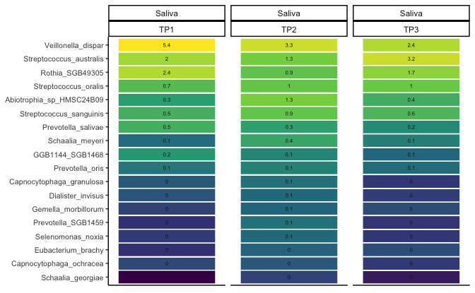

``` r
load(here::here("../../data/processed_data/metaphlan/01_data.Rdata"))
```


``` r
pd <- position_dodge(0.3)
```

# Explore proportion of the dominant taxa:


Source the function `phyloseq_top_heatmap_barplot`:


``` r
source("https://raw.githubusercontent.com/fconstancias/KU_Caroline/refs/heads/main/code/functions/phyloseq_functions.R")
```

below the Arguments of the function phyloseq_top_heatmap_barplot() + default values:


``` r
# parameters:

#' @param ps_up A phyloseq object containing microbiome data.
#' @param group_var Character string for the grouping variable (default: "Sample_Time").
#' @param tax_levels Character vector of taxonomic levels to include in plots (default: c("Phylum", "Family", "Genus", "Species")).
#' @param ntax Integer specifying the number of taxa to display at each level (default: 5).
#' @param ntax_species Integer specifying the number of species-level taxa to display (default: 14).
#' @param plot_heights Numeric vector for the heights of the plot panels (default: c(1.4, 1.5, 4)).
#' @param plot_x Character string for the x-axis label in bar plots (default: "Subject").
#' @param facet_by Character vector specifying variables to use for faceting in heatmaps (default: c("Sample_Type", "Time")).
#' @param group_by Character vector for grouping in heatmaps (default: c("Sample_Type", "Time")).
#' @param facet_heat Formula for faceting heatmap plots (default: "~ Sample_Type + Time").
#' @param facet_formula Formula for faceting bar plots (default: "Sample_Type ~ Time").
#' @param rm_unclassified Logical indicating if unclassified taxa should be removed (default: TRUE).
#' @param barplot_level Character string for taxonomic level in bar plots (default: "Species").
#' @param boxplot_main_group Character string for the main grouping variable in box plots (default: "Class").
```

Run the function:


``` r
ps_up %>% 
  phyloseq_top_heatmap_barplot(facet_formula = "Sample_Type ~ Time" , 
                               ntax = 5, ntax_species = 10, plot_heights = c(1.4, 1.4, 4),
                               boxplot_main_group = "Family") -> out
```

Output is a list which containts different objects:


``` r
ls(out)
```

```
## [1] "bar_plot"      "heat"          "heat_all"      "heat_legend"  
## [5] "most_ab_treat" "nested_legend" "p"             "ps_sub"
```


``` r
out$heat_all
```


``` r
out$bar_plot + 
  ggpubr::rotate_x_text(60)
```


``` r
out$p
```


``` r
out$nested_legend
```


``` r
out$ps_sub
```


``` r
out$ps_sub + facet_null() +
  facet_grid(rows = vars(Sample_Type), 
             cols = vars(cluster_Dtp2, Subject )) + theme(legend.position = "none") 
```


# Statistical test to find differential abundant (i.e., proporition) taxa:


Function `phyloseq_diff_abundance()` allows to run different methods, here are the arguments:


``` r
#' @title Differiential feature analyses wrapper for Microbiome analyses
#' @author Florentin Constancias
#' @description 
#' This script performs a comparative analysis of various approaches for microbiome studies, 
#' including metagenomics, metabarcoding, metabolomics, and transcriptomics. The script 
#' calculates the number of publications, environments analyzed, and the methods applied.
#' 
#' @param ps_tmp A phyloseq object. Defaults to saliva samples (`ps_up %>% subset_samples(Sample == "Saliva")`).
#' @param approach Character vector specifying the analysis approach. Options include:
#'   - "run_lefse": Linear discriminant analysis (LEfSe)
#'   - "run_ancom": Analysis of composition of microbiomes (ANCOM)
#'   - "ancombc2": ANCOMBC2 method for differential abundance
#'   - "maaslin3": Multivariate analysis using Maaslin3
#'   - "trans_diff_rf": Transformation-based Random Forest
#'   - "classifier_rf": Random Forest classifier
#' @param glom Taxonomic rank for agglomeration (e.g., "Species"). Set to `NULL` to skip agglomeration.
#' @param unclassified_name Name for unclassified taxa (default: "UNCLASSIFIED").
#' @param taxa_rank Taxonomic rank for differential abundance (default: "all").
#' @param density Density metric to normalize counts. Default is "Quant".
#' @param comp_group Grouping variable for comparison (e.g., "Time").
#' @param palette Color palette for plots.
#' @param pvalue_cutoff p-value cutoff for significance.
#' @param p_adjust Method for p-value adjustment (e.g., "BH" for Benjamini-Hochberg).
#' @param lefse_* Parameters specific to the LEfSe method.
#' @param maaslin3_* Parameters specific to Maaslin3 analysis.
#' @param ancombc2_* Parameters specific to ANCOMBC2 analysis.
#' @param linda_* Parameters specific to LINDA (if used in the future).
#' @param rf_* Parameters specific to Random Forest methods.
#' @param trans_diff_rf_MeanDecreaseGini_cutoff Gini index cutoff for feature importance in Random Forest.
```


## Test differences at Baseline between Saliva and Plaque microbiome:


``` r
ps_up %>% 
  subset_samples(Time == "TP1") %>% 
  phyloseq_diff_abundance(ps_tmp = .,
                          approach = c("run_lefse", "run_ancom", "trans_diff_rf", "maaslin3", "ancombc2", "linda"),
                          glom = "Species",
                          taxa_rank = "all", #"OTU"
                          comp_group = "Sample",
                          formula =  "~ Sample",
                          ancombc2_fix_formula = "Sample",
                          ancombc2_rand_formula = NULL,
                          ancombc2_group = "Sample",
                          linda_formula = NULL,
                          linda_comp_group = "Sample",,
                          palette = sample_pal,
                          unclassified_name = "UNCLASSIFIED") -> TP1
```

```
## Loading required package: microbiomeMarker
```

```
## Registered S3 methods overwritten by 'proxy':
##   method               from    
##   print.registry_field registry
##   print.registry_entry registry
```

```
## Registered S3 method overwritten by 'gplots':
##   method         from     
##   reorder.factor DescTools
```

```
## 
## Attaching package: 'microbiomeMarker'
```

```
## The following object is masked from 'package:speedyseq':
## 
##     plot_heatmap
```

```
## The following object is masked from 'package:phyloseq':
## 
##     plot_heatmap
```

```
## Loading required package: magrittr
```

```
## 
## Attaching package: 'magrittr'
```

```
## The following object is masked from 'package:purrr':
## 
##     set_names
```

```
## The following object is masked from 'package:tidyr':
## 
##     extract
```

```
## Loading required package: ANCOMBC
```

```
## Loading required package: microeco
```

```
## 2024-11-25 11:15:02.495423 INFO::Writing function arguments to log file
## 2024-11-25 11:15:02.941039 INFO::Verifying options selected are valid
## 2024-11-25 11:15:02.943931 INFO::Determining format of input files
## 2024-11-25 11:15:02.945725 INFO::Input format is data samples as rows and metadata samples as rows
## 2024-11-25 11:15:02.95437 INFO::Running selected normalization method: TSS
## 2024-11-25 11:15:02.962202 INFO::Writing normalized data to file ~/test_masslin3//features/data_norm.tsv
## 2024-11-25 11:15:02.978475 INFO::Filter data based on min abundance and min prevalence
## 2024-11-25 11:15:02.980656 INFO::Total samples in data: 80
## 2024-11-25 11:15:02.982676 INFO::Min samples required with min abundance for a feature not to be filtered: 0.000000
## 2024-11-25 11:15:03.009611 INFO::Total filtered features: 0
## 2024-11-25 11:15:03.011799 INFO::Filtered feature names from abundance and prevalence filtering:
## 2024-11-25 11:15:03.017204 INFO::Total features filtered by non-zero variance filtering: 62
## 2024-11-25 11:15:03.019698 INFO::Filtered feature names from variance filtering: GGB4733_SGB6557, GGB1460_SGB2023, GGB4300_SGB123921, Treponema_parvum, Lactococcus_lactis, Candida_albicans, Caldibacillus_thermoamylovorans, Ureibacillus_chungkukjangi, GGB16822_SGB82363, Fusobacterium_hwasookii, GGB96297_SGB123797, GGB49499_SGB69440, GGB38873_SGB47522, Peptostreptococcaceae_bacterium_AS15, Treponema_sp_Marseille_Q3903, Corynebacterium_propinquum, GGB3389_SGB4477, Selenomonas_SGB5883, GGB1840_SGB2490, Lacticaseibacillus_rhamnosus, GGB4533_SGB97508, Desulfovibrio_desulfuricans, Prevotella_SGB63829, Corynebacterium_kefirresidentii, Schaalia_cardiffensis, GGB49400_SGB97338, Treponema_SGB3604, Treponema_SGB96715, GGB4333_SGB5935, Kingella_kingae, Staphylococcus_epidermidis, Fusobacterium_massiliense, Corynebacterium_pseudodiphtheriticum, Limosilactobacillus_fermentum, Neisseria_meningitidis, Treponema_SGB69453, Alloprevotella_SGB98150, GGB1188_SGB1538, Fusobacterium_gonidiaformans, Pseudomonas_sp_WS_5010, Sneathia_sanguinegens, Acinetobacter_guillouiae, Klebsiella_pneumoniae, Candidatus_Saccharibacteria_unclassified_SGB95617, GGB3390_SGB4478, Arcanobacterium_haemolyticum, Pseudomonas_fragi, Pseudomonas_weihenstephanensis, GGB4393_SGB6047, Latilactobacillus_curvatus, Pseudomonas_helleri, Porphyromonas_SGB2015, Mogibacterium_pumilum, GGB4733_SGB6556, GGB2671_SGB3598, Limosilactobacillus_vaginalis, Streptococcus_pyogenes, GGB1021_SGB1314, Leuconostoc_gelidum, Leuconostoc_carnosum, Weissella_viridescens, Prevotella_bivia
## 2024-11-25 11:15:03.021764 INFO::Writing filtered data to file ~/test_masslin3//features/filtered_data.tsv
## 2024-11-25 11:15:03.035903 INFO::Running selected transform method: LOG
## 2024-11-25 11:15:03.040159 INFO::Writing normalized, filtered, transformed data to file ~/test_masslin3//features/data_transformed.tsv
## 2024-11-25 11:15:03.053862 INFO::Factor detected for categorial metadata 'Sample'. Using as-is.
## 2024-11-25 11:15:03.05602 INFO::Applying z-score to standardize continuous metadata
## 2024-11-25 11:15:03.062107 INFO::Running the linear model component
## 2024-11-25 11:15:03.065257 INFO::Creating cluster of 2 R processes
## 2024-11-25 11:15:04.312076 INFO::Performing tests against medians
## 2024-11-25 11:15:05.239488 INFO::Counting total values for each feature
## 2024-11-25 11:15:05.245473 INFO::Running the logistic model component
## 2024-11-25 11:15:05.252678 INFO::Creating cluster of 2 R processes
## 2024-11-25 11:15:09.819192 INFO::Counting total values for each feature
## 2024-11-25 11:15:09.832339 INFO::Re-running abundances for warn_prevalence
## 2024-11-25 11:15:09.842763 INFO::Running selected normalization method: TSS
## 2024-11-25 11:15:09.854221 INFO::Running selected transform method: LOG
## 2024-11-25 11:15:09.861606 INFO::Creating cluster of 2 R processes
## 2024-11-25 11:15:21.571787 WARNING::Deleting existing model objects file: ~/test_masslin3//fits/models_linear.rds
## 2024-11-25 11:15:21.582613 INFO::Writing model objects to file ~/test_masslin3//fits/models_linear.rds
## 2024-11-25 11:15:22.049239 WARNING::Deleting existing residuals file: ~/test_masslin3//fits/residuals_linear.rds
## 2024-11-25 11:15:22.052036 INFO::Writing residuals to file ~/test_masslin3//fits/residuals_linear.rds
## 2024-11-25 11:15:22.060963 WARNING::Deleting existing fitted file: ~/test_masslin3//fits/fitted_linear.rds
## 2024-11-25 11:15:22.066229 INFO::Writing fitted values to file ~/test_masslin3//fits/fitted_linear.rds
## 2024-11-25 11:15:22.074998 WARNING::Deleting existing model objects file: ~/test_masslin3//fits/models_logistic.rds
## 2024-11-25 11:15:22.081644 INFO::Writing model objects to file ~/test_masslin3//fits/models_logistic.rds
## 2024-11-25 11:15:28.837921 WARNING::Deleting existing residuals file: ~/test_masslin3//fits/residuals_logistic.rds
## 2024-11-25 11:15:28.845696 INFO::Writing residuals to file ~/test_masslin3//fits/residuals_logistic.rds
## 2024-11-25 11:15:28.864144 WARNING::Deleting existing fitted file: ~/test_masslin3//fits/fitted_logistic.rds
## 2024-11-25 11:15:28.868856 INFO::Writing fitted values to file ~/test_masslin3//fits/fitted_logistic.rds
## 2024-11-25 11:15:28.880808 INFO::Writing all the results to file (ordered 
##             by increasing individual q-values): ~/test_masslin3//all_results.tsv
## 2024-11-25 11:15:28.890912 INFO::Writing the significant results without errors (those which have joint q-values less than or equal to the threshold of 0.050000 ) to file (ordered by increasing individual q-values): ~/test_masslin3//significant_results.tsv
## 2024-11-25 11:15:28.896656 INFO::Writing summary plot of significant 
##                         results to file: ~/test_masslin3//figures/summary_plot.pdf
```

```
## 2024-11-25 11:15:29.49648 INFO::Writing association plots (one for each significant association) to output folder: ~/test_masslin3//figures
## 2024-11-25 11:15:29.497583 INFO::Plotting associations from most to least significant, grouped by metadata
## 2024-11-25 11:15:29.501452 INFO::Creating box plot for categorical data (linear), 
##                         Sample vs Actinomyces_graevenitzii
## 2024-11-25 11:15:29.511995 INFO::Creating box plot for categorical data (linear), 
##                         Sample vs Actinomyces_sp_ICM47
## 2024-11-25 11:15:29.521326 INFO::Creating box plot for categorical data (linear), 
##                         Sample vs Corynebacterium_matruchotii
## 2024-11-25 11:15:29.533472 INFO::Creating box plot for categorical data (linear), 
##                         Sample vs Granulicatella_SGB8255
## 2024-11-25 11:15:29.542404 INFO::Creating box plot for categorical data (linear), 
##                         Sample vs Neisseria_subflava
## 2024-11-25 11:15:29.551448 INFO::Creating box plot for categorical data (linear), 
##                         Sample vs Rothia_mucilaginosa
## 2024-11-25 11:15:29.560806 INFO::Creating box plot for categorical data (linear), 
##                         Sample vs Schaalia_SGB17157
## 2024-11-25 11:15:29.57786 INFO::Creating box plot for categorical data (linear), 
##                         Sample vs Streptococcus_australis
## 2024-11-25 11:15:29.586748 INFO::Creating box plot for categorical data (linear), 
##                         Sample vs Streptococcus_infantis
## 2024-11-25 11:15:29.604128 INFO::Creating box plot for categorical data (linear), 
##                         Sample vs Streptococcus_mitis
## 2024-11-25 11:15:29.615459 INFO::Creating box plot for categorical data (linear), 
##                         Sample vs Streptococcus_parasanguinis
## 2024-11-25 11:15:29.624589 INFO::Creating box plot for categorical data (linear), 
##                         Sample vs Streptococcus_salivarius
## 2024-11-25 11:15:29.633148 INFO::Creating box plot for categorical data (linear), 
##                         Sample vs Veillonella_atypica
## 2024-11-25 11:15:29.642827 INFO::Creating box plot for categorical data (linear), 
##                         Sample vs Veillonella_dispar
## 2024-11-25 11:15:29.653647 INFO::Creating box plot for categorical data (linear), 
##                         Sample vs Veillonella_rogosae
## 2024-11-25 11:15:29.703047 INFO::Creating box plot for categorical data (linear), 
##                         Sample vs Campylobacter_concisus
## 2024-11-25 11:15:29.710771 INFO::Creating box plot for categorical data (linear), 
##                         Sample vs Lancefieldella_parvula
## 2024-11-25 11:15:29.721202 INFO::Creating box plot for categorical data (linear), 
##                         Sample vs UNCLASSIFIED
## 2024-11-25 11:15:29.730769 INFO::Creating box plot for categorical data (linear), 
##                         Sample vs Prevotella_jejuni
## 2024-11-25 11:15:29.73999 INFO::Creating box plot for categorical data (linear), 
##                         Sample vs Actinomyces_SGB17132
## 2024-11-25 11:15:29.749869 INFO::Creating box plot for categorical data (linear), 
##                         Sample vs Prevotella_histicola
## 2024-11-25 11:15:29.759448 INFO::Creating box plot for categorical data (linear), 
##                         Sample vs Prevotella_pallens
## 2024-11-25 11:15:29.769472 INFO::Creating box plot for categorical data (linear), 
##                         Sample vs Oribacterium_sinus
## 2024-11-25 11:15:29.779139 INFO::Creating box plot for categorical data (linear), 
##                         Sample vs Prevotella_nanceiensis
## 2024-11-25 11:15:29.789005 INFO::Creating box plot for categorical data (linear), 
##                         Sample vs Prevotella_melaninogenica
## 2024-11-25 11:15:29.799298 INFO::Creating box plot for categorical data (linear), 
##                         Sample vs Fusobacterium_periodonticum
## 2024-11-25 11:15:29.808884 INFO::Creating box plot for categorical data (linear), 
##                         Sample vs TM7_phylum_sp_oral_taxon_352
## 2024-11-25 11:15:29.817036 INFO::Creating box plot for categorical data (linear), 
##                         Sample vs Actinobaculum_sp_oral_taxon_183
## 2024-11-25 11:15:29.828939 INFO::Creating box plot for categorical data (linear), 
##                         Sample vs GGB3883_SGB5266
## 2024-11-25 11:15:29.837281 INFO::Creating box plot for categorical data (linear), 
##                         Sample vs Schaalia_odontolytica
```

```
## 0  features are filtered!
## The filtered data has  80  samples and  316  features will be tested!
## Pseudo-count approach is used.
## Fit linear models ...
## Completed.
```


``` r
ps_up %>% 
  subset_samples(Time == "TP1") %>% 
  phyloseq_diff_abundance(ps_tmp = .,
                          approach = c("run_lefse"),
                          glom = "Species",
                          lefse_lda_cutoff = 4,
                          pvalue_cutoff = 0.001,
                          taxa_rank = "all", #"OTU"
                          comp_group = "Sample",
                          palette = sample_pal) -> lefse_TP1


lefse_TP1$mmlefse_df %>% 
  DT::datatable()
```

```{=html}
<div class="datatables html-widget html-fill-item" id="htmlwidget-1117ee2e33398548f3b2" style="width:100%;height:auto;"></div>
<script type="application/json" data-for="htmlwidget-1117ee2e33398548f3b2">{"x":{"filter":"none","vertical":false,"data":[["marker1","marker2","marker3","marker4","marker5","marker6","marker7","marker8","marker9","marker10","marker11","marker12","marker13","marker14","marker15","marker16","marker17","marker18","marker19","marker20","marker21","marker22","marker23","marker24","marker25","marker26","marker27","marker28","marker29","marker30","marker31","marker32","marker33","marker34","marker35","marker36","marker37","marker38","marker39","marker40","marker41","marker42","marker43","marker44","marker45","marker46","marker47","marker48","marker49","marker50","marker51","marker52","marker53","marker54","marker55","marker56","marker57","marker58","marker59","marker60","marker61","marker62","marker63","marker64","marker65","marker66","marker67","marker68","marker69","marker70","marker71","marker72","marker73","marker74"],["k__Bacteria|p__Firmicutes","k__Bacteria|p__Firmicutes|c__Bacilli","k__Bacteria|p__Firmicutes|c__Bacilli|o__Lactobacillales","k__Bacteria|p__Firmicutes|c__Bacilli|o__Lactobacillales|f__Streptococcaceae","k__Bacteria|p__Firmicutes|c__Bacilli|o__Lactobacillales|f__Streptococcaceae|g__Streptococcus","k__Bacteria|p__Actinobacteria|c__Actinomycetia|o__Micrococcales|f__Micrococcaceae|g__Rothia|s__Rothia_mucilaginosa","k__Bacteria|p__Bacteroidota|c__Bacteroidia|o__Bacteroidales|f__Prevotellaceae","k__Bacteria|p__Bacteroidota|c__Bacteroidia","k__Bacteria|p__Bacteroidota|c__Bacteroidia|o__Bacteroidales","k__Bacteria|p__Firmicutes|c__Negativicutes|o__Veillonellales","k__Bacteria|p__Firmicutes|c__Negativicutes|o__Veillonellales|f__Veillonellaceae","k__Bacteria|p__Bacteroidota|c__Bacteroidia|o__Bacteroidales|f__Prevotellaceae|g__Prevotella","k__Bacteria|p__Actinobacteria|c__Actinomycetia|o__Micrococcales","k__Bacteria|p__Actinobacteria|c__Actinomycetia|o__Micrococcales|f__Micrococcaceae","k__Bacteria|p__Actinobacteria|c__Actinomycetia|o__Micrococcales|f__Micrococcaceae|g__Rothia","k__Bacteria|p__Firmicutes|c__Negativicutes|o__Veillonellales|f__Veillonellaceae|g__Veillonella","k__Bacteria|p__Proteobacteria|c__Betaproteobacteria|o__Neisseriales|f__Neisseriaceae|g__Neisseria|s__Neisseria_subflava","k__Bacteria|p__Actinobacteria|c__Actinomycetia|o__Actinomycetales|f__Actinomycetaceae|g__Schaalia","k__Bacteria|p__Firmicutes|c__Negativicutes","k__Bacteria|p__Firmicutes|c__Negativicutes|o__Veillonellales|f__Veillonellaceae|g__Veillonella|s__Veillonella_dispar","k__Bacteria|p__Firmicutes|c__Bacilli|o__Lactobacillales|f__Streptococcaceae|g__Streptococcus|s__Streptococcus_salivarius","k__Bacteria|p__Bacteroidota|c__Bacteroidia|o__Bacteroidales|f__Prevotellaceae|g__Prevotella|s__Prevotella_melaninogenica","k__Bacteria|p__Firmicutes|c__Negativicutes|o__Veillonellales|f__Veillonellaceae|g__Veillonella|s__Veillonella_rogosae","k__Bacteria|p__Actinobacteria|c__Actinomycetia|o__Actinomycetales|f__Actinomycetaceae|g__Actinomyces|s__Actinomyces_sp_ICM47","k__Bacteria|p__Firmicutes|c__Bacilli|o__Lactobacillales|f__Streptococcaceae|g__Streptococcus|s__Streptococcus_parasanguinis","k__Bacteria|p__Actinobacteria|c__Actinomycetia|o__Actinomycetales|f__Actinomycetaceae|g__Actinomyces|s__Actinomyces_graevenitzii","k__Bacteria|p__Firmicutes|c__Negativicutes|o__Veillonellales|f__Veillonellaceae|g__Veillonella|s__Veillonella_atypica","k__Bacteria|p__Bacteroidota|c__Bacteroidia|o__Bacteroidales|f__Prevotellaceae|g__Prevotella|s__Prevotella_histicola","k__Bacteria|p__Firmicutes|c__Clostridia","k__Bacteria|p__Firmicutes|c__Clostridia|o__Eubacteriales","k__Bacteria|p__Actinobacteria|c__Actinomycetia|o__Actinomycetales|f__Actinomycetaceae|g__Schaalia|s__Schaalia_SGB17157","k__Bacteria|p__Firmicutes|c__Bacilli|o__Lactobacillales|f__Streptococcaceae|g__Streptococcus|s__Streptococcus_australis","k__Bacteria|p__Firmicutes|c__Bacilli|o__Lactobacillales|f__Streptococcaceae|g__Streptococcus|s__Streptococcus_mitis","k__Bacteria|p__Firmicutes|c__Bacilli|o__Lactobacillales|f__Carnobacteriaceae|g__Granulicatella|s__Granulicatella_SGB8255","k__Bacteria|p__Actinobacteria|c__Actinomycetia|o__Actinomycetales|f__Actinomycetaceae|g__Schaalia|s__Schaalia_odontolytica","k__Bacteria|p__Firmicutes|c__Bacilli|o__Lactobacillales|f__Carnobacteriaceae","k__Bacteria|p__Firmicutes|c__Bacilli|o__Lactobacillales|f__Carnobacteriaceae|g__Granulicatella","k__Bacteria|p__Firmicutes|c__Clostridia|o__Eubacteriales|f__Eubacteriales_Family_XIII_Incertae_Sedis","k__Bacteria|p__Candidatus_Saccharibacteria|c__Candidatus_Saccharibacteria_unclassified|o__Candidatus_Saccharibacteria_unclassified|f__Candidatus_Saccharibacteria_unclassified|g__Candidatus_Saccharibacteria_unclassified|s__TM7_phylum_sp_oral_taxon_352","k__Bacteria|p__Actinobacteria|c__Actinomycetia|o__Actinomycetales|f__Actinomycetaceae|g__Schaalia|s__Schaalia_SGB17158","k__Bacteria|p__Actinobacteria|c__Actinomycetia|o__Actinomycetales|f__Actinomycetaceae|g__Schaalia|s__Schaalia_SGB17168","k__Bacteria|p__Bacteroidota|c__Bacteroidia|o__Bacteroidales|f__Prevotellaceae|g__Prevotella|s__Prevotella_pallens","k__Bacteria|p__Bacteroidota|c__Bacteroidia|o__Bacteroidales|f__Prevotellaceae|g__Prevotella|s__Prevotella_nanceiensis","k__Bacteria|p__Actinobacteria|c__Actinomycetia","k__Bacteria|p__Actinobacteria","k__Bacteria|p__Actinobacteria|c__Actinomycetia|o__Actinomycetales","k__Bacteria|p__Actinobacteria|c__Actinomycetia|o__Actinomycetales|f__Actinomycetaceae","k__Bacteria|p__Actinobacteria|c__Actinomycetia|o__Actinomycetales|f__Actinomycetaceae|g__Actinomyces","k__Bacteria|p__Actinobacteria|c__Actinomycetia|o__Actinomycetales|f__Actinomycetaceae|g__Actinobaculum","k__Bacteria|p__Actinobacteria|c__Actinomycetia|o__Actinomycetales|f__Actinomycetaceae|g__Actinobaculum|s__Actinobaculum_sp_oral_taxon_183","k__Bacteria|p__Actinobacteria|c__Actinomycetia|o__Corynebacteriales","k__Bacteria|p__Actinobacteria|c__Actinomycetia|o__Corynebacteriales|f__Corynebacteriaceae","k__Bacteria|p__Actinobacteria|c__Actinomycetia|o__Corynebacteriales|f__Corynebacteriaceae|g__Corynebacterium","k__Bacteria|p__Actinobacteria|c__Actinomycetia|o__Corynebacteriales|f__Corynebacteriaceae|g__Corynebacterium|s__Corynebacterium_matruchotii","k__Bacteria|p__Actinobacteria|c__Actinomycetia|o__Actinomycetales|f__Actinomycetaceae|g__Actinomyces|s__Actinomyces_sp_oral_taxon_448","k__Bacteria|p__Firmicutes|c__Negativicutes|o__Veillonellales|f__Veillonellaceae|g__Veillonella|s__Veillonella_parvula","k__Bacteria|p__Actinobacteria|c__Actinomycetia|o__Actinomycetales|f__Actinomycetaceae|g__Actinomyces|s__Actinomyces_oris","k__Bacteria|p__Bacteroidota|c__Flavobacteriia|o__Flavobacteriales|f__Flavobacteriaceae","k__Bacteria|p__Bacteroidota|c__Flavobacteriia|o__Flavobacteriales|f__Flavobacteriaceae|g__Capnocytophaga","k__Bacteria|p__Bacteroidota|c__Flavobacteriia","k__Bacteria|p__Bacteroidota|c__Flavobacteriia|o__Flavobacteriales","k__Bacteria|p__Actinobacteria|c__Actinomycetia|o__Actinomycetales|f__Actinomycetaceae|g__Actinomyces|s__Actinomyces_gerencseriae","k__Bacteria|p__Actinobacteria|c__Actinomycetia|o__Actinomycetales|f__Actinomycetaceae|g__Actinomyces|s__Actinomyces_naeslundii","k__Bacteria|p__Proteobacteria|c__Betaproteobacteria|o__Neisseriales|f__Neisseriaceae|g__Kingella","k__Bacteria|p__Firmicutes|c__Negativicutes|o__Selenomonadales","k__Bacteria|p__Firmicutes|c__Negativicutes|o__Selenomonadales|f__Selenomonadaceae","k__Bacteria|p__Firmicutes|c__Negativicutes|o__Selenomonadales|f__Selenomonadaceae|g__Selenomonas","k__Bacteria|p__Actinobacteria|c__Actinomycetia|o__Actinomycetales|f__Actinomycetaceae|g__Actinomyces|s__Actinomyces_johnsonii","k__Bacteria|p__Actinobacteria|c__Actinomycetia|o__Actinomycetales|f__Actinomycetaceae|g__Actinomyces|s__Actinomyces_dentalis","k__Bacteria|p__Actinobacteria|c__Actinomycetia|o__Actinomycetales|f__Actinomycetaceae|g__Actinomyces|s__Actinomyces_massiliensis","k__Bacteria|p__Firmicutes|c__Negativicutes|o__Selenomonadales|f__Selenomonadaceae|g__Selenomonas|s__Selenomonas_noxia","k__Bacteria|p__Proteobacteria|c__Gammaproteobacteria|o__Cardiobacteriales","k__Bacteria|p__Proteobacteria|c__Gammaproteobacteria|o__Cardiobacteriales|f__Cardiobacteriaceae","k__Bacteria|p__Proteobacteria|c__Gammaproteobacteria|o__Cardiobacteriales|f__Cardiobacteriaceae|g__Cardiobacterium"],["Saliva","Saliva","Saliva","Saliva","Saliva","Saliva","Saliva","Saliva","Saliva","Saliva","Saliva","Saliva","Saliva","Saliva","Saliva","Saliva","Saliva","Saliva","Saliva","Saliva","Saliva","Saliva","Saliva","Saliva","Saliva","Saliva","Saliva","Saliva","Saliva","Saliva","Saliva","Saliva","Saliva","Saliva","Saliva","Saliva","Saliva","Saliva","Saliva","Saliva","Saliva","Saliva","Saliva","Plaque","Plaque","Plaque","Plaque","Plaque","Plaque","Plaque","Plaque","Plaque","Plaque","Plaque","Plaque","Plaque","Plaque","Plaque","Plaque","Plaque","Plaque","Plaque","Plaque","Plaque","Plaque","Plaque","Plaque","Plaque","Plaque","Plaque","Plaque","Plaque","Plaque","Plaque"],[5.338968395423686,5.113789142473884,5.110208397346473,5.059450895242256,5.059450895242256,5.055953813715556,4.963479646439956,4.937072793812731,4.937072793812731,4.932954890250167,4.932954890250167,4.932806347205315,4.912160687172427,4.912160687172427,4.912160687172427,4.910089280138607,4.849635432751405,4.817232470880562,4.815106421756841,4.768092991008283,4.750428558660646,4.659957744187171,4.649896837707499,4.592618282513852,4.54219606724857,4.468381381893579,4.428523652717026,4.368922645694602,4.344748760325556,4.344748760325556,4.338817541342264,4.314324418704319,4.223250100148627,4.160715511633767,4.148466281775906,4.115518035131172,4.115518035131172,4.091116976531318,4.082010789696339,4.072491342381023,4.056340905729875,4.048381055316347,4.046972501077068,5.312445019277167,5.301386118230343,5.271609509177146,5.271609509177146,5.12631860083818,5.043017370880435,5.043017370880435,4.861167852770075,4.861167852770075,4.861167852770075,4.817192715813946,4.806269500505551,4.713263689901084,4.69674474516054,4.51675299425038,4.512982740390054,4.503456458826671,4.503456458826671,4.491082188765131,4.336233270272221,4.309013439002037,4.308925467696082,4.308925467696082,4.286110327035783,4.21638485914875,4.137467817280426,4.084460495517601,4.051224738918758,4.007929478032003,4.007929478032003,4.007929478032003],[8.955958639798012e-12,4.882257037918459e-12,4.561908136732195e-12,1.526316135346062e-11,1.526316135346062e-11,1.372360760736825e-14,8.702333067856341e-09,2.416784639044133e-06,2.416784639044133e-06,1.222756495329499e-08,1.222756495329499e-08,4.138729391000882e-08,8.334411574844404e-08,8.334411574844404e-08,8.334411574844404e-08,1.810839777494831e-08,1.42835480951123e-14,4.905063057299941e-14,4.233900422892646e-06,3.04360597497023e-12,1.202786210361728e-14,1.188561323584405e-09,1.346892477677708e-14,7.300560652902829e-15,1.70796030343518e-14,3.593896300209487e-15,1.908198928951925e-12,1.56583570122577e-11,5.090675606362915e-10,5.090675606362915e-10,1.413365767366352e-13,1.264254098694124e-13,1.745212740301994e-12,1.085099161053807e-14,4.841191267746661e-10,1.364863892169017e-13,1.364863892169017e-13,8.370313605012755e-13,5.689742333643786e-15,1.332429327184096e-10,1.841313868721912e-06,1.824916913686267e-13,3.119123043247693e-14,7.211120372816726e-07,8.362046747435796e-07,1.196418108042443e-05,1.196418108042443e-05,6.393070966649925e-06,7.853642179701012e-08,7.853642179701012e-08,1.151794168093298e-12,1.151794168093298e-12,1.151794168093298e-12,3.134782193091349e-12,0.0001524093456011236,4.613890108794056e-08,1.732277261141851e-06,1.092098677273372e-08,1.031962910712692e-08,5.141752189828557e-08,5.141752189828557e-08,3.281540980076141e-07,9.165666919075157e-06,6.538400312453851e-09,2.610139393417239e-05,2.610139393417239e-05,3.092185181034884e-05,3.828316112311352e-05,1.086559637525151e-06,8.332962691955489e-08,1.424670218713818e-09,4.071041875501809e-09,4.071041875501809e-09,4.071041875501809e-09],[8.955958639798012e-12,4.882257037918459e-12,4.561908136732195e-12,1.526316135346062e-11,1.526316135346062e-11,1.372360760736825e-14,8.702333067856341e-09,2.416784639044133e-06,2.416784639044133e-06,1.222756495329499e-08,1.222756495329499e-08,4.138729391000882e-08,8.334411574844404e-08,8.334411574844404e-08,8.334411574844404e-08,1.810839777494831e-08,1.42835480951123e-14,4.905063057299941e-14,4.233900422892646e-06,3.04360597497023e-12,1.202786210361728e-14,1.188561323584405e-09,1.346892477677708e-14,7.300560652902829e-15,1.70796030343518e-14,3.593896300209487e-15,1.908198928951925e-12,1.56583570122577e-11,5.090675606362915e-10,5.090675606362915e-10,1.413365767366352e-13,1.264254098694124e-13,1.745212740301994e-12,1.085099161053807e-14,4.841191267746661e-10,1.364863892169017e-13,1.364863892169017e-13,8.370313605012755e-13,5.689742333643786e-15,1.332429327184096e-10,1.841313868721912e-06,1.824916913686267e-13,3.119123043247693e-14,7.211120372816726e-07,8.362046747435796e-07,1.196418108042443e-05,1.196418108042443e-05,6.393070966649925e-06,7.853642179701012e-08,7.853642179701012e-08,1.151794168093298e-12,1.151794168093298e-12,1.151794168093298e-12,3.134782193091349e-12,0.0001524093456011236,4.613890108794056e-08,1.732277261141851e-06,1.092098677273372e-08,1.031962910712692e-08,5.141752189828557e-08,5.141752189828557e-08,3.281540980076141e-07,9.165666919075157e-06,6.538400312453851e-09,2.610139393417239e-05,2.610139393417239e-05,3.092185181034884e-05,3.828316112311352e-05,1.086559637525151e-06,8.332962691955489e-08,1.424670218713818e-09,4.071041875501809e-09,4.071041875501809e-09,4.071041875501809e-09]],"container":"<table class=\"display\">\n  <thead>\n    <tr>\n      <th> <\/th>\n      <th>feature<\/th>\n      <th>enrich_group<\/th>\n      <th>ef_lda<\/th>\n      <th>pvalue<\/th>\n      <th>padj<\/th>\n    <\/tr>\n  <\/thead>\n<\/table>","options":{"columnDefs":[{"className":"dt-right","targets":[3,4,5]},{"orderable":false,"targets":0},{"name":" ","targets":0},{"name":"feature","targets":1},{"name":"enrich_group","targets":2},{"name":"ef_lda","targets":3},{"name":"pvalue","targets":4},{"name":"padj","targets":5}],"order":[],"autoWidth":false,"orderClasses":false}},"evals":[],"jsHooks":[]}</script>
```

``` r
lefse_TP1$mmlefse_p
```


## Exploring output : Lefse

Dataframe:


``` r
TP1$mmlefse_df %>% 
  DT::datatable()
```

```{=html}
<div class="datatables html-widget html-fill-item" id="htmlwidget-27a7b2d86d3f65ebffc9" style="width:100%;height:auto;"></div>
<script type="application/json" data-for="htmlwidget-27a7b2d86d3f65ebffc9">{"x":{"filter":"none","vertical":false,"data":[["marker1","marker2","marker3","marker4","marker5","marker6","marker7","marker8","marker9","marker10","marker11","marker12","marker13","marker14","marker15","marker16","marker17","marker18","marker19","marker20","marker21","marker22","marker23","marker24","marker25","marker26","marker27","marker28","marker29","marker30","marker31","marker32","marker33","marker34","marker35","marker36","marker37","marker38","marker39","marker40","marker41","marker42","marker43","marker44","marker45","marker46","marker47","marker48","marker49","marker50","marker51","marker52","marker53","marker54","marker55","marker56","marker57","marker58","marker59","marker60","marker61","marker62","marker63","marker64","marker65","marker66","marker67","marker68","marker69","marker70","marker71","marker72","marker73","marker74","marker75","marker76","marker77","marker78","marker79","marker80","marker81","marker82","marker83","marker84","marker85","marker86","marker87","marker88","marker89","marker90","marker91","marker92","marker93","marker94","marker95","marker96","marker97","marker98","marker99","marker100","marker101","marker102","marker103","marker104","marker105","marker106","marker107","marker108","marker109","marker110","marker111","marker112","marker113","marker114","marker115","marker116","marker117","marker118","marker119","marker120","marker121","marker122","marker123","marker124","marker125","marker126","marker127","marker128","marker129","marker130","marker131","marker132","marker133","marker134","marker135","marker136","marker137","marker138","marker139","marker140","marker141","marker142","marker143","marker144","marker145","marker146","marker147","marker148","marker149","marker150","marker151","marker152","marker153","marker154","marker155","marker156","marker157","marker158","marker159","marker160","marker161","marker162","marker163","marker164","marker165","marker166","marker167","marker168","marker169","marker170","marker171","marker172","marker173","marker174","marker175","marker176","marker177","marker178","marker179","marker180","marker181","marker182","marker183","marker184","marker185","marker186","marker187","marker188","marker189","marker190","marker191","marker192","marker193","marker194","marker195","marker196","marker197","marker198","marker199","marker200","marker201","marker202","marker203","marker204","marker205","marker206","marker207","marker208","marker209","marker210","marker211","marker212","marker213","marker214","marker215","marker216","marker217","marker218","marker219","marker220","marker221","marker222","marker223","marker224","marker225","marker226","marker227","marker228","marker229","marker230","marker231","marker232","marker233","marker234","marker235","marker236","marker237","marker238","marker239","marker240","marker241","marker242","marker243","marker244","marker245","marker246","marker247","marker248","marker249","marker250","marker251","marker252","marker253","marker254","marker255","marker256","marker257","marker258","marker259","marker260","marker261","marker262","marker263","marker264","marker265","marker266","marker267","marker268","marker269","marker270","marker271","marker272","marker273","marker274","marker275","marker276","marker277","marker278","marker279","marker280","marker281","marker282","marker283","marker284","marker285","marker286","marker287","marker288","marker289","marker290","marker291","marker292","marker293","marker294","marker295","marker296","marker297","marker298","marker299","marker300","marker301","marker302","marker303","marker304","marker305","marker306","marker307","marker308","marker309","marker310","marker311","marker312","marker313","marker314","marker315","marker316"],["k__Bacteria|p__Firmicutes","k__Bacteria|p__Firmicutes|c__Bacilli","k__Bacteria|p__Firmicutes|c__Bacilli|o__Lactobacillales","k__Bacteria|p__Actinobacteria|c__Actinomycetia|o__Micrococcales|f__Micrococcaceae|g__Rothia|s__Rothia_mucilaginosa","k__Bacteria|p__Firmicutes|c__Bacilli|o__Lactobacillales|f__Streptococcaceae","k__Bacteria|p__Firmicutes|c__Bacilli|o__Lactobacillales|f__Streptococcaceae|g__Streptococcus","k__Bacteria|p__Bacteroidota|c__Bacteroidia|o__Bacteroidales|f__Prevotellaceae","k__Bacteria|p__Bacteroidota|c__Bacteroidia","k__Bacteria|p__Bacteroidota|c__Bacteroidia|o__Bacteroidales","k__Bacteria|p__Bacteroidota|c__Bacteroidia|o__Bacteroidales|f__Prevotellaceae|g__Prevotella","k__Bacteria|p__Actinobacteria|c__Actinomycetia|o__Micrococcales","k__Bacteria|p__Actinobacteria|c__Actinomycetia|o__Micrococcales|f__Micrococcaceae","k__Bacteria|p__Actinobacteria|c__Actinomycetia|o__Micrococcales|f__Micrococcaceae|g__Rothia","k__Bacteria|p__Firmicutes|c__Negativicutes|o__Veillonellales","k__Bacteria|p__Firmicutes|c__Negativicutes|o__Veillonellales|f__Veillonellaceae","k__Bacteria|p__Firmicutes|c__Negativicutes|o__Veillonellales|f__Veillonellaceae|g__Veillonella","k__Bacteria|p__Proteobacteria|c__Betaproteobacteria|o__Neisseriales|f__Neisseriaceae|g__Neisseria|s__Neisseria_subflava","k__Bacteria|p__Actinobacteria|c__Actinomycetia|o__Actinomycetales|f__Actinomycetaceae|g__Schaalia","k__Bacteria|p__Firmicutes|c__Negativicutes","k__Bacteria|p__Firmicutes|c__Negativicutes|o__Veillonellales|f__Veillonellaceae|g__Veillonella|s__Veillonella_dispar","k__Bacteria|p__Bacteroidota","k__Bacteria|p__Firmicutes|c__Bacilli|o__Lactobacillales|f__Streptococcaceae|g__Streptococcus|s__Streptococcus_salivarius","k__Bacteria|p__Bacteroidota|c__Bacteroidia|o__Bacteroidales|f__Prevotellaceae|g__Prevotella|s__Prevotella_melaninogenica","k__Bacteria|p__Firmicutes|c__Negativicutes|o__Veillonellales|f__Veillonellaceae|g__Veillonella|s__Veillonella_rogosae","k__Bacteria|p__Actinobacteria|c__Actinomycetia|o__Actinomycetales|f__Actinomycetaceae|g__Actinomyces|s__Actinomyces_sp_ICM47","k__Bacteria|p__Firmicutes|c__Bacilli|o__Lactobacillales|f__Streptococcaceae|g__Streptococcus|s__Streptococcus_parasanguinis","k__Bacteria|p__Actinobacteria|c__Actinomycetia|o__Actinomycetales|f__Actinomycetaceae|g__Actinomyces|s__Actinomyces_graevenitzii","k__Bacteria|p__Proteobacteria|c__Betaproteobacteria|o__Neisseriales|f__Neisseriaceae|g__Neisseria","k__Bacteria|p__Firmicutes|c__Negativicutes|o__Veillonellales|f__Veillonellaceae|g__Veillonella|s__Veillonella_atypica","k__Bacteria|p__Bacteroidota|c__Bacteroidia|o__Bacteroidales|f__Prevotellaceae|g__Prevotella|s__Prevotella_histicola","k__Bacteria|p__Firmicutes|c__Clostridia","k__Bacteria|p__Firmicutes|c__Clostridia|o__Eubacteriales","k__Bacteria|p__Actinobacteria|c__Actinomycetia|o__Actinomycetales|f__Actinomycetaceae|g__Schaalia|s__Schaalia_SGB17157","k__Bacteria|p__Firmicutes|c__Bacilli|o__Lactobacillales|f__Streptococcaceae|g__Streptococcus|s__Streptococcus_australis","k__Bacteria|p__Firmicutes|c__Bacilli|o__Lactobacillales|f__Streptococcaceae|g__Streptococcus|s__Streptococcus_mitis","k__Bacteria|p__Actinobacteria|c__Actinomycetia|o__Actinomycetales|f__Actinomycetaceae|g__Schaalia|s__Schaalia_odontolytica","k__Bacteria|p__Firmicutes|c__Bacilli|o__Lactobacillales|f__Carnobacteriaceae|g__Granulicatella|s__Granulicatella_SGB8255","k__Bacteria|p__Firmicutes|c__Bacilli|o__Lactobacillales|f__Carnobacteriaceae","k__Bacteria|p__Firmicutes|c__Bacilli|o__Lactobacillales|f__Carnobacteriaceae|g__Granulicatella","k__Bacteria|p__Firmicutes|c__Clostridia|o__Eubacteriales|f__Eubacteriales_Family_XIII_Incertae_Sedis","k__Bacteria|p__Bacteroidota|c__Bacteroidia|o__Bacteroidales|f__Porphyromonadaceae|g__Porphyromonas|s__Porphyromonas_bobii","k__Bacteria|p__Actinobacteria|c__Actinomycetia|o__Actinomycetales|f__Actinomycetaceae|g__Schaalia|s__Schaalia_SGB17168","k__Bacteria|p__Candidatus_Saccharibacteria|c__Candidatus_Saccharibacteria_unclassified|o__Candidatus_Saccharibacteria_unclassified|f__Candidatus_Saccharibacteria_unclassified|g__Candidatus_Saccharibacteria_unclassified|s__TM7_phylum_sp_oral_taxon_352","k__Bacteria|p__Bacteroidota|c__Bacteroidia|o__Bacteroidales|f__Prevotellaceae|g__Prevotella|s__Prevotella_pallens","k__Bacteria|p__Bacteroidota|c__Bacteroidia|o__Bacteroidales|f__Prevotellaceae|g__Prevotella|s__Prevotella_nanceiensis","k__Bacteria|p__Actinobacteria|c__Actinomycetia|o__Actinomycetales|f__Actinomycetaceae|g__Schaalia|s__Schaalia_SGB17158","k__Bacteria|p__Firmicutes|c__Clostridia|o__Eubacteriales|f__Eubacteriales_Family_XIII_Incertae_Sedis|g__Eubacteriales_Family_XIII_Incertae_Sedis_unclassified|s__Eubacterium_sulci","k__Bacteria|p__Firmicutes|c__Clostridia|o__Eubacteriales|f__Eubacteriales_Family_XIII_Incertae_Sedis|g__Eubacteriales_Family_XIII_Incertae_Sedis_unclassified","k__Bacteria|p__Firmicutes|c__Clostridia|o__Eubacteriales|f__Lachnospiraceae","k__Bacteria|p__Actinobacteria|c__Coriobacteriia|o__Coriobacteriales|f__Atopobiaceae|g__Lancefieldella|s__Lancefieldella_parvula","k__Bacteria|p__Actinobacteria|c__Coriobacteriia|o__Coriobacteriales|f__Atopobiaceae|g__Lancefieldella","k__Bacteria|p__Bacteroidota|c__Bacteroidia|o__Bacteroidales|f__Prevotellaceae|g__Prevotella|s__Prevotella_jejuni","k__Bacteria|p__Actinobacteria|c__Actinomycetia|o__Actinomycetales|f__Actinomycetaceae|g__Schaalia|s__Schaalia_SGB17153","k__Bacteria|p__Actinobacteria|c__Actinomycetia|o__Actinomycetales|f__Actinomycetaceae|g__Schaalia|s__Schaalia_SGB17154","k__Bacteria|p__Actinobacteria|c__Coriobacteriia","k__Bacteria|p__Actinobacteria|c__Coriobacteriia|o__Coriobacteriales","k__Bacteria|p__Actinobacteria|c__Coriobacteriia|o__Coriobacteriales|f__Atopobiaceae","k__Bacteria|p__Candidatus_Saccharibacteria|c__Candidatus_Saccharibacteria_unclassified|o__Candidatus_Saccharibacteria_unclassified|f__Candidatus_Saccharibacteria_unclassified|g__Candidatus_Saccharibacteria_unclassified","k__Bacteria|p__Firmicutes|c__Clostridia|o__Eubacteriales|f__Lachnospiraceae|g__GGB3883","k__Bacteria|p__Firmicutes|c__Negativicutes|o__Veillonellales|f__Veillonellaceae|g__Megasphaera","k__Bacteria|p__Firmicutes|c__Negativicutes|o__Veillonellales|f__Veillonellaceae|g__Megasphaera|s__Megasphaera_micronuciformis","k__Bacteria|p__Firmicutes|c__Clostridia|o__Eubacteriales|f__Lachnospiraceae|g__GGB3883|s__GGB3883_SGB5266","k__Bacteria|p__Candidatus_Saccharibacteria|c__Candidatus_Saccharibacteria_unclassified","k__Bacteria|p__Candidatus_Saccharibacteria|c__Candidatus_Saccharibacteria_unclassified|o__Candidatus_Saccharibacteria_unclassified","k__Bacteria|p__Candidatus_Saccharibacteria|c__Candidatus_Saccharibacteria_unclassified|o__Candidatus_Saccharibacteria_unclassified|f__Candidatus_Saccharibacteria_unclassified","k__Bacteria|p__Firmicutes|c__Clostridia|o__Eubacteriales|f__Lachnospiraceae|g__Oribacterium","k__Bacteria|p__Bacteroidota|c__Bacteroidia|o__Bacteroidales|f__Prevotellaceae|g__Prevotella|s__Prevotella_salivae","k__Bacteria|p__Proteobacteria|c__Gammaproteobacteria|o__Pasteurellales|f__Pasteurellaceae|g__Haemophilus","k__Bacteria|p__Bacteroidota|c__Bacteroidia|o__Bacteroidales|f__Prevotellaceae|g__GGB1144","k__Bacteria|p__Proteobacteria|c__Gammaproteobacteria|o__Pasteurellales|f__Pasteurellaceae|g__Haemophilus|s__Haemophilus_haemolyticus","k__Bacteria|p__Proteobacteria|c__Gammaproteobacteria|o__Pasteurellales|f__Pasteurellaceae|g__Haemophilus|s__Haemophilus_sputorum","k__Bacteria|p__Firmicutes|c__Bacilli|o__Lactobacillales|f__Streptococcaceae|g__Streptococcus|s__Streptococcus_infantis","k__Bacteria|p__Actinobacteria|c__Actinomycetia|o__Actinomycetales|f__Actinomycetaceae|g__Actinomyces|s__Actinomyces_bouchesdurhonensis","k__Bacteria|p__Firmicutes|c__Clostridia|o__Eubacteriales|f__Lachnospiraceae|g__Oribacterium|s__Oribacterium_sinus","k__Bacteria|p__Firmicutes|c__Clostridia|o__Eubacteriales|f__Eubacteriales_Family_XIII_Incertae_Sedis|g__Mogibacterium|s__Mogibacterium_diversum","k__Bacteria|p__Firmicutes|c__Clostridia|o__Eubacteriales|f__Eubacteriales_Family_XIII_Incertae_Sedis|g__Mogibacterium","k__Bacteria|p__Bacteroidota|c__Bacteroidia|o__Bacteroidales|f__Prevotellaceae|g__Prevotella|s__Prevotella_vespertina","k__Bacteria|p__Candidatus_Saccharibacteria|c__Candidatus_Saccharimonadia|o__Candidatus_Nanosynbacterales|f__Candidatus_Nanosynbacteraceae|g__Candidatus_Nanosynbacter|s__Candidatus_Nanosynbacter_sp_HMT_352","k__Bacteria|p__Firmicutes|c__Bacilli|o__Lactobacillales|f__Streptococcaceae|g__Streptococcus|s__Streptococcus_sp_F0442","k__Bacteria|p__Actinobacteria|c__Actinomycetia|o__Actinomycetales|f__Actinomycetaceae|g__Actinomyces|s__Actinomyces_sp_ph3","k__Bacteria|p__Proteobacteria|c__Epsilonproteobacteria|o__Campylobacterales|f__Campylobacteraceae|g__Campylobacter|s__Campylobacter_concisus","k__Bacteria|p__Candidatus_Absconditabacteria|c__Candidatus_Absconditabacteria_unclassified|o__Candidatus_Absconditabacteria_unclassified|f__Candidatus_Absconditabacteria_unclassified|g__GGB4936","k__Bacteria|p__Candidatus_Absconditabacteria|c__Candidatus_Absconditabacteria_unclassified|o__Candidatus_Absconditabacteria_unclassified|f__Candidatus_Absconditabacteria_unclassified|g__GGB4936|s__GGB4936_SGB6889","k__Bacteria|p__Bacteroidota|c__Bacteroidia|o__Bacteroidales|f__Prevotellaceae|g__Prevotella|s__Prevotella_shahii","k__Bacteria|p__Candidatus_Saccharibacteria|c__Candidatus_Saccharimonadia|o__Candidatus_Nanosynbacterales","k__Bacteria|p__Candidatus_Saccharibacteria|c__Candidatus_Saccharimonadia|o__Candidatus_Nanosynbacterales|f__Candidatus_Nanosynbacteraceae|g__Candidatus_Nanosynbacter","k__Bacteria|p__Candidatus_Saccharibacteria|c__Candidatus_Saccharimonadia|o__Candidatus_Nanosynbacterales|f__Candidatus_Nanosynbacteraceae","k__Bacteria|p__Firmicutes|c__Bacilli|o__Bacillales|f__Bacillales_unclassified|g__Gemella|s__Gemella_sanguinis","k__Bacteria|p__Firmicutes|c__Negativicutes|o__Veillonellales|f__Veillonellaceae|g__Veillonella|s__Veillonella_tobetsuensis","k__Bacteria|p__Actinobacteria|c__Actinomycetia|o__Actinomycetales|f__Actinomycetaceae|g__Actinomyces|s__Actinomyces_SGB17132","k__Bacteria|p__Bacteroidota|c__Bacteroidia|o__Bacteroidales|f__Prevotellaceae|g__GGB1144|s__GGB1144_SGB1468","k__Bacteria|p__Fusobacteria|c__Fusobacteriia|o__Fusobacteriales|f__Fusobacteriaceae|g__Fusobacterium|s__Fusobacterium_periodonticum","k__Bacteria|p__Firmicutes|c__Negativicutes|o__Selenomonadales|f__Selenomonadaceae|g__Selenomonas|s__Selenomonas_SGB5880","k__Bacteria|p__Bacteroidota|c__Bacteroidia|o__Bacteroidales|f__Prevotellaceae|g__GGB1144|s__GGB1144_SGB1469","k__Bacteria|p__Firmicutes|c__Clostridia|o__Eubacteriales|f__Peptostreptococcaceae|g__Peptostreptococcus|s__Peptostreptococcus_SGB749","k__Bacteria|p__Firmicutes|c__Clostridia|o__Eubacteriales|f__Peptostreptococcaceae","k__Bacteria|p__Firmicutes|c__Clostridia|o__Eubacteriales|f__Peptostreptococcaceae|g__Peptostreptococcus","k__Bacteria|p__Bacteroidota|c__Bacteroidia|o__Bacteroidales|f__Prevotellaceae|g__Alloprevotella","k__Bacteria|p__Firmicutes|c__Bacilli|o__Lactobacillales|f__Aerococcaceae|g__Abiotrophia|s__Abiotrophia_sp_HMSC24B09","k__Bacteria|p__Firmicutes|c__Erysipelotrichia|o__Erysipelotrichales|f__Erysipelotrichaceae|g__Solobacterium|s__Solobacterium_SGB6829","k__Bacteria|p__Firmicutes|c__Erysipelotrichia","k__Bacteria|p__Firmicutes|c__Erysipelotrichia|o__Erysipelotrichales|f__Erysipelotrichaceae|g__Solobacterium","k__Bacteria|p__Firmicutes|c__Erysipelotrichia|o__Erysipelotrichales","k__Bacteria|p__Firmicutes|c__Erysipelotrichia|o__Erysipelotrichales|f__Erysipelotrichaceae","k__Bacteria|p__Proteobacteria|c__Gammaproteobacteria|o__Pasteurellales|f__Pasteurellaceae|g__Haemophilus|s__Haemophilus_parahaemolyticus","k__Bacteria|p__Firmicutes|c__Bacilli|o__Lactobacillales|f__Streptococcaceae|g__Streptococcus|s__Streptococcus_vestibularis","k__Bacteria|p__Fusobacteria|c__Fusobacteriia|o__Fusobacteriales|f__Fusobacteriaceae","k__Bacteria|p__Fusobacteria|c__Fusobacteriia|o__Fusobacteriales|f__Fusobacteriaceae|g__Fusobacterium","k__Bacteria|p__Proteobacteria|c__Epsilonproteobacteria","k__Bacteria|p__Proteobacteria|c__Epsilonproteobacteria|o__Campylobacterales","k__Bacteria|p__Proteobacteria|c__Epsilonproteobacteria|o__Campylobacterales|f__Campylobacteraceae","k__Bacteria|p__Proteobacteria|c__Epsilonproteobacteria|o__Campylobacterales|f__Campylobacteraceae|g__Campylobacter","k__Bacteria|p__Bacteroidota|c__Bacteroidia|o__Bacteroidales|f__Prevotellaceae|g__Prevotellaceae_unclassified","k__Bacteria|p__Bacteroidota|c__Bacteroidia|o__Bacteroidales|f__Prevotellaceae|g__Prevotellaceae_unclassified|s__Prevotellaceae_bacterium_Marseille_P2826","k__Bacteria|p__Firmicutes|c__Bacilli|o__Bacillales","k__Bacteria|p__Firmicutes|c__Bacilli|o__Bacillales|f__Bacillales_unclassified","k__Bacteria|p__Firmicutes|c__Bacilli|o__Bacillales|f__Bacillales_unclassified|g__Gemella","k__Bacteria|p__Proteobacteria|c__Gammaproteobacteria|o__Pasteurellales|f__Pasteurellaceae|g__Haemophilus|s__Haemophilus_paraphrohaemolyticus","k__Bacteria|p__Firmicutes|c__Clostridia|o__Eubacteriales|f__Lachnospiraceae|g__Oribacterium|s__Oribacterium_parvum","k__Bacteria|p__Bacteroidota|c__Bacteroidia|o__Bacteroidales|f__Prevotellaceae|g__Alloprevotella|s__Alloprevotella_SGB1463","k__Bacteria|p__Bacteroidota|c__Flavobacteriia|o__Flavobacteriales|f__Weeksellaceae","k__Bacteria|p__Firmicutes|c__Clostridia|o__Eubacteriales|f__Lachnospiraceae|g__Oribacterium|s__Oribacterium_asaccharolyticum","k__Bacteria|p__Bacteroidota|c__Flavobacteriia|o__Flavobacteriales|f__Weeksellaceae|g__GGB1844|s__GGB1844_SGB2532","k__Bacteria|p__Bacteroidota|c__Bacteroidia|o__Bacteroidales|f__Prevotellaceae|g__Alloprevotella|s__Alloprevotella_SGB1466","k__Bacteria|p__Bacteroidota|c__Flavobacteriia|o__Flavobacteriales|f__Weeksellaceae|g__GGB1844","k__Bacteria|p__Firmicutes|c__Negativicutes|o__Veillonellales|f__Veillonellaceae|g__Veillonella|s__Veillonella_sp_3627","k__Bacteria|p__Bacteroidota|c__Bacteroidia|o__Bacteroidales|f__Prevotellaceae|g__Prevotella|s__Prevotella_scopos","k__Bacteria|p__Proteobacteria|c__Gammaproteobacteria|o__Pasteurellales|f__Pasteurellaceae|g__Haemophilus|s__Haemophilus_pittmaniae","k__Bacteria|p__Proteobacteria|c__Betaproteobacteria|o__Neisseriales|f__Neisseriaceae|g__Neisseria|s__Neisseria_cinerea","k__Bacteria|p__Candidatus_Saccharibacteria|c__Candidatus_Nanosyncoccalia|o__Candidatus_Nanogingivales|f__Candidatus_Nanogingivalaceae|g__GGB12785|s__GGB12785_SGB19823","k__Bacteria|p__Firmicutes|c__CFGB1534|o__OFGB1534|f__FGB1534","k__Bacteria|p__Firmicutes|c__CFGB1534|o__OFGB1534","k__Bacteria|p__Firmicutes|c__CFGB1534","k__Bacteria|p__Firmicutes|c__CFGB1534|o__OFGB1534|f__FGB1534|g__GGB3886|s__GGB3886_SGB5269","k__Bacteria|p__Firmicutes|c__CFGB1534|o__OFGB1534|f__FGB1534|g__GGB3886","k__Bacteria|p__Firmicutes|c__Clostridia|o__Eubacteriales|f__Lachnospiraceae|g__Catonella","k__Bacteria|p__Firmicutes|c__Clostridia|o__Eubacteriales|f__Lachnospiraceae|g__Catonella|s__Catonella_massiliensis","k__Bacteria|p__Bacteroidota|c__CFGB570|o__OFGB570|f__FGB570|g__GGB1203|s__GGB1203_SGB1568","k__Bacteria|p__Bacteroidota|c__CFGB570|o__OFGB570|f__FGB570|g__GGB1203","k__Bacteria|p__Firmicutes|c__Clostridia|o__Eubacteriales|f__Lachnospiraceae|g__Oribacterium|s__Oribacterium_SGB5287","k__Bacteria|p__Candidatus_Saccharibacteria|c__Candidatus_Saccharibacteria_unclassified|o__Candidatus_Saccharibacteria_unclassified|f__Candidatus_Saccharibacteria_unclassified|g__Candidatus_Saccharibacteria_unclassified|s__TM7_phylum_sp_oral_taxon_351","k__Bacteria|p__Bacteroidota|c__Bacteroidia|o__Bacteroidales|f__Prevotellaceae|g__Prevotella|s__Prevotella_sp_HJM029","k__Bacteria|p__Bacteroidota|c__CFGB497|o__OFGB497","k__Bacteria|p__Bacteroidota|c__CFGB497|o__OFGB497|f__FGB497","k__Bacteria|p__Bacteroidota|c__CFGB497","k__Bacteria|p__Bacteroidota|c__CFGB497|o__OFGB497|f__FGB497|g__GGB1026","k__Bacteria|p__Bacteroidota|c__CFGB497|o__OFGB497|f__FGB497|g__GGB1026|s__GGB1026_SGB1321","k__Bacteria|p__Firmicutes|c__Bacilli|o__Lactobacillales|f__Carnobacteriaceae|g__Granulicatella|s__Granulicatella_SGB8239","k__Bacteria|p__Firmicutes|c__Clostridia|o__Eubacteriales|f__Lachnospiraceae|g__GGB3887|s__GGB3887_SGB5270","k__Bacteria|p__Firmicutes|c__Clostridia|o__Eubacteriales|f__Lachnospiraceae|g__GGB3887","k__Bacteria|p__Bacteroidota|c__Flavobacteriia|o__Flavobacteriales|f__Weeksellaceae|g__GGB1843|s__GGB1843_SGB2524","k__Bacteria|p__Candidatus_Saccharibacteria|c__Candidatus_Nanosyncoccalia","k__Bacteria|p__Candidatus_Saccharibacteria|c__Candidatus_Nanosyncoccalia|o__Candidatus_Nanogingivales","k__Bacteria|p__Candidatus_Saccharibacteria|c__Candidatus_Nanosyncoccalia|o__Candidatus_Nanogingivales|f__Candidatus_Nanogingivalaceae|g__GGB12785","k__Bacteria|p__Candidatus_Saccharibacteria|c__Candidatus_Nanosyncoccalia|o__Candidatus_Nanogingivales|f__Candidatus_Nanogingivalaceae","k__Bacteria|p__Candidatus_Saccharibacteria|c__Candidatus_Saccharibacteria_unclassified|o__Candidatus_Saccharibacteria_unclassified|f__Candidatus_Saccharibacteria_unclassified|g__GGB18703|s__GGB18703_SGB19793","k__Bacteria|p__Bacteroidota|c__Bacteroidia|o__Bacteroidales|f__Prevotellaceae|g__Alloprevotella|s__Alloprevotella_SGB1484","k__Bacteria|p__Firmicutes|c__Clostridia|o__Eubacteriales|f__Lachnospiraceae|g__Lachnoanaerobaculum|s__Lachnoanaerobaculum_sp_ICM7","k__Bacteria|p__Firmicutes|c__Clostridia|o__Eubacteriales|f__Lachnospiraceae|g__Lachnoanaerobaculum|s__Lachnoanaerobaculum_orale","k__Bacteria|p__Bacteroidota|c__CFGB570|o__OFGB570|f__FGB570|g__GGB1202|s__GGB1202_SGB1567","k__Bacteria|p__Firmicutes|c__Bacilli|o__Bacillales|f__Bacillales_unclassified|g__Gemella|s__Gemella_SGB7284","k__Bacteria|p__Proteobacteria|c__Betaproteobacteria|o__Neisseriales|f__Neisseriaceae|g__GGB6688|s__GGB6688_SGB9473","k__Bacteria|p__Proteobacteria|c__Betaproteobacteria|o__Neisseriales|f__Neisseriaceae|g__GGB6688","k__Bacteria|p__Fusobacteria|c__Fusobacteriia|o__Fusobacteriales|f__Leptotrichiaceae|g__Leptotrichia|s__Leptotrichia_sp_oral_taxon_215","k__Bacteria|p__Bacteroidota|c__Bacteroidia|o__Bacteroidales|f__Porphyromonadaceae|g__Porphyromonas|s__Porphyromonas_endodontalis","k__Bacteria|p__Fusobacteria|c__Fusobacteriia|o__Fusobacteriales|f__Leptotrichiaceae|g__Leptotrichia|s__Leptotrichia_sp_oral_taxon_221","k__Bacteria|p__Firmicutes|c__Clostridia|o__Eubacteriales|f__Lachnospiraceae|g__Oribacterium|s__Oribacterium_SGB96486","k__Bacteria|p__Proteobacteria|c__Alphaproteobacteria|o__Sphingomonadales|f__Sphingomonadaceae|g__Sphingomonas","k__Bacteria|p__Proteobacteria|c__Alphaproteobacteria|o__Sphingomonadales|f__Sphingomonadaceae","k__Bacteria|p__Proteobacteria|c__Alphaproteobacteria|o__Sphingomonadales|f__Sphingomonadaceae|g__Sphingomonas|s__Sphingomonas_sp_JXJ_CY_53","k__Bacteria|p__Proteobacteria|c__Alphaproteobacteria","k__Bacteria|p__Proteobacteria|c__Alphaproteobacteria|o__Sphingomonadales","k__Bacteria|p__Proteobacteria|c__CFGB4196|o__OFGB4196|f__FGB4196|g__GGB12441","k__Bacteria|p__Proteobacteria|c__CFGB4196|o__OFGB4196|f__FGB4196","k__Bacteria|p__Proteobacteria|c__CFGB4196|o__OFGB4196","k__Bacteria|p__Proteobacteria|c__CFGB4196|o__OFGB4196|f__FGB4196|g__GGB12441|s__GGB12441_SGB19290","k__Bacteria|p__Proteobacteria|c__CFGB4196","k__Bacteria|p__Bacteroidota|c__Bacteroidia|o__Bacteroidales|f__Porphyromonadaceae|g__GGB1088|s__GGB1088_SGB1395","k__Bacteria|p__Bacteroidota|c__Bacteroidia|o__Bacteroidales|f__Porphyromonadaceae|g__GGB1088","k__Bacteria|p__Firmicutes|c__Negativicutes|o__Veillonellales|f__Veillonellaceae|g__Veillonella|s__Veillonella_sp_3310","k__Bacteria|p__Bacteroidota|c__Bacteroidia|o__Bacteroidales|f__Prevotellaceae|g__Alloprevotella|s__Alloprevotella_SGB1483","k__Bacteria|p__Bacteroidota|c__Bacteroidota_unclassified|o__Bacteroidota_unclassified|f__Bacteroidota_unclassified|g__Bacteroidota_unclassified|s__Bacteroidetes_oral_taxon_274","k__Bacteria|p__Bacteroidota|c__Bacteroidota_unclassified|o__Bacteroidota_unclassified|f__Bacteroidota_unclassified|g__Bacteroidota_unclassified","k__Bacteria|p__Bacteroidota|c__Bacteroidota_unclassified|o__Bacteroidota_unclassified","k__Bacteria|p__Bacteroidota|c__Bacteroidota_unclassified|o__Bacteroidota_unclassified|f__Bacteroidota_unclassified","k__Bacteria|p__Bacteroidota|c__Bacteroidota_unclassified","k__Bacteria|p__Actinobacteria|c__Actinomycetia","k__Bacteria|p__Actinobacteria","k__Bacteria|p__Actinobacteria|c__Actinomycetia|o__Actinomycetales","k__Bacteria|p__Actinobacteria|c__Actinomycetia|o__Actinomycetales|f__Actinomycetaceae","k__Bacteria|p__Actinobacteria|c__Actinomycetia|o__Actinomycetales|f__Actinomycetaceae|g__Actinomyces","k__Bacteria|p__Actinobacteria|c__Actinomycetia|o__Actinomycetales|f__Actinomycetaceae|g__Actinobaculum","k__Bacteria|p__Actinobacteria|c__Actinomycetia|o__Actinomycetales|f__Actinomycetaceae|g__Actinobaculum|s__Actinobaculum_sp_oral_taxon_183","k__Bacteria|p__Actinobacteria|c__Actinomycetia|o__Corynebacteriales","k__Bacteria|p__Actinobacteria|c__Actinomycetia|o__Corynebacteriales|f__Corynebacteriaceae","k__Bacteria|p__Actinobacteria|c__Actinomycetia|o__Corynebacteriales|f__Corynebacteriaceae|g__Corynebacterium","k__Bacteria|p__Actinobacteria|c__Actinomycetia|o__Corynebacteriales|f__Corynebacteriaceae|g__Corynebacterium|s__Corynebacterium_matruchotii","k__Bacteria|p__Actinobacteria|c__Actinomycetia|o__Actinomycetales|f__Actinomycetaceae|g__Actinomyces|s__Actinomyces_sp_oral_taxon_448","k__Bacteria|p__Actinobacteria|c__Actinomycetia|o__Actinomycetales|f__Actinomycetaceae|g__Actinomyces|s__Actinomyces_oris","k__Bacteria|p__Firmicutes|c__Negativicutes|o__Veillonellales|f__Veillonellaceae|g__Veillonella|s__Veillonella_parvula","k__Bacteria|p__Proteobacteria|c__Betaproteobacteria|o__Burkholderiales","k__Bacteria|p__Proteobacteria|c__Betaproteobacteria|o__Burkholderiales|f__Burkholderiaceae","k__Bacteria|p__Proteobacteria|c__Betaproteobacteria|o__Burkholderiales|f__Burkholderiaceae|g__Lautropia","k__Bacteria|p__Proteobacteria|c__Betaproteobacteria|o__Burkholderiales|f__Burkholderiaceae|g__Lautropia|s__Lautropia_dentalis","k__Bacteria|p__Bacteroidota|c__Flavobacteriia|o__Flavobacteriales|f__Flavobacteriaceae","k__Bacteria|p__Bacteroidota|c__Flavobacteriia|o__Flavobacteriales|f__Flavobacteriaceae|g__Capnocytophaga","k__Bacteria|p__Bacteroidota|c__Flavobacteriia","k__Bacteria|p__Bacteroidota|c__Flavobacteriia|o__Flavobacteriales","k__Bacteria|p__Actinobacteria|c__Actinomycetia|o__Actinomycetales|f__Actinomycetaceae|g__Actinomyces|s__Actinomyces_gerencseriae","k__Bacteria|p__Actinobacteria|c__Actinomycetia|o__Propionibacteriales","k__Bacteria|p__Actinobacteria|c__Actinomycetia|o__Propionibacteriales|f__Propionibacteriaceae","k__Bacteria|p__Actinobacteria|c__Actinomycetia|o__Propionibacteriales|f__Propionibacteriaceae|g__Arachnia","k__Bacteria|p__Actinobacteria|c__Actinomycetia|o__Actinomycetales|f__Actinomycetaceae|g__Actinomyces|s__Actinomyces_naeslundii","k__Bacteria|p__Proteobacteria|c__Betaproteobacteria|o__Neisseriales|f__Neisseriaceae|g__Kingella","k__Bacteria|p__Actinobacteria|c__Actinomycetia|o__Propionibacteriales|f__Propionibacteriaceae|g__Arachnia|s__Arachnia_rubra","k__Bacteria|p__Firmicutes|c__Negativicutes|o__Selenomonadales","k__Bacteria|p__Firmicutes|c__Negativicutes|o__Selenomonadales|f__Selenomonadaceae","k__Bacteria|p__Firmicutes|c__Negativicutes|o__Selenomonadales|f__Selenomonadaceae|g__Selenomonas","k__Bacteria|p__Actinobacteria|c__Actinomycetia|o__Actinomycetales|f__Actinomycetaceae|g__Actinomyces|s__Actinomyces_johnsonii","k__Bacteria|p__Proteobacteria|c__Gammaproteobacteria","k__Bacteria|p__Actinobacteria|c__Actinomycetia|o__Actinomycetales|f__Actinomycetaceae|g__Actinomyces|s__Actinomyces_dentalis","k__Bacteria|p__Actinobacteria|c__Actinomycetia|o__Actinomycetales|f__Actinomycetaceae|g__Actinomyces|s__Actinomyces_massiliensis","k__Bacteria|p__Proteobacteria|c__Gammaproteobacteria|o__Cardiobacteriales","k__Bacteria|p__Proteobacteria|c__Gammaproteobacteria|o__Cardiobacteriales|f__Cardiobacteriaceae","k__Bacteria|p__Proteobacteria|c__Gammaproteobacteria|o__Cardiobacteriales|f__Cardiobacteriaceae|g__Cardiobacterium","k__Bacteria|p__Firmicutes|c__Negativicutes|o__Selenomonadales|f__Selenomonadaceae|g__Selenomonas|s__Selenomonas_noxia","k__Bacteria|p__Candidatus_Saccharibacteria","k__Bacteria|p__Bacteroidota|c__Bacteroidia|o__Bacteroidales|f__Prevotellaceae|g__Prevotella|s__Prevotella_SGB1459","k__Bacteria|p__Proteobacteria|c__Gammaproteobacteria|o__Pasteurellales|f__Pasteurellaceae|g__Aggregatibacter","k__Bacteria|p__Actinobacteria|c__Actinomycetia|o__Actinomycetales|f__Actinomycetaceae|g__Pauljensenia","k__Bacteria|p__Actinobacteria|c__Actinomycetia|o__Actinomycetales|f__Actinomycetaceae|g__Pauljensenia|s__Pauljensenia_hongkongensis","k__Bacteria|p__Firmicutes|c__Bacilli|o__Lactobacillales|f__Streptococcaceae|g__Streptococcus|s__Streptococcus_gordonii","k__Bacteria|p__Proteobacteria|c__Gammaproteobacteria|o__Pasteurellales|f__Pasteurellaceae|g__Haemophilus|s__Haemophilus_parainfluenzae","k__Bacteria|p__Candidatus_Saccharibacteria|c__Candidatus_Saccharibacteria_unclassified|o__Candidatus_Saccharibacteria_unclassified|f__Candidatus_Saccharibacteria_unclassified|g__Candidatus_Saccharibacteria_unclassified|s__TM7_phylum_sp_oral_taxon_348","k__Bacteria|p__Bacteroidota|c__Flavobacteriia|o__Flavobacteriales|f__Flavobacteriaceae|g__Capnocytophaga|s__Capnocytophaga_ochracea","k__Bacteria|p__Bacteroidota|c__Flavobacteriia|o__Flavobacteriales|f__Flavobacteriaceae|g__Capnocytophaga|s__Capnocytophaga_gingivalis","k__Bacteria|p__Proteobacteria|c__Betaproteobacteria|o__Neisseriales|f__Neisseriaceae|g__Kingella|s__Kingella_bonacorsii","k__Bacteria|p__Bacteroidota|c__Bacteroidia|o__Bacteroidales|f__Tannerellaceae","k__Bacteria|p__Bacteroidota|c__Bacteroidia|o__Bacteroidales|f__Tannerellaceae|g__Tannerella","k__Bacteria|p__Bacteroidota|c__Flavobacteriia|o__Flavobacteriales|f__Flavobacteriaceae|g__Capnocytophaga|s__Capnocytophaga_granulosa","k__Bacteria|p__Bacteroidota|c__Bacteroidia|o__Bacteroidales|f__Tannerellaceae|g__Tannerella|s__Tannerella_serpentiformis","k__Bacteria|p__Firmicutes|c__Bacilli|o__Lactobacillales|f__Streptococcaceae|g__Streptococcus|s__Streptococcus_cristatus","k__Bacteria|p__Bacteroidota|c__Flavobacteriia|o__Flavobacteriales|f__Flavobacteriaceae|g__Capnocytophaga|s__Capnocytophaga_SGB2480","k__Bacteria|p__Proteobacteria|c__Gammaproteobacteria|o__Cardiobacteriales|f__Cardiobacteriaceae|g__Cardiobacterium|s__Cardiobacterium_hominis","k__Bacteria|p__Proteobacteria|c__Gammaproteobacteria|o__Cardiobacteriales|f__Cardiobacteriaceae|g__Cardiobacterium|s__Cardiobacterium_SGB9419","k__Bacteria|p__Actinobacteria|c__Actinomycetia|o__Actinomycetales|f__Actinomycetaceae|g__Schaalia|s__Schaalia_meyeri","k__Bacteria|p__Bacteroidota|c__Bacteroidia|o__Bacteroidales|f__Prevotellaceae|g__Prevotella|s__Prevotella_oulorum","k__Bacteria|p__Proteobacteria|c__Betaproteobacteria|o__Burkholderiales|f__Comamonadaceae","k__Bacteria|p__Proteobacteria|c__Betaproteobacteria|o__Burkholderiales|f__Comamonadaceae|g__Ottowia","k__Bacteria|p__Firmicutes|c__Negativicutes|o__Selenomonadales|f__Selenomonadaceae|g__Selenomonas|s__Selenomonas_SGB5897","k__Bacteria|p__Proteobacteria|c__Betaproteobacteria|o__Burkholderiales|f__Comamonadaceae|g__Ottowia|s__Ottowia_sp_Marseille_P4747","k__Bacteria|p__Proteobacteria|c__Betaproteobacteria|o__Neisseriales|f__Neisseriaceae|g__Eikenella","k__Bacteria|p__Bacteroidota|c__Flavobacteriia|o__Flavobacteriales|f__Flavobacteriaceae|g__Capnocytophaga|s__Capnocytophaga_leadbetteri","k__Bacteria|p__Bacteroidota|c__Flavobacteriia|o__Flavobacteriales|f__Flavobacteriaceae|g__Capnocytophaga|s__Capnocytophaga_sputigena","k__Bacteria|p__Actinobacteria|c__Coriobacteriia|o__Coriobacteriales|f__Atopobiaceae|g__Olsenella","k__Bacteria|p__Actinobacteria|c__Coriobacteriia|o__Coriobacteriales|f__Atopobiaceae|g__Olsenella|s__Olsenella_sp_oral_taxon_807","k__Bacteria|p__Bacteroidota|c__Flavobacteriia|o__Flavobacteriales|f__Flavobacteriaceae|g__Capnocytophaga|s__Capnocytophaga_genosp_AHN8471","k__Bacteria|p__Proteobacteria|c__Betaproteobacteria|o__Neisseriales|f__Neisseriaceae|g__Eikenella|s__Eikenella_corrodens","k__Bacteria|p__Firmicutes|c__Clostridia|o__Eubacteriales|f__Lachnospiraceae|g__Lachnospiraceae_unclassified","k__Bacteria|p__Firmicutes|c__Clostridia|o__Eubacteriales|f__Lachnospiraceae|g__Lachnospiraceae_unclassified|s__Lachnospiraceae_bacterium_oral_taxon_096","k__Bacteria|p__Firmicutes|c__Negativicutes|o__Selenomonadales|f__Selenomonadaceae|g__Selenomonas|s__Selenomonas_felix","k__Bacteria|p__Bacteroidota|c__Bacteroidia|o__Bacteroidales|f__Prevotellaceae|g__Prevotella|s__Prevotella_maculosa","k__Bacteria|p__Firmicutes|c__Clostridia|o__Eubacteriales|f__Lachnospiraceae|g__Lachnoanaerobaculum|s__Lachnoanaerobaculum_saburreum","k__Bacteria|p__Firmicutes|c__Negativicutes|o__Selenomonadales|f__Selenomonadaceae|g__Selenomonas|s__Selenomonas_artemidis","k__Bacteria|p__Proteobacteria|c__Betaproteobacteria|o__Neisseriales|f__Neisseriaceae|g__Eikenella|s__Eikenella_halliae","k__Bacteria|p__Firmicutes|c__Bacilli|o__Bacillales|f__Bacillales_unclassified|g__Gemella|s__Gemella_morbillorum","k__Bacteria|p__Firmicutes|c__Negativicutes|o__Selenomonadales|f__Selenomonadaceae|g__Selenomonas|s__Selenomonas_flueggei","k__Bacteria|p__Proteobacteria|c__Gammaproteobacteria|o__Cardiobacteriales|f__Cardiobacteriaceae|g__Cardiobacterium|s__Cardiobacterium_sp_Marseille_Q4385","k__Bacteria|p__Actinobacteria|c__Actinomycetia|o__Propionibacteriales|f__Propionibacteriaceae|g__Arachnia|s__Arachnia_propionica","k__Bacteria|p__Firmicutes|c__Negativicutes|o__Selenomonadales|f__Selenomonadaceae|g__Selenomonas|s__Selenomonas_infelix","k__Bacteria|p__Bacteroidota|c__Bacteroidia|o__Bacteroidales|f__Prevotellaceae|g__Alloprevotella|s__Alloprevotella_tannerae","k__Bacteria|p__Spirochaetes","k__Bacteria|p__Spirochaetes|c__Spirochaetia|o__Spirochaetales|f__Treponemataceae","k__Bacteria|p__Spirochaetes|c__Spirochaetia","k__Bacteria|p__Spirochaetes|c__Spirochaetia|o__Spirochaetales|f__Treponemataceae|g__Treponema","k__Bacteria|p__Spirochaetes|c__Spirochaetia|o__Spirochaetales","k__Bacteria|p__Bacteroidota|c__CFGB570|o__OFGB570|f__FGB570|g__GGB1202|s__GGB1202_SGB1566","k__Bacteria|p__Firmicutes|c__Negativicutes|o__Selenomonadales|f__Selenomonadaceae|g__Selenomonas|s__Selenomonas_SGB5891","k__Bacteria|p__Bacteroidota|c__CFGB494|o__OFGB494|f__FGB494|g__GGB1022|s__GGB1022_SGB1315","k__Bacteria|p__Bacteroidota|c__CFGB494|o__OFGB494","k__Bacteria|p__Bacteroidota|c__CFGB494|o__OFGB494|f__FGB494","k__Bacteria|p__Bacteroidota|c__CFGB494|o__OFGB494|f__FGB494|g__GGB1022","k__Bacteria|p__Bacteroidota|c__CFGB494","k__Bacteria|p__Firmicutes|c__Clostridia|o__Eubacteriales|f__Lachnospiraceae|g__Oribacterium|s__Oribacterium_sp_oral_taxon_078","k__Bacteria|p__Fusobacteria|c__Fusobacteriia|o__Fusobacteriales|f__Leptotrichiaceae","k__Bacteria|p__Bacteroidota|c__Flavobacteriia|o__Flavobacteriales|f__Flavobacteriaceae|g__Capnocytophaga|s__Capnocytophaga_haemolytica","k__Bacteria|p__Firmicutes|c__Bacilli|o__Bacillales|f__Bacillales_unclassified|g__Gemella|s__Gemella_haemolysans","k__Bacteria|p__Bacteroidota|c__Bacteroidia|o__Bacteroidales|f__Prevotellaceae|g__Prevotella|s__Prevotella_loescheii","k__Bacteria|p__Fusobacteria|c__Fusobacteriia|o__Fusobacteriales|f__Fusobacteriaceae|g__Fusobacterium|s__Fusobacterium_nucleatum","k__Bacteria|p__Actinobacteria|c__Coriobacteriia|o__Coriobacteriales|f__Atopobiaceae|g__Lancefieldella|s__Lancefieldella_rimae","k__Bacteria|p__Spirochaetes|c__Spirochaetia|o__Spirochaetales|f__Treponemataceae|g__Treponema|s__Treponema_socranskii","k__Bacteria|p__Firmicutes|c__Negativicutes|o__Selenomonadales|f__Selenomonadaceae|g__Centipeda|s__Centipeda_periodontii","k__Bacteria|p__Firmicutes|c__Negativicutes|o__Selenomonadales|f__Selenomonadaceae|g__Centipeda","k__Bacteria|p__Proteobacteria|c__Betaproteobacteria|o__Neisseriales|f__Neisseriaceae|g__Kingella|s__Kingella_SGB99951","k__Bacteria|p__Proteobacteria|c__Epsilonproteobacteria|o__Campylobacterales|f__Campylobacteraceae|g__Campylobacter|s__Campylobacter_SGB19316","k__Bacteria|p__Proteobacteria|c__Epsilonproteobacteria|o__Campylobacterales|f__Campylobacteraceae|g__Campylobacter|s__Campylobacter_SGB19292","k__Bacteria|p__Firmicutes|c__Negativicutes|o__Selenomonadales|f__Selenomonadaceae|g__GGB97311|s__GGB97311_SGB5873","k__Bacteria|p__Firmicutes|c__Negativicutes|o__Selenomonadales|f__Selenomonadaceae|g__GGB97311","k__Bacteria|p__Bacteroidota|c__CFGB570","k__Bacteria|p__Bacteroidota|c__CFGB570|o__OFGB570","k__Bacteria|p__Bacteroidota|c__CFGB570|o__OFGB570|f__FGB570","k__Bacteria|p__Fusobacteria|c__Fusobacteriia|o__Fusobacteriales|f__Leptotrichiaceae|g__Leptotrichia|s__Leptotrichia_hofstadii","k__Bacteria|p__Firmicutes|c__Negativicutes|o__Selenomonadales|f__Selenomonadaceae|g__GGB4303","k__Bacteria|p__Firmicutes|c__Negativicutes|o__Selenomonadales|f__Selenomonadaceae|g__GGB4303|s__GGB4303_SGB5876","k__Bacteria|p__Bacteroidota|c__Bacteroidia|o__Bacteroidales|f__Prevotellaceae|g__Prevotella|s__Prevotella_saccharolytica","k__Bacteria|p__Firmicutes|c__Clostridia|o__Eubacteriales|f__Lachnospiraceae|g__GGB3385|s__GGB3385_SGB4472","k__Bacteria|p__Firmicutes|c__Clostridia|o__Eubacteriales|f__Lachnospiraceae|g__GGB3385","k__Bacteria|p__Bacteroidota|c__Flavobacteriia|o__Flavobacteriales|f__Weeksellaceae|g__GGB1843|s__GGB1843_SGB2516","k__Bacteria|p__Fusobacteria|c__Fusobacteriia|o__Fusobacteriales|f__Leptotrichiaceae|g__Leptotrichia|s__Leptotrichia_hongkongensis","k__Bacteria|p__Fusobacteria|c__Fusobacteriia|o__Fusobacteriales|f__Leptotrichiaceae|g__GGB4400","k__Bacteria|p__Fusobacteria|c__Fusobacteriia|o__Fusobacteriales|f__Leptotrichiaceae|g__GGB4400|s__GGB4400_SGB6074","k__Bacteria|p__Proteobacteria|c__Epsilonproteobacteria|o__Campylobacterales|f__Campylobacteraceae|g__Campylobacter|s__Campylobacter_gracilis","k__Bacteria|p__Proteobacteria|c__Epsilonproteobacteria|o__Campylobacterales|f__Campylobacteraceae|g__Campylobacter|s__Campylobacter_SGB19301","k__Bacteria|p__Fusobacteria|c__Fusobacteriia|o__Fusobacteriales|f__Leptotrichiaceae|g__Leptotrichia|s__Leptotrichia_buccalis","k__Bacteria|p__Proteobacteria|c__Betaproteobacteria|o__Burkholderiales|f__Comamonadaceae|g__Delftia","k__Bacteria|p__Proteobacteria|c__Betaproteobacteria|o__Burkholderiales|f__Comamonadaceae|g__Delftia|s__Delftia_acidovorans"],["Saliva","Saliva","Saliva","Saliva","Saliva","Saliva","Saliva","Saliva","Saliva","Saliva","Saliva","Saliva","Saliva","Saliva","Saliva","Saliva","Saliva","Saliva","Saliva","Saliva","Saliva","Saliva","Saliva","Saliva","Saliva","Saliva","Saliva","Saliva","Saliva","Saliva","Saliva","Saliva","Saliva","Saliva","Saliva","Saliva","Saliva","Saliva","Saliva","Saliva","Saliva","Saliva","Saliva","Saliva","Saliva","Saliva","Saliva","Saliva","Saliva","Saliva","Saliva","Saliva","Saliva","Saliva","Saliva","Saliva","Saliva","Saliva","Saliva","Saliva","Saliva","Saliva","Saliva","Saliva","Saliva","Saliva","Saliva","Saliva","Saliva","Saliva","Saliva","Saliva","Saliva","Saliva","Saliva","Saliva","Saliva","Saliva","Saliva","Saliva","Saliva","Saliva","Saliva","Saliva","Saliva","Saliva","Saliva","Saliva","Saliva","Saliva","Saliva","Saliva","Saliva","Saliva","Saliva","Saliva","Saliva","Saliva","Saliva","Saliva","Saliva","Saliva","Saliva","Saliva","Saliva","Saliva","Saliva","Saliva","Saliva","Saliva","Saliva","Saliva","Saliva","Saliva","Saliva","Saliva","Saliva","Saliva","Saliva","Saliva","Saliva","Saliva","Saliva","Saliva","Saliva","Saliva","Saliva","Saliva","Saliva","Saliva","Saliva","Saliva","Saliva","Saliva","Saliva","Saliva","Saliva","Saliva","Saliva","Saliva","Saliva","Saliva","Saliva","Saliva","Saliva","Saliva","Saliva","Saliva","Saliva","Saliva","Saliva","Saliva","Saliva","Saliva","Saliva","Saliva","Saliva","Saliva","Saliva","Saliva","Saliva","Saliva","Saliva","Saliva","Saliva","Saliva","Saliva","Saliva","Saliva","Saliva","Saliva","Saliva","Saliva","Saliva","Saliva","Saliva","Saliva","Saliva","Saliva","Saliva","Saliva","Saliva","Saliva","Saliva","Saliva","Saliva","Plaque","Plaque","Plaque","Plaque","Plaque","Plaque","Plaque","Plaque","Plaque","Plaque","Plaque","Plaque","Plaque","Plaque","Plaque","Plaque","Plaque","Plaque","Plaque","Plaque","Plaque","Plaque","Plaque","Plaque","Plaque","Plaque","Plaque","Plaque","Plaque","Plaque","Plaque","Plaque","Plaque","Plaque","Plaque","Plaque","Plaque","Plaque","Plaque","Plaque","Plaque","Plaque","Plaque","Plaque","Plaque","Plaque","Plaque","Plaque","Plaque","Plaque","Plaque","Plaque","Plaque","Plaque","Plaque","Plaque","Plaque","Plaque","Plaque","Plaque","Plaque","Plaque","Plaque","Plaque","Plaque","Plaque","Plaque","Plaque","Plaque","Plaque","Plaque","Plaque","Plaque","Plaque","Plaque","Plaque","Plaque","Plaque","Plaque","Plaque","Plaque","Plaque","Plaque","Plaque","Plaque","Plaque","Plaque","Plaque","Plaque","Plaque","Plaque","Plaque","Plaque","Plaque","Plaque","Plaque","Plaque","Plaque","Plaque","Plaque","Plaque","Plaque","Plaque","Plaque","Plaque","Plaque","Plaque","Plaque","Plaque","Plaque","Plaque","Plaque","Plaque","Plaque","Plaque","Plaque","Plaque","Plaque","Plaque","Plaque","Plaque","Plaque","Plaque","Plaque","Plaque","Plaque","Plaque","Plaque","Plaque","Plaque"],[5.321127666724291,5.088924056347747,5.084327457828403,5.061363239302532,5.026516672246506,5.026516672246506,4.964718011604878,4.947241040152897,4.947241040152897,4.931481980610771,4.927642146411278,4.927642146411278,4.927642146411278,4.909548483328278,4.909548483328278,4.8862177039959,4.866654387536822,4.816253649350969,4.792895138893896,4.757034274971985,4.751865269883268,4.730350249814133,4.641223405410178,4.627816556481285,4.604776712406909,4.521800186687901,4.485674194667278,4.441391757336256,4.414975238914727,4.392112584844718,4.371486004538776,4.371486004538776,4.299120972086214,4.273867617222356,4.246523731735222,4.174670109176243,4.160654931023648,4.114269116930709,4.114269116930709,4.09721946070417,4.082213576259079,4.082115066191695,4.052817943162944,4.045543135449857,4.043574365002392,4.018175274349008,3.995196311819735,3.992142109314349,3.9625193404946,3.916295361987408,3.902317278209293,3.860949041154501,3.844767415346746,3.756981133450806,3.719976429233939,3.719976429233939,3.719976429233939,3.714100792389118,3.705997678322473,3.696222929587077,3.696222929587077,3.692329318695257,3.667789695808456,3.667789695808456,3.667789695808456,3.666266164170652,3.600263916530748,3.597749910975209,3.596382067527067,3.546669588478236,3.538955628716431,3.520600097534447,3.519754933388143,3.461226130644234,3.45981445504615,3.430790999204925,3.41734831589358,3.416887602591665,3.414617448409162,3.388573335362119,3.388021321821533,3.379419274216231,3.374933217776375,3.371853451224546,3.367643414623993,3.366975160087975,3.366384271066593,3.335522778658973,3.325423969010241,3.322310082102956,3.313758696474299,3.311117596564294,3.29967098616229,3.278621561942617,3.27765743718021,3.267055118713854,3.266561027824467,3.264980358037292,3.242208484712246,3.219093559470459,3.198184313439527,3.198155834856446,3.198071510180494,3.198003967363636,3.194731183210269,3.188760355020732,3.18798215261316,3.18798215261316,3.166975707643714,3.166975707643714,3.166975707643714,3.166975707643714,3.119583911214503,3.116392740538066,3.11245677696059,3.11245677696059,3.11245677696059,3.013039032649684,3.006875383319647,2.983199286184053,2.975133422766116,2.942446625211964,2.922010444039963,2.921147007170945,2.921079019196069,2.872455890953039,2.82054078257192,2.791601395509193,2.762153391657418,2.748770113751401,2.74307711192654,2.743076806384591,2.743076742456378,2.743076701236895,2.743076632613278,2.685491279452874,2.685489995913865,2.683850708090741,2.683849868955926,2.682660154223246,2.665381962289218,2.645057351385632,2.631040578655231,2.631039919244031,2.631039821743363,2.631039575976683,2.631039410696973,2.615271207313191,2.613374898827952,2.612872799547455,2.600902394176005,2.600675211900183,2.600187369230792,2.59567748290142,2.593646991014348,2.458986418392831,2.449257262404121,2.409363821095792,2.393691478032283,2.387503943491865,2.37857113666358,2.366908260805103,2.366908060622717,2.332022690455372,2.31896351970424,2.309081581417476,2.267722931692771,2.250348258359316,2.250203632550139,2.250203057991694,2.249963677299956,2.249950181270073,2.204544465960597,2.203856914608177,2.203848573686048,2.203609906304362,2.202371367976264,2.192611214821841,2.186157691053517,2.185773802774376,2.169700197446196,2.157423700047652,2.155492437863485,2.155411884545904,2.153297065186353,2.142275619694556,5.306414984201945,5.295053004849809,5.269502777474174,5.269502777474174,5.124782801312271,5.04154681264368,5.04154681264368,4.8644309563129,4.8644309563129,4.8644309563129,4.816547419377955,4.795100418694852,4.730200782864277,4.712690331588226,4.697120913507245,4.667406952431778,4.667406952431778,4.598262831342125,4.513676839286197,4.510080661213718,4.501040524711552,4.501040524711552,4.491694578333761,4.436980976002259,4.436980976002259,4.436980976002259,4.339103717074884,4.308595929084514,4.305442406262967,4.283524615412899,4.283524615412899,4.258568289442413,4.215251630252601,4.182263124676123,4.106879639191817,4.100320510640852,4.018600358887594,4.018600358887594,4.018600358887594,4.00482657182779,3.956953901210518,3.911085194922203,3.899211359577929,3.87177166348561,3.87177166348561,3.854096802596498,3.842726479047463,3.827623762509774,3.823335871937139,3.808766402342017,3.772832478566729,3.753457715398056,3.753457715398056,3.725147740277519,3.72309790231337,3.691828987976641,3.691710898504405,3.680094824083085,3.653811166561444,3.650224378373103,3.574461938838195,3.517766456546421,3.511837347125071,3.505975589925407,3.504243456969909,3.50050408469584,3.500289385635477,3.471500144231591,3.440333464837837,3.440333464837837,3.271195042634875,3.265930240078597,3.229373307564414,3.20972124864029,3.169748207175406,3.142624943337008,3.138236680226945,3.136441345790661,3.123132737757178,3.093212583046435,3.063596692959786,3.062921667884557,3.058569083764703,3.027442999369615,2.980823906263324,2.979024086735452,2.979009250905615,2.978957647875964,2.978910673324702,2.97889841836454,2.95503355658545,2.928569900812457,2.892386526617394,2.888259528482783,2.888151414477706,2.881462063965617,2.880660804237193,2.846627393883585,2.765343304862893,2.732352147537688,2.728383501477065,2.725574927903871,2.71024748643312,2.688790600962327,2.680443783992853,2.679913316923412,2.679417429838713,2.658286555159637,2.653003387921653,2.563007542522853,2.547063548173996,2.546914522893756,2.542778023142493,2.542778023142493,2.542778023142493,2.530503216508361,2.487046915986853,2.48695433626688,2.486452037451745,2.440354451676541,2.435936427108513,2.429753592683738,2.410317325154026,2.321926707134094,2.320952626708024,2.255149433500433,2.225303957961702,2.167717344525225,2.129517474882894,2.129490822506624],[8.955958639798012e-12,4.882257037918459e-12,4.561908136732195e-12,1.372360760736825e-14,1.526316135346062e-11,1.526316135346062e-11,8.702333067856341e-09,2.416784639044133e-06,2.416784639044133e-06,4.138729391000882e-08,8.334411574844404e-08,8.334411574844404e-08,8.334411574844404e-08,1.222756495329499e-08,1.222756495329499e-08,1.810839777494831e-08,1.42835480951123e-14,4.905063057299941e-14,4.233900422892646e-06,3.04360597497023e-12,0.007688908140766379,1.202786210361728e-14,1.188561323584405e-09,1.346892477677708e-14,7.300560652902829e-15,1.70796030343518e-14,3.593896300209487e-15,0.00303933469770466,1.908198928951925e-12,1.56583570122577e-11,5.090675606362915e-10,5.090675606362915e-10,1.413365767366352e-13,1.264254098694124e-13,1.745212740301994e-12,4.841191267746661e-10,1.085099161053807e-14,1.364863892169017e-13,1.364863892169017e-13,8.370313605012755e-13,0.002436591455012329,1.841313868721912e-06,5.689742333643786e-15,1.824916913686267e-13,3.119123043247693e-14,1.332429327184096e-10,2.422435397429626e-15,4.294447716386879e-13,2.914166909540859e-07,6.176072675979478e-12,4.262237933331653e-11,1.866630779318385e-12,0.000695092604150614,1.165758775485257e-05,2.301984812809966e-06,2.301984812809966e-06,2.301984812809966e-06,1.156685448210325e-05,4.750810060619457e-07,1.374729861799591e-10,1.374729861799591e-10,8.138733446225728e-08,0.0005119268756997091,0.0005119268756997091,0.0005119268756997091,6.012913310366996e-12,1.637111507445133e-09,0.0006132355665247827,2.319899273904558e-09,5.449737594949637e-10,8.168058699310939e-12,1.42770971930144e-15,0.0002961698061541075,1.768187091078009e-15,4.245183088527861e-14,6.492782743102965e-12,5.840674347382939e-08,0.0003423760617787517,2.61151095021533e-11,2.307243965134725e-13,3.095388115334282e-13,0.001263750092866011,0.001263750092866011,3.42401887967288e-05,0.008557572691176135,0.008557572691176135,0.008557572691176135,3.740784602815991e-16,1.04337961828979e-05,5.08951506769973e-16,3.434827658777574e-09,1.328217779752093e-12,6.039482740043367e-15,0.02309998843354705,1.316661643981045e-12,2.52764382417071e-10,2.52764382417071e-10,6.853324328104685e-05,0.001650882279717414,1.884105791228922e-16,4.864431279768794e-13,4.864431279768794e-13,4.864431279768794e-13,4.864431279768794e-13,1.860069944633085e-07,9.102621843112324e-07,2.19183834719152e-05,2.19183834719152e-05,4.858732932073673e-06,4.858732932073673e-06,4.858732932073673e-06,4.858732932073673e-06,0.0001033924949851828,0.0001033924949851828,1.045109218158875e-05,1.045109218158875e-05,1.045109218158875e-05,0.02456099710019231,1.063664611206509e-11,2.431145503069557e-05,0.001982683812515622,8.761181058673403e-15,3.111440900739047e-06,0.001613465598307623,3.111440900739047e-06,4.368709225883034e-06,2.158875971192579e-06,1.404917867783114e-06,0.022817145364759,1.211670497848664e-08,1.063664611206509e-11,1.063664611206509e-11,1.063664611206509e-11,1.063664611206509e-11,1.063664611206509e-11,2.6303246868853e-15,2.6303246868853e-15,2.504582951332235e-10,2.504582951332235e-10,1.823224147103323e-09,3.808126625661245e-07,1.512444035502552e-08,3.023208552112917e-08,3.023208552112917e-08,3.023208552112917e-08,3.023208552112917e-08,3.023208552112917e-08,3.253858010632944e-07,2.559128642078827e-07,2.559128642078827e-07,5.260171110594701e-09,0.002607383109271161,0.002607383109271161,0.002607383109271161,0.002607383109271161,0.0003368397075837917,0.002102289161841242,1.605382670885636e-09,7.905118409901235e-06,3.647270302037659e-08,0.00743048990278421,4.149866196116822e-07,4.149866196116822e-07,3.965108076770401e-06,0.0001852829831893248,8.351156619299156e-06,4.791179363707196e-06,6.836959397965299e-10,6.836959397965299e-10,6.836959397965299e-10,6.836959397965299e-10,6.836959397965299e-10,6.76900855396843e-06,6.76900855396843e-06,6.76900855396843e-06,6.76900855396843e-06,6.76900855396843e-06,0.01544899879339561,0.01544899879339561,0.0006190111665072031,0.004681369158983984,0.004385164361354861,0.004385164361354861,0.004385164361354861,0.004385164361354861,0.004385164361354861,7.211120372816726e-07,8.362046747435796e-07,1.196418108042443e-05,1.196418108042443e-05,6.393070966649925e-06,7.853642179701012e-08,7.853642179701012e-08,1.151794168093298e-12,1.151794168093298e-12,1.151794168093298e-12,3.134782193091349e-12,0.0001524093456011236,1.732277261141851e-06,4.613890108794056e-08,0.002285870628881002,0.005922595857839288,0.005922595857839288,0.01861277092658822,1.092098677273372e-08,1.031962910712692e-08,5.141752189828557e-08,5.141752189828557e-08,3.281540980076141e-07,0.003024946655188501,0.003024946655188501,0.003024946655188501,9.165666919075157e-06,6.538400312453851e-09,0.005217985635192934,2.610139393417239e-05,2.610139393417239e-05,3.092185181034884e-05,3.828316112311352e-05,0.01452075124782076,1.086559637525151e-06,8.332962691955489e-08,4.071041875501809e-09,4.071041875501809e-09,4.071041875501809e-09,1.424670218713818e-09,0.03345139141336123,0.006642920834849676,0.03463732403902395,8.128455691748885e-09,8.128455691748885e-09,1.933872310112491e-05,6.547212951119906e-10,0.02569146502989442,2.895378469248145e-09,0.0003066411994486463,1.531180219583896e-08,0.0006797174001009309,0.0006797174001009309,0.000102471516469623,0.004474122714199757,7.061991146477933e-05,0.001574537711961673,0.001039412647371671,2.908063068018688e-09,5.093128006631435e-05,0.0005176523441021881,2.845017831509355e-08,0.0007499143501303648,2.225338302911138e-07,0.0007499143501303648,9.398940738294189e-07,0.04631486259055217,0.005076797837534996,0.02216603549621941,0.02216603549621941,2.935757556114582e-06,1.621600371783607e-05,2.21741059976179e-09,2.21741059976179e-09,0.0002691427184916779,0.0006951002573398075,7.947639137295325e-11,2.144847884028501e-09,2.186214361958862e-05,0.003000291127136014,3.825514045953996e-05,0.0006150694835656396,0.01136742555165119,0.0005865886097853628,0.001457997900284613,0.02569146502989442,0.02569146502989442,0.02569146502989442,0.02569146502989442,0.02569146502989442,5.217227758247649e-05,4.687463388293307e-07,0.037853195319945,0.037853195319945,0.037853195319945,0.037853195319945,0.037853195319945,3.459037588561151e-05,0.001589993174751668,0.005690691747179458,4.371623854066957e-08,0.005142960397982893,8.77009251776354e-06,0.01393809141700599,7.235899449654502e-05,8.527369429240907e-05,8.527369429240907e-05,0.001980547926963636,1.766293301175392e-05,1.802284332161303e-11,0.003786565069577825,0.003786565069577825,0.03150683946698735,0.03150683946698735,0.03150683946698735,3.269046449847124e-07,3.68818676914072e-07,3.68818676914072e-07,0.0001912034744032805,0.001431819662034833,0.001431819662034833,4.356564863718209e-05,1.139038341288538e-12,1.536551005409327e-05,1.536551005409327e-05,1.211670497848664e-08,2.158875971192579e-06,4.791179363707196e-06,1.768226541313925e-07,1.768226541313925e-07],[8.955958639798012e-12,4.882257037918459e-12,4.561908136732195e-12,1.372360760736825e-14,1.526316135346062e-11,1.526316135346062e-11,8.702333067856341e-09,2.416784639044133e-06,2.416784639044133e-06,4.138729391000882e-08,8.334411574844404e-08,8.334411574844404e-08,8.334411574844404e-08,1.222756495329499e-08,1.222756495329499e-08,1.810839777494831e-08,1.42835480951123e-14,4.905063057299941e-14,4.233900422892646e-06,3.04360597497023e-12,0.007688908140766379,1.202786210361728e-14,1.188561323584405e-09,1.346892477677708e-14,7.300560652902829e-15,1.70796030343518e-14,3.593896300209487e-15,0.00303933469770466,1.908198928951925e-12,1.56583570122577e-11,5.090675606362915e-10,5.090675606362915e-10,1.413365767366352e-13,1.264254098694124e-13,1.745212740301994e-12,4.841191267746661e-10,1.085099161053807e-14,1.364863892169017e-13,1.364863892169017e-13,8.370313605012755e-13,0.002436591455012329,1.841313868721912e-06,5.689742333643786e-15,1.824916913686267e-13,3.119123043247693e-14,1.332429327184096e-10,2.422435397429626e-15,4.294447716386879e-13,2.914166909540859e-07,6.176072675979478e-12,4.262237933331653e-11,1.866630779318385e-12,0.000695092604150614,1.165758775485257e-05,2.301984812809966e-06,2.301984812809966e-06,2.301984812809966e-06,1.156685448210325e-05,4.750810060619457e-07,1.374729861799591e-10,1.374729861799591e-10,8.138733446225728e-08,0.0005119268756997091,0.0005119268756997091,0.0005119268756997091,6.012913310366996e-12,1.637111507445133e-09,0.0006132355665247827,2.319899273904558e-09,5.449737594949637e-10,8.168058699310939e-12,1.42770971930144e-15,0.0002961698061541075,1.768187091078009e-15,4.245183088527861e-14,6.492782743102965e-12,5.840674347382939e-08,0.0003423760617787517,2.61151095021533e-11,2.307243965134725e-13,3.095388115334282e-13,0.001263750092866011,0.001263750092866011,3.42401887967288e-05,0.008557572691176135,0.008557572691176135,0.008557572691176135,3.740784602815991e-16,1.04337961828979e-05,5.08951506769973e-16,3.434827658777574e-09,1.328217779752093e-12,6.039482740043367e-15,0.02309998843354705,1.316661643981045e-12,2.52764382417071e-10,2.52764382417071e-10,6.853324328104685e-05,0.001650882279717414,1.884105791228922e-16,4.864431279768794e-13,4.864431279768794e-13,4.864431279768794e-13,4.864431279768794e-13,1.860069944633085e-07,9.102621843112324e-07,2.19183834719152e-05,2.19183834719152e-05,4.858732932073673e-06,4.858732932073673e-06,4.858732932073673e-06,4.858732932073673e-06,0.0001033924949851828,0.0001033924949851828,1.045109218158875e-05,1.045109218158875e-05,1.045109218158875e-05,0.02456099710019231,1.063664611206509e-11,2.431145503069557e-05,0.001982683812515622,8.761181058673403e-15,3.111440900739047e-06,0.001613465598307623,3.111440900739047e-06,4.368709225883034e-06,2.158875971192579e-06,1.404917867783114e-06,0.022817145364759,1.211670497848664e-08,1.063664611206509e-11,1.063664611206509e-11,1.063664611206509e-11,1.063664611206509e-11,1.063664611206509e-11,2.6303246868853e-15,2.6303246868853e-15,2.504582951332235e-10,2.504582951332235e-10,1.823224147103323e-09,3.808126625661245e-07,1.512444035502552e-08,3.023208552112917e-08,3.023208552112917e-08,3.023208552112917e-08,3.023208552112917e-08,3.023208552112917e-08,3.253858010632944e-07,2.559128642078827e-07,2.559128642078827e-07,5.260171110594701e-09,0.002607383109271161,0.002607383109271161,0.002607383109271161,0.002607383109271161,0.0003368397075837917,0.002102289161841242,1.605382670885636e-09,7.905118409901235e-06,3.647270302037659e-08,0.00743048990278421,4.149866196116822e-07,4.149866196116822e-07,3.965108076770401e-06,0.0001852829831893248,8.351156619299156e-06,4.791179363707196e-06,6.836959397965299e-10,6.836959397965299e-10,6.836959397965299e-10,6.836959397965299e-10,6.836959397965299e-10,6.76900855396843e-06,6.76900855396843e-06,6.76900855396843e-06,6.76900855396843e-06,6.76900855396843e-06,0.01544899879339561,0.01544899879339561,0.0006190111665072031,0.004681369158983984,0.004385164361354861,0.004385164361354861,0.004385164361354861,0.004385164361354861,0.004385164361354861,7.211120372816726e-07,8.362046747435796e-07,1.196418108042443e-05,1.196418108042443e-05,6.393070966649925e-06,7.853642179701012e-08,7.853642179701012e-08,1.151794168093298e-12,1.151794168093298e-12,1.151794168093298e-12,3.134782193091349e-12,0.0001524093456011236,1.732277261141851e-06,4.613890108794056e-08,0.002285870628881002,0.005922595857839288,0.005922595857839288,0.01861277092658822,1.092098677273372e-08,1.031962910712692e-08,5.141752189828557e-08,5.141752189828557e-08,3.281540980076141e-07,0.003024946655188501,0.003024946655188501,0.003024946655188501,9.165666919075157e-06,6.538400312453851e-09,0.005217985635192934,2.610139393417239e-05,2.610139393417239e-05,3.092185181034884e-05,3.828316112311352e-05,0.01452075124782076,1.086559637525151e-06,8.332962691955489e-08,4.071041875501809e-09,4.071041875501809e-09,4.071041875501809e-09,1.424670218713818e-09,0.03345139141336123,0.006642920834849676,0.03463732403902395,8.128455691748885e-09,8.128455691748885e-09,1.933872310112491e-05,6.547212951119906e-10,0.02569146502989442,2.895378469248145e-09,0.0003066411994486463,1.531180219583896e-08,0.0006797174001009309,0.0006797174001009309,0.000102471516469623,0.004474122714199757,7.061991146477933e-05,0.001574537711961673,0.001039412647371671,2.908063068018688e-09,5.093128006631435e-05,0.0005176523441021881,2.845017831509355e-08,0.0007499143501303648,2.225338302911138e-07,0.0007499143501303648,9.398940738294189e-07,0.04631486259055217,0.005076797837534996,0.02216603549621941,0.02216603549621941,2.935757556114582e-06,1.621600371783607e-05,2.21741059976179e-09,2.21741059976179e-09,0.0002691427184916779,0.0006951002573398075,7.947639137295325e-11,2.144847884028501e-09,2.186214361958862e-05,0.003000291127136014,3.825514045953996e-05,0.0006150694835656396,0.01136742555165119,0.0005865886097853628,0.001457997900284613,0.02569146502989442,0.02569146502989442,0.02569146502989442,0.02569146502989442,0.02569146502989442,5.217227758247649e-05,4.687463388293307e-07,0.037853195319945,0.037853195319945,0.037853195319945,0.037853195319945,0.037853195319945,3.459037588561151e-05,0.001589993174751668,0.005690691747179458,4.371623854066957e-08,0.005142960397982893,8.77009251776354e-06,0.01393809141700599,7.235899449654502e-05,8.527369429240907e-05,8.527369429240907e-05,0.001980547926963636,1.766293301175392e-05,1.802284332161303e-11,0.003786565069577825,0.003786565069577825,0.03150683946698735,0.03150683946698735,0.03150683946698735,3.269046449847124e-07,3.68818676914072e-07,3.68818676914072e-07,0.0001912034744032805,0.001431819662034833,0.001431819662034833,4.356564863718209e-05,1.139038341288538e-12,1.536551005409327e-05,1.536551005409327e-05,1.211670497848664e-08,2.158875971192579e-06,4.791179363707196e-06,1.768226541313925e-07,1.768226541313925e-07]],"container":"<table class=\"display\">\n  <thead>\n    <tr>\n      <th> <\/th>\n      <th>feature<\/th>\n      <th>enrich_group<\/th>\n      <th>ef_lda<\/th>\n      <th>pvalue<\/th>\n      <th>padj<\/th>\n    <\/tr>\n  <\/thead>\n<\/table>","options":{"columnDefs":[{"className":"dt-right","targets":[3,4,5]},{"orderable":false,"targets":0},{"name":" ","targets":0},{"name":"feature","targets":1},{"name":"enrich_group","targets":2},{"name":"ef_lda","targets":3},{"name":"pvalue","targets":4},{"name":"padj","targets":5}],"order":[],"autoWidth":false,"orderClasses":false}},"evals":[],"jsHooks":[]}</script>
```
Plot:


``` r
TP1$mmlefse_p 
```


``` r
ps_up %>% 
  subset_samples(Time == "TP1") %>% 
  phyloseq_diff_abundance(ps_tmp = .,
                          approach = c("run_lefse"),
                          glom = "Species",
                          taxa_rank = "all", #"OTU"
                          comp_group = "Sample",
                          palette = sample_pal,
                          unclassified_name = "UNCLASSIFIED") -> TP1
```


``` r
# TP1$mmlefse_p + coord_cartesian(xlim = c(4, 20))
```


``` r
ps_up %>% 
  subset_samples(Time == "TP1") %>% 
  phyloseq_diff_abundance(ps_tmp = .,
                          approach = c("run_lefse"),
                          glom = "Species",
                          taxa_rank = "all", #"OTU"
                          comp_group = "Sample",
                          lefse_multigrp_strat = TRUE,
                          lefse_strict = "2",
                          palette = sample_pal) -> TP1_lefse


TP1_lefse$mmlefse_df %>% 
  DT::datatable()
```

```{=html}
<div class="datatables html-widget html-fill-item" id="htmlwidget-6c1e607cbed5dbf45702" style="width:100%;height:auto;"></div>
<script type="application/json" data-for="htmlwidget-6c1e607cbed5dbf45702">{"x":{"filter":"none","vertical":false,"data":[["marker1","marker2","marker3","marker4","marker5","marker6","marker7","marker8","marker9","marker10","marker11","marker12","marker13","marker14","marker15","marker16","marker17","marker18","marker19","marker20","marker21","marker22","marker23","marker24","marker25","marker26","marker27","marker28","marker29","marker30","marker31","marker32","marker33","marker34","marker35","marker36","marker37","marker38","marker39","marker40","marker41","marker42","marker43","marker44","marker45","marker46","marker47","marker48","marker49","marker50","marker51","marker52","marker53","marker54","marker55","marker56","marker57","marker58","marker59","marker60","marker61","marker62","marker63","marker64","marker65","marker66","marker67","marker68","marker69","marker70","marker71","marker72","marker73","marker74","marker75","marker76","marker77","marker78","marker79","marker80","marker81","marker82","marker83","marker84","marker85","marker86","marker87","marker88","marker89","marker90","marker91","marker92","marker93","marker94","marker95","marker96","marker97","marker98","marker99","marker100","marker101","marker102","marker103","marker104","marker105","marker106","marker107","marker108","marker109","marker110","marker111","marker112","marker113","marker114","marker115","marker116","marker117","marker118","marker119","marker120","marker121","marker122","marker123","marker124","marker125","marker126","marker127","marker128","marker129","marker130","marker131","marker132","marker133","marker134","marker135","marker136","marker137","marker138","marker139","marker140","marker141","marker142","marker143","marker144","marker145","marker146","marker147","marker148","marker149","marker150","marker151","marker152","marker153","marker154","marker155","marker156","marker157","marker158","marker159","marker160","marker161","marker162","marker163","marker164","marker165","marker166","marker167","marker168","marker169","marker170","marker171","marker172","marker173","marker174","marker175","marker176","marker177","marker178","marker179","marker180","marker181","marker182","marker183","marker184","marker185","marker186","marker187","marker188","marker189","marker190","marker191","marker192","marker193","marker194","marker195","marker196","marker197","marker198","marker199","marker200","marker201","marker202","marker203","marker204","marker205","marker206","marker207","marker208","marker209","marker210","marker211","marker212","marker213","marker214","marker215","marker216","marker217","marker218","marker219","marker220","marker221","marker222","marker223","marker224","marker225","marker226","marker227","marker228","marker229","marker230","marker231","marker232","marker233","marker234","marker235","marker236","marker237","marker238","marker239","marker240","marker241","marker242","marker243","marker244","marker245","marker246","marker247","marker248","marker249","marker250","marker251","marker252","marker253","marker254","marker255","marker256","marker257","marker258","marker259","marker260","marker261","marker262","marker263","marker264","marker265","marker266","marker267","marker268","marker269","marker270","marker271","marker272","marker273","marker274","marker275","marker276","marker277","marker278","marker279","marker280","marker281","marker282","marker283","marker284","marker285","marker286","marker287","marker288","marker289","marker290","marker291","marker292","marker293","marker294","marker295","marker296","marker297","marker298","marker299","marker300","marker301","marker302","marker303","marker304","marker305","marker306","marker307","marker308","marker309","marker310","marker311","marker312","marker313","marker314","marker315","marker316"],["k__Bacteria|p__Firmicutes","k__Bacteria|p__Firmicutes|c__Bacilli","k__Bacteria|p__Firmicutes|c__Bacilli|o__Lactobacillales","k__Bacteria|p__Firmicutes|c__Bacilli|o__Lactobacillales|f__Streptococcaceae","k__Bacteria|p__Firmicutes|c__Bacilli|o__Lactobacillales|f__Streptococcaceae|g__Streptococcus","k__Bacteria|p__Actinobacteria|c__Actinomycetia|o__Micrococcales|f__Micrococcaceae|g__Rothia|s__Rothia_mucilaginosa","k__Bacteria|p__Bacteroidota|c__Bacteroidia|o__Bacteroidales|f__Prevotellaceae","k__Bacteria|p__Bacteroidota|c__Bacteroidia","k__Bacteria|p__Bacteroidota|c__Bacteroidia|o__Bacteroidales","k__Bacteria|p__Bacteroidota|c__Bacteroidia|o__Bacteroidales|f__Prevotellaceae|g__Prevotella","k__Bacteria|p__Firmicutes|c__Negativicutes|o__Veillonellales","k__Bacteria|p__Firmicutes|c__Negativicutes|o__Veillonellales|f__Veillonellaceae","k__Bacteria|p__Firmicutes|c__Negativicutes|o__Veillonellales|f__Veillonellaceae|g__Veillonella","k__Bacteria|p__Actinobacteria|c__Actinomycetia|o__Micrococcales","k__Bacteria|p__Actinobacteria|c__Actinomycetia|o__Micrococcales|f__Micrococcaceae","k__Bacteria|p__Actinobacteria|c__Actinomycetia|o__Micrococcales|f__Micrococcaceae|g__Rothia","k__Bacteria|p__Proteobacteria|c__Betaproteobacteria|o__Neisseriales|f__Neisseriaceae|g__Neisseria|s__Neisseria_subflava","k__Bacteria|p__Actinobacteria|c__Actinomycetia|o__Actinomycetales|f__Actinomycetaceae|g__Schaalia","k__Bacteria|p__Firmicutes|c__Negativicutes","k__Bacteria|p__Bacteroidota","k__Bacteria|p__Firmicutes|c__Negativicutes|o__Veillonellales|f__Veillonellaceae|g__Veillonella|s__Veillonella_dispar","k__Bacteria|p__Firmicutes|c__Bacilli|o__Lactobacillales|f__Streptococcaceae|g__Streptococcus|s__Streptococcus_salivarius","k__Bacteria|p__Bacteroidota|c__Bacteroidia|o__Bacteroidales|f__Prevotellaceae|g__Prevotella|s__Prevotella_melaninogenica","k__Bacteria|p__Firmicutes|c__Negativicutes|o__Veillonellales|f__Veillonellaceae|g__Veillonella|s__Veillonella_rogosae","k__Bacteria|p__Actinobacteria|c__Actinomycetia|o__Actinomycetales|f__Actinomycetaceae|g__Actinomyces|s__Actinomyces_sp_ICM47","k__Bacteria|p__Firmicutes|c__Bacilli|o__Lactobacillales|f__Streptococcaceae|g__Streptococcus|s__Streptococcus_parasanguinis","k__Bacteria|p__Actinobacteria|c__Actinomycetia|o__Actinomycetales|f__Actinomycetaceae|g__Actinomyces|s__Actinomyces_graevenitzii","k__Bacteria|p__Firmicutes|c__Negativicutes|o__Veillonellales|f__Veillonellaceae|g__Veillonella|s__Veillonella_atypica","k__Bacteria|p__Bacteroidota|c__Bacteroidia|o__Bacteroidales|f__Prevotellaceae|g__Prevotella|s__Prevotella_histicola","k__Bacteria|p__Proteobacteria|c__Betaproteobacteria|o__Neisseriales|f__Neisseriaceae|g__Neisseria","k__Bacteria|p__Firmicutes|c__Clostridia","k__Bacteria|p__Firmicutes|c__Clostridia|o__Eubacteriales","k__Bacteria|p__Firmicutes|c__Bacilli|o__Lactobacillales|f__Streptococcaceae|g__Streptococcus|s__Streptococcus_australis","k__Bacteria|p__Actinobacteria|c__Actinomycetia|o__Actinomycetales|f__Actinomycetaceae|g__Schaalia|s__Schaalia_SGB17157","k__Bacteria|p__Firmicutes|c__Bacilli|o__Lactobacillales|f__Streptococcaceae|g__Streptococcus|s__Streptococcus_mitis","k__Bacteria|p__Actinobacteria|c__Actinomycetia|o__Actinomycetales|f__Actinomycetaceae|g__Schaalia|s__Schaalia_odontolytica","k__Bacteria|p__Firmicutes|c__Bacilli|o__Lactobacillales|f__Carnobacteriaceae|g__Granulicatella|s__Granulicatella_SGB8255","k__Bacteria|p__Bacteroidota|c__Bacteroidia|o__Bacteroidales|f__Porphyromonadaceae|g__Porphyromonas|s__Porphyromonas_bobii","k__Bacteria|p__Firmicutes|c__Bacilli|o__Lactobacillales|f__Carnobacteriaceae","k__Bacteria|p__Firmicutes|c__Bacilli|o__Lactobacillales|f__Carnobacteriaceae|g__Granulicatella","k__Bacteria|p__Firmicutes|c__Clostridia|o__Eubacteriales|f__Eubacteriales_Family_XIII_Incertae_Sedis","k__Bacteria|p__Actinobacteria|c__Actinomycetia|o__Actinomycetales|f__Actinomycetaceae|g__Schaalia|s__Schaalia_SGB17158","k__Bacteria|p__Candidatus_Saccharibacteria|c__Candidatus_Saccharibacteria_unclassified|o__Candidatus_Saccharibacteria_unclassified|f__Candidatus_Saccharibacteria_unclassified|g__Candidatus_Saccharibacteria_unclassified|s__TM7_phylum_sp_oral_taxon_352","k__Bacteria|p__Actinobacteria|c__Actinomycetia|o__Actinomycetales|f__Actinomycetaceae|g__Schaalia|s__Schaalia_SGB17168","k__Bacteria|p__Bacteroidota|c__Bacteroidia|o__Bacteroidales|f__Prevotellaceae|g__Prevotella|s__Prevotella_pallens","k__Bacteria|p__Bacteroidota|c__Bacteroidia|o__Bacteroidales|f__Prevotellaceae|g__Prevotella|s__Prevotella_nanceiensis","k__Bacteria|p__Firmicutes|c__Clostridia|o__Eubacteriales|f__Eubacteriales_Family_XIII_Incertae_Sedis|g__Eubacteriales_Family_XIII_Incertae_Sedis_unclassified|s__Eubacterium_sulci","k__Bacteria|p__Firmicutes|c__Clostridia|o__Eubacteriales|f__Eubacteriales_Family_XIII_Incertae_Sedis|g__Eubacteriales_Family_XIII_Incertae_Sedis_unclassified","k__Bacteria|p__Firmicutes|c__Clostridia|o__Eubacteriales|f__Lachnospiraceae","k__Bacteria|p__Actinobacteria|c__Coriobacteriia|o__Coriobacteriales|f__Atopobiaceae|g__Lancefieldella|s__Lancefieldella_parvula","k__Bacteria|p__Actinobacteria|c__Coriobacteriia|o__Coriobacteriales|f__Atopobiaceae|g__Lancefieldella","k__Bacteria|p__Bacteroidota|c__Bacteroidia|o__Bacteroidales|f__Prevotellaceae|g__Prevotella|s__Prevotella_jejuni","k__Bacteria|p__Actinobacteria|c__Actinomycetia|o__Actinomycetales|f__Actinomycetaceae|g__Schaalia|s__Schaalia_SGB17153","k__Bacteria|p__Candidatus_Saccharibacteria|c__Candidatus_Saccharibacteria_unclassified|o__Candidatus_Saccharibacteria_unclassified|f__Candidatus_Saccharibacteria_unclassified|g__Candidatus_Saccharibacteria_unclassified","k__Bacteria|p__Proteobacteria|c__Gammaproteobacteria|o__Pasteurellales|f__Pasteurellaceae|g__Haemophilus","k__Bacteria|p__Candidatus_Saccharibacteria|c__Candidatus_Saccharibacteria_unclassified","k__Bacteria|p__Candidatus_Saccharibacteria|c__Candidatus_Saccharibacteria_unclassified|o__Candidatus_Saccharibacteria_unclassified","k__Bacteria|p__Candidatus_Saccharibacteria|c__Candidatus_Saccharibacteria_unclassified|o__Candidatus_Saccharibacteria_unclassified|f__Candidatus_Saccharibacteria_unclassified","k__Bacteria|p__Actinobacteria|c__Actinomycetia|o__Actinomycetales|f__Actinomycetaceae|g__Schaalia|s__Schaalia_SGB17154","k__Bacteria|p__Firmicutes|c__Negativicutes|o__Veillonellales|f__Veillonellaceae|g__Megasphaera","k__Bacteria|p__Firmicutes|c__Negativicutes|o__Veillonellales|f__Veillonellaceae|g__Megasphaera|s__Megasphaera_micronuciformis","k__Bacteria|p__Actinobacteria|c__Coriobacteriia","k__Bacteria|p__Actinobacteria|c__Coriobacteriia|o__Coriobacteriales","k__Bacteria|p__Actinobacteria|c__Coriobacteriia|o__Coriobacteriales|f__Atopobiaceae","k__Bacteria|p__Firmicutes|c__Clostridia|o__Eubacteriales|f__Lachnospiraceae|g__GGB3883|s__GGB3883_SGB5266","k__Bacteria|p__Firmicutes|c__Clostridia|o__Eubacteriales|f__Lachnospiraceae|g__GGB3883","k__Bacteria|p__Firmicutes|c__Clostridia|o__Eubacteriales|f__Lachnospiraceae|g__Oribacterium","k__Bacteria|p__Bacteroidota|c__Bacteroidia|o__Bacteroidales|f__Prevotellaceae|g__GGB1144","k__Bacteria|p__Bacteroidota|c__Bacteroidia|o__Bacteroidales|f__Prevotellaceae|g__Prevotella|s__Prevotella_salivae","k__Bacteria|p__Proteobacteria|c__Gammaproteobacteria|o__Pasteurellales|f__Pasteurellaceae|g__Haemophilus|s__Haemophilus_haemolyticus","k__Bacteria|p__Proteobacteria|c__Gammaproteobacteria|o__Pasteurellales|f__Pasteurellaceae|g__Haemophilus|s__Haemophilus_sputorum","k__Bacteria|p__Firmicutes|c__Bacilli|o__Lactobacillales|f__Streptococcaceae|g__Streptococcus|s__Streptococcus_infantis","k__Bacteria|p__Bacteroidota|c__Bacteroidia|o__Bacteroidales|f__Prevotellaceae|g__Prevotella|s__Prevotella_vespertina","k__Bacteria|p__Firmicutes|c__Clostridia|o__Eubacteriales|f__Eubacteriales_Family_XIII_Incertae_Sedis|g__Mogibacterium|s__Mogibacterium_diversum","k__Bacteria|p__Firmicutes|c__Clostridia|o__Eubacteriales|f__Lachnospiraceae|g__Oribacterium|s__Oribacterium_sinus","k__Bacteria|p__Actinobacteria|c__Actinomycetia|o__Actinomycetales|f__Actinomycetaceae|g__Actinomyces|s__Actinomyces_bouchesdurhonensis","k__Bacteria|p__Firmicutes|c__Clostridia|o__Eubacteriales|f__Eubacteriales_Family_XIII_Incertae_Sedis|g__Mogibacterium","k__Bacteria|p__Firmicutes|c__Bacilli|o__Lactobacillales|f__Streptococcaceae|g__Streptococcus|s__Streptococcus_sp_F0442","k__Bacteria|p__Candidatus_Saccharibacteria|c__Candidatus_Saccharimonadia|o__Candidatus_Nanosynbacterales|f__Candidatus_Nanosynbacteraceae|g__Candidatus_Nanosynbacter|s__Candidatus_Nanosynbacter_sp_HMT_352","k__Bacteria|p__Proteobacteria|c__Epsilonproteobacteria|o__Campylobacterales|f__Campylobacteraceae|g__Campylobacter|s__Campylobacter_concisus","k__Bacteria|p__Actinobacteria|c__Actinomycetia|o__Actinomycetales|f__Actinomycetaceae|g__Actinomyces|s__Actinomyces_sp_ph3","k__Bacteria|p__Bacteroidota|c__Bacteroidia|o__Bacteroidales|f__Prevotellaceae|g__Prevotella|s__Prevotella_shahii","k__Bacteria|p__Candidatus_Absconditabacteria|c__Candidatus_Absconditabacteria_unclassified|o__Candidatus_Absconditabacteria_unclassified|f__Candidatus_Absconditabacteria_unclassified|g__GGB4936","k__Bacteria|p__Candidatus_Absconditabacteria|c__Candidatus_Absconditabacteria_unclassified|o__Candidatus_Absconditabacteria_unclassified|f__Candidatus_Absconditabacteria_unclassified|g__GGB4936|s__GGB4936_SGB6889","k__Bacteria|p__Bacteroidota|c__Bacteroidia|o__Bacteroidales|f__Prevotellaceae|g__GGB1144|s__GGB1144_SGB1468","k__Bacteria|p__Candidatus_Saccharibacteria|c__Candidatus_Saccharimonadia|o__Candidatus_Nanosynbacterales","k__Bacteria|p__Candidatus_Saccharibacteria|c__Candidatus_Saccharimonadia|o__Candidatus_Nanosynbacterales|f__Candidatus_Nanosynbacteraceae","k__Bacteria|p__Candidatus_Saccharibacteria|c__Candidatus_Saccharimonadia|o__Candidatus_Nanosynbacterales|f__Candidatus_Nanosynbacteraceae|g__Candidatus_Nanosynbacter","k__Bacteria|p__Actinobacteria|c__Actinomycetia|o__Actinomycetales|f__Actinomycetaceae|g__Actinomyces|s__Actinomyces_SGB17132","k__Bacteria|p__Firmicutes|c__Bacilli|o__Bacillales|f__Bacillales_unclassified|g__Gemella|s__Gemella_sanguinis","k__Bacteria|p__Firmicutes|c__Negativicutes|o__Selenomonadales|f__Selenomonadaceae|g__Selenomonas|s__Selenomonas_SGB5880","k__Bacteria|p__Firmicutes|c__Negativicutes|o__Veillonellales|f__Veillonellaceae|g__Veillonella|s__Veillonella_tobetsuensis","k__Bacteria|p__Fusobacteria|c__Fusobacteriia|o__Fusobacteriales|f__Fusobacteriaceae|g__Fusobacterium|s__Fusobacterium_periodonticum","k__Bacteria|p__Bacteroidota|c__Bacteroidia|o__Bacteroidales|f__Prevotellaceae|g__Alloprevotella","k__Bacteria|p__Firmicutes|c__Clostridia|o__Eubacteriales|f__Peptostreptococcaceae|g__Peptostreptococcus|s__Peptostreptococcus_SGB749","k__Bacteria|p__Firmicutes|c__Clostridia|o__Eubacteriales|f__Peptostreptococcaceae","k__Bacteria|p__Firmicutes|c__Clostridia|o__Eubacteriales|f__Peptostreptococcaceae|g__Peptostreptococcus","k__Bacteria|p__Bacteroidota|c__Bacteroidia|o__Bacteroidales|f__Prevotellaceae|g__GGB1144|s__GGB1144_SGB1469","k__Bacteria|p__Firmicutes|c__Erysipelotrichia|o__Erysipelotrichales|f__Erysipelotrichaceae|g__Solobacterium|s__Solobacterium_SGB6829","k__Bacteria|p__Firmicutes|c__Erysipelotrichia","k__Bacteria|p__Firmicutes|c__Erysipelotrichia|o__Erysipelotrichales|f__Erysipelotrichaceae|g__Solobacterium","k__Bacteria|p__Firmicutes|c__Erysipelotrichia|o__Erysipelotrichales|f__Erysipelotrichaceae","k__Bacteria|p__Firmicutes|c__Erysipelotrichia|o__Erysipelotrichales","k__Bacteria|p__Firmicutes|c__Bacilli|o__Lactobacillales|f__Streptococcaceae|g__Streptococcus|s__Streptococcus_vestibularis","k__Bacteria|p__Proteobacteria|c__Epsilonproteobacteria","k__Bacteria|p__Proteobacteria|c__Epsilonproteobacteria|o__Campylobacterales","k__Bacteria|p__Proteobacteria|c__Epsilonproteobacteria|o__Campylobacterales|f__Campylobacteraceae","k__Bacteria|p__Proteobacteria|c__Epsilonproteobacteria|o__Campylobacterales|f__Campylobacteraceae|g__Campylobacter","k__Bacteria|p__Proteobacteria|c__Gammaproteobacteria|o__Pasteurellales|f__Pasteurellaceae|g__Haemophilus|s__Haemophilus_parahaemolyticus","k__Bacteria|p__Fusobacteria|c__Fusobacteriia|o__Fusobacteriales|f__Fusobacteriaceae","k__Bacteria|p__Fusobacteria|c__Fusobacteriia|o__Fusobacteriales|f__Fusobacteriaceae|g__Fusobacterium","k__Bacteria|p__Firmicutes|c__Bacilli|o__Lactobacillales|f__Aerococcaceae|g__Abiotrophia|s__Abiotrophia_sp_HMSC24B09","k__Bacteria|p__Proteobacteria|c__Gammaproteobacteria|o__Pasteurellales|f__Pasteurellaceae|g__Haemophilus|s__Haemophilus_paraphrohaemolyticus","k__Bacteria|p__Firmicutes|c__Bacilli|o__Bacillales","k__Bacteria|p__Firmicutes|c__Bacilli|o__Bacillales|f__Bacillales_unclassified","k__Bacteria|p__Firmicutes|c__Bacilli|o__Bacillales|f__Bacillales_unclassified|g__Gemella","k__Bacteria|p__Bacteroidota|c__Bacteroidia|o__Bacteroidales|f__Prevotellaceae|g__Prevotellaceae_unclassified|s__Prevotellaceae_bacterium_Marseille_P2826","k__Bacteria|p__Bacteroidota|c__Flavobacteriia|o__Flavobacteriales|f__Weeksellaceae","k__Bacteria|p__Bacteroidota|c__Bacteroidia|o__Bacteroidales|f__Prevotellaceae|g__Prevotellaceae_unclassified","k__Bacteria|p__Firmicutes|c__Clostridia|o__Eubacteriales|f__Lachnospiraceae|g__Oribacterium|s__Oribacterium_parvum","k__Bacteria|p__Bacteroidota|c__Bacteroidia|o__Bacteroidales|f__Prevotellaceae|g__Alloprevotella|s__Alloprevotella_SGB1463","k__Bacteria|p__Bacteroidota|c__Flavobacteriia|o__Flavobacteriales|f__Weeksellaceae|g__GGB1844|s__GGB1844_SGB2532","k__Bacteria|p__Bacteroidota|c__Flavobacteriia|o__Flavobacteriales|f__Weeksellaceae|g__GGB1844","k__Bacteria|p__Firmicutes|c__Clostridia|o__Eubacteriales|f__Lachnospiraceae|g__Oribacterium|s__Oribacterium_asaccharolyticum","k__Bacteria|p__Bacteroidota|c__Bacteroidia|o__Bacteroidales|f__Prevotellaceae|g__Prevotella|s__Prevotella_scopos","k__Bacteria|p__Bacteroidota|c__Bacteroidia|o__Bacteroidales|f__Prevotellaceae|g__Alloprevotella|s__Alloprevotella_SGB1466","k__Bacteria|p__Firmicutes|c__Negativicutes|o__Veillonellales|f__Veillonellaceae|g__Veillonella|s__Veillonella_sp_3627","k__Bacteria|p__Proteobacteria|c__Gammaproteobacteria|o__Pasteurellales|f__Pasteurellaceae|g__Haemophilus|s__Haemophilus_pittmaniae","k__Bacteria|p__Firmicutes|c__CFGB1534|o__OFGB1534|f__FGB1534|g__GGB3886","k__Bacteria|p__Firmicutes|c__CFGB1534|o__OFGB1534|f__FGB1534|g__GGB3886|s__GGB3886_SGB5269","k__Bacteria|p__Firmicutes|c__CFGB1534|o__OFGB1534|f__FGB1534","k__Bacteria|p__Firmicutes|c__CFGB1534","k__Bacteria|p__Firmicutes|c__CFGB1534|o__OFGB1534","k__Bacteria|p__Candidatus_Saccharibacteria|c__Candidatus_Nanosyncoccalia|o__Candidatus_Nanogingivales|f__Candidatus_Nanogingivalaceae|g__GGB12785|s__GGB12785_SGB19823","k__Bacteria|p__Proteobacteria|c__Betaproteobacteria|o__Neisseriales|f__Neisseriaceae|g__Neisseria|s__Neisseria_cinerea","k__Bacteria|p__Bacteroidota|c__CFGB570|o__OFGB570|f__FGB570|g__GGB1203|s__GGB1203_SGB1568","k__Bacteria|p__Bacteroidota|c__CFGB570|o__OFGB570|f__FGB570|g__GGB1203","k__Bacteria|p__Firmicutes|c__Clostridia|o__Eubacteriales|f__Lachnospiraceae|g__Oribacterium|s__Oribacterium_SGB5287","k__Bacteria|p__Firmicutes|c__Clostridia|o__Eubacteriales|f__Lachnospiraceae|g__Catonella","k__Bacteria|p__Firmicutes|c__Clostridia|o__Eubacteriales|f__Lachnospiraceae|g__Catonella|s__Catonella_massiliensis","k__Bacteria|p__Candidatus_Saccharibacteria|c__Candidatus_Saccharibacteria_unclassified|o__Candidatus_Saccharibacteria_unclassified|f__Candidatus_Saccharibacteria_unclassified|g__Candidatus_Saccharibacteria_unclassified|s__TM7_phylum_sp_oral_taxon_351","k__Bacteria|p__Bacteroidota|c__Bacteroidia|o__Bacteroidales|f__Prevotellaceae|g__Prevotella|s__Prevotella_sp_HJM029","k__Bacteria|p__Bacteroidota|c__CFGB497|o__OFGB497","k__Bacteria|p__Bacteroidota|c__CFGB497|o__OFGB497|f__FGB497|g__GGB1026|s__GGB1026_SGB1321","k__Bacteria|p__Bacteroidota|c__CFGB497","k__Bacteria|p__Bacteroidota|c__CFGB497|o__OFGB497|f__FGB497|g__GGB1026","k__Bacteria|p__Bacteroidota|c__CFGB497|o__OFGB497|f__FGB497","k__Bacteria|p__Firmicutes|c__Bacilli|o__Lactobacillales|f__Carnobacteriaceae|g__Granulicatella|s__Granulicatella_SGB8239","k__Bacteria|p__Firmicutes|c__Clostridia|o__Eubacteriales|f__Lachnospiraceae|g__GGB3887|s__GGB3887_SGB5270","k__Bacteria|p__Firmicutes|c__Clostridia|o__Eubacteriales|f__Lachnospiraceae|g__GGB3887","k__Bacteria|p__Bacteroidota|c__Flavobacteriia|o__Flavobacteriales|f__Weeksellaceae|g__GGB1843|s__GGB1843_SGB2524","k__Bacteria|p__Candidatus_Saccharibacteria|c__Candidatus_Nanosyncoccalia|o__Candidatus_Nanogingivales|f__Candidatus_Nanogingivalaceae","k__Bacteria|p__Candidatus_Saccharibacteria|c__Candidatus_Nanosyncoccalia","k__Bacteria|p__Candidatus_Saccharibacteria|c__Candidatus_Nanosyncoccalia|o__Candidatus_Nanogingivales","k__Bacteria|p__Candidatus_Saccharibacteria|c__Candidatus_Nanosyncoccalia|o__Candidatus_Nanogingivales|f__Candidatus_Nanogingivalaceae|g__GGB12785","k__Bacteria|p__Bacteroidota|c__Bacteroidia|o__Bacteroidales|f__Prevotellaceae|g__Alloprevotella|s__Alloprevotella_SGB1484","k__Bacteria|p__Candidatus_Saccharibacteria|c__Candidatus_Saccharibacteria_unclassified|o__Candidatus_Saccharibacteria_unclassified|f__Candidatus_Saccharibacteria_unclassified|g__GGB18703|s__GGB18703_SGB19793","k__Bacteria|p__Firmicutes|c__Clostridia|o__Eubacteriales|f__Lachnospiraceae|g__Lachnoanaerobaculum|s__Lachnoanaerobaculum_sp_ICM7","k__Bacteria|p__Bacteroidota|c__CFGB570|o__OFGB570|f__FGB570|g__GGB1202|s__GGB1202_SGB1567","k__Bacteria|p__Proteobacteria|c__Betaproteobacteria|o__Neisseriales|f__Neisseriaceae|g__GGB6688|s__GGB6688_SGB9473","k__Bacteria|p__Proteobacteria|c__Betaproteobacteria|o__Neisseriales|f__Neisseriaceae|g__GGB6688","k__Bacteria|p__Fusobacteria|c__Fusobacteriia|o__Fusobacteriales|f__Leptotrichiaceae|g__Leptotrichia|s__Leptotrichia_sp_oral_taxon_215","k__Bacteria|p__Firmicutes|c__Clostridia|o__Eubacteriales|f__Lachnospiraceae|g__Lachnoanaerobaculum|s__Lachnoanaerobaculum_orale","k__Bacteria|p__Bacteroidota|c__Bacteroidia|o__Bacteroidales|f__Porphyromonadaceae|g__GGB1088","k__Bacteria|p__Bacteroidota|c__Bacteroidia|o__Bacteroidales|f__Porphyromonadaceae|g__GGB1088|s__GGB1088_SGB1395","k__Bacteria|p__Proteobacteria|c__Alphaproteobacteria|o__Sphingomonadales|f__Sphingomonadaceae|g__Sphingomonas|s__Sphingomonas_sp_JXJ_CY_53","k__Bacteria|p__Firmicutes|c__Bacilli|o__Bacillales|f__Bacillales_unclassified|g__Gemella|s__Gemella_SGB7284","k__Bacteria|p__Proteobacteria|c__Alphaproteobacteria|o__Sphingomonadales|f__Sphingomonadaceae","k__Bacteria|p__Proteobacteria|c__Alphaproteobacteria","k__Bacteria|p__Proteobacteria|c__Alphaproteobacteria|o__Sphingomonadales","k__Bacteria|p__Proteobacteria|c__Alphaproteobacteria|o__Sphingomonadales|f__Sphingomonadaceae|g__Sphingomonas","k__Bacteria|p__Proteobacteria|c__CFGB4196","k__Bacteria|p__Proteobacteria|c__CFGB4196|o__OFGB4196|f__FGB4196|g__GGB12441|s__GGB12441_SGB19290","k__Bacteria|p__Proteobacteria|c__CFGB4196|o__OFGB4196|f__FGB4196","k__Bacteria|p__Proteobacteria|c__CFGB4196|o__OFGB4196","k__Bacteria|p__Proteobacteria|c__CFGB4196|o__OFGB4196|f__FGB4196|g__GGB12441","k__Bacteria|p__Bacteroidota|c__Bacteroidia|o__Bacteroidales|f__Porphyromonadaceae|g__Porphyromonas|s__Porphyromonas_endodontalis","k__Bacteria|p__Firmicutes|c__Clostridia|o__Eubacteriales|f__Lachnospiraceae|g__Oribacterium|s__Oribacterium_SGB96486","k__Bacteria|p__Bacteroidota|c__Bacteroidia|o__Bacteroidales|f__Prevotellaceae|g__Alloprevotella|s__Alloprevotella_SGB1483","k__Bacteria|p__Fusobacteria|c__Fusobacteriia|o__Fusobacteriales|f__Leptotrichiaceae|g__Leptotrichia|s__Leptotrichia_sp_oral_taxon_221","k__Bacteria|p__Bacteroidota|c__Bacteroidota_unclassified|o__Bacteroidota_unclassified|f__Bacteroidota_unclassified|g__Bacteroidota_unclassified","k__Bacteria|p__Firmicutes|c__Negativicutes|o__Veillonellales|f__Veillonellaceae|g__Veillonella|s__Veillonella_sp_3310","k__Bacteria|p__Bacteroidota|c__Bacteroidota_unclassified|o__Bacteroidota_unclassified|f__Bacteroidota_unclassified|g__Bacteroidota_unclassified|s__Bacteroidetes_oral_taxon_274","k__Bacteria|p__Bacteroidota|c__Bacteroidota_unclassified|o__Bacteroidota_unclassified","k__Bacteria|p__Bacteroidota|c__Bacteroidota_unclassified|o__Bacteroidota_unclassified|f__Bacteroidota_unclassified","k__Bacteria|p__Bacteroidota|c__Bacteroidota_unclassified","k__Bacteria|p__Actinobacteria|c__Actinomycetia","k__Bacteria|p__Actinobacteria","k__Bacteria|p__Actinobacteria|c__Actinomycetia|o__Actinomycetales","k__Bacteria|p__Actinobacteria|c__Actinomycetia|o__Actinomycetales|f__Actinomycetaceae","k__Bacteria|p__Actinobacteria|c__Actinomycetia|o__Actinomycetales|f__Actinomycetaceae|g__Actinomyces","k__Bacteria|p__Actinobacteria|c__Actinomycetia|o__Actinomycetales|f__Actinomycetaceae|g__Actinobaculum","k__Bacteria|p__Actinobacteria|c__Actinomycetia|o__Actinomycetales|f__Actinomycetaceae|g__Actinobaculum|s__Actinobaculum_sp_oral_taxon_183","k__Bacteria|p__Actinobacteria|c__Actinomycetia|o__Corynebacteriales","k__Bacteria|p__Actinobacteria|c__Actinomycetia|o__Corynebacteriales|f__Corynebacteriaceae","k__Bacteria|p__Actinobacteria|c__Actinomycetia|o__Corynebacteriales|f__Corynebacteriaceae|g__Corynebacterium","k__Bacteria|p__Actinobacteria|c__Actinomycetia|o__Actinomycetales|f__Actinomycetaceae|g__Actinomyces|s__Actinomyces_sp_oral_taxon_448","k__Bacteria|p__Actinobacteria|c__Actinomycetia|o__Corynebacteriales|f__Corynebacteriaceae|g__Corynebacterium|s__Corynebacterium_matruchotii","k__Bacteria|p__Proteobacteria|c__Betaproteobacteria|o__Burkholderiales","k__Bacteria|p__Proteobacteria|c__Betaproteobacteria|o__Burkholderiales|f__Burkholderiaceae","k__Bacteria|p__Proteobacteria|c__Betaproteobacteria|o__Burkholderiales|f__Burkholderiaceae|g__Lautropia","k__Bacteria|p__Actinobacteria|c__Actinomycetia|o__Actinomycetales|f__Actinomycetaceae|g__Actinomyces|s__Actinomyces_oris","k__Bacteria|p__Firmicutes|c__Negativicutes|o__Veillonellales|f__Veillonellaceae|g__Veillonella|s__Veillonella_parvula","k__Bacteria|p__Proteobacteria|c__Betaproteobacteria|o__Burkholderiales|f__Burkholderiaceae|g__Lautropia|s__Lautropia_dentalis","k__Bacteria|p__Bacteroidota|c__Flavobacteriia|o__Flavobacteriales|f__Flavobacteriaceae","k__Bacteria|p__Bacteroidota|c__Flavobacteriia|o__Flavobacteriales|f__Flavobacteriaceae|g__Capnocytophaga","k__Bacteria|p__Actinobacteria|c__Actinomycetia|o__Actinomycetales|f__Actinomycetaceae|g__Actinomyces|s__Actinomyces_gerencseriae","k__Bacteria|p__Bacteroidota|c__Flavobacteriia","k__Bacteria|p__Bacteroidota|c__Flavobacteriia|o__Flavobacteriales","k__Bacteria|p__Actinobacteria|c__Actinomycetia|o__Propionibacteriales","k__Bacteria|p__Actinobacteria|c__Actinomycetia|o__Propionibacteriales|f__Propionibacteriaceae","k__Bacteria|p__Actinobacteria|c__Actinomycetia|o__Propionibacteriales|f__Propionibacteriaceae|g__Arachnia","k__Bacteria|p__Proteobacteria|c__Betaproteobacteria|o__Neisseriales|f__Neisseriaceae|g__Kingella","k__Bacteria|p__Actinobacteria|c__Actinomycetia|o__Actinomycetales|f__Actinomycetaceae|g__Actinomyces|s__Actinomyces_naeslundii","k__Bacteria|p__Firmicutes|c__Negativicutes|o__Selenomonadales","k__Bacteria|p__Firmicutes|c__Negativicutes|o__Selenomonadales|f__Selenomonadaceae","k__Bacteria|p__Firmicutes|c__Negativicutes|o__Selenomonadales|f__Selenomonadaceae|g__Selenomonas","k__Bacteria|p__Actinobacteria|c__Actinomycetia|o__Propionibacteriales|f__Propionibacteriaceae|g__Arachnia|s__Arachnia_rubra","k__Bacteria|p__Actinobacteria|c__Actinomycetia|o__Actinomycetales|f__Actinomycetaceae|g__Actinomyces|s__Actinomyces_johnsonii","k__Bacteria|p__Proteobacteria|c__Gammaproteobacteria","k__Bacteria|p__Actinobacteria|c__Actinomycetia|o__Actinomycetales|f__Actinomycetaceae|g__Actinomyces|s__Actinomyces_dentalis","k__Bacteria|p__Actinobacteria|c__Actinomycetia|o__Actinomycetales|f__Actinomycetaceae|g__Actinomyces|s__Actinomyces_massiliensis","k__Bacteria|p__Firmicutes|c__Negativicutes|o__Selenomonadales|f__Selenomonadaceae|g__Selenomonas|s__Selenomonas_noxia","k__Bacteria|p__Proteobacteria|c__Gammaproteobacteria|o__Cardiobacteriales","k__Bacteria|p__Proteobacteria|c__Gammaproteobacteria|o__Cardiobacteriales|f__Cardiobacteriaceae","k__Bacteria|p__Proteobacteria|c__Gammaproteobacteria|o__Cardiobacteriales|f__Cardiobacteriaceae|g__Cardiobacterium","k__Bacteria|p__Candidatus_Saccharibacteria","k__Bacteria|p__Bacteroidota|c__Bacteroidia|o__Bacteroidales|f__Prevotellaceae|g__Prevotella|s__Prevotella_SGB1459","k__Bacteria|p__Actinobacteria|c__Actinomycetia|o__Actinomycetales|f__Actinomycetaceae|g__Pauljensenia","k__Bacteria|p__Actinobacteria|c__Actinomycetia|o__Actinomycetales|f__Actinomycetaceae|g__Pauljensenia|s__Pauljensenia_hongkongensis","k__Bacteria|p__Proteobacteria|c__Gammaproteobacteria|o__Pasteurellales|f__Pasteurellaceae|g__Aggregatibacter","k__Bacteria|p__Candidatus_Saccharibacteria|c__Candidatus_Saccharibacteria_unclassified|o__Candidatus_Saccharibacteria_unclassified|f__Candidatus_Saccharibacteria_unclassified|g__Candidatus_Saccharibacteria_unclassified|s__TM7_phylum_sp_oral_taxon_348","k__Bacteria|p__Firmicutes|c__Bacilli|o__Lactobacillales|f__Streptococcaceae|g__Streptococcus|s__Streptococcus_gordonii","k__Bacteria|p__Bacteroidota|c__Flavobacteriia|o__Flavobacteriales|f__Flavobacteriaceae|g__Capnocytophaga|s__Capnocytophaga_ochracea","k__Bacteria|p__Proteobacteria|c__Gammaproteobacteria|o__Pasteurellales|f__Pasteurellaceae|g__Haemophilus|s__Haemophilus_parainfluenzae","k__Bacteria|p__Bacteroidota|c__Flavobacteriia|o__Flavobacteriales|f__Flavobacteriaceae|g__Capnocytophaga|s__Capnocytophaga_gingivalis","k__Bacteria|p__Proteobacteria|c__Betaproteobacteria|o__Neisseriales|f__Neisseriaceae|g__Kingella|s__Kingella_bonacorsii","k__Bacteria|p__Bacteroidota|c__Bacteroidia|o__Bacteroidales|f__Tannerellaceae","k__Bacteria|p__Bacteroidota|c__Bacteroidia|o__Bacteroidales|f__Tannerellaceae|g__Tannerella","k__Bacteria|p__Bacteroidota|c__Bacteroidia|o__Bacteroidales|f__Tannerellaceae|g__Tannerella|s__Tannerella_serpentiformis","k__Bacteria|p__Bacteroidota|c__Flavobacteriia|o__Flavobacteriales|f__Flavobacteriaceae|g__Capnocytophaga|s__Capnocytophaga_granulosa","k__Bacteria|p__Proteobacteria|c__Gammaproteobacteria|o__Cardiobacteriales|f__Cardiobacteriaceae|g__Cardiobacterium|s__Cardiobacterium_hominis","k__Bacteria|p__Actinobacteria|c__Actinomycetia|o__Actinomycetales|f__Actinomycetaceae|g__Schaalia|s__Schaalia_meyeri","k__Bacteria|p__Proteobacteria|c__Gammaproteobacteria|o__Cardiobacteriales|f__Cardiobacteriaceae|g__Cardiobacterium|s__Cardiobacterium_SGB9419","k__Bacteria|p__Bacteroidota|c__Flavobacteriia|o__Flavobacteriales|f__Flavobacteriaceae|g__Capnocytophaga|s__Capnocytophaga_SGB2480","k__Bacteria|p__Firmicutes|c__Bacilli|o__Lactobacillales|f__Streptococcaceae|g__Streptococcus|s__Streptococcus_cristatus","k__Bacteria|p__Bacteroidota|c__Bacteroidia|o__Bacteroidales|f__Prevotellaceae|g__Prevotella|s__Prevotella_oulorum","k__Bacteria|p__Firmicutes|c__Negativicutes|o__Selenomonadales|f__Selenomonadaceae|g__Selenomonas|s__Selenomonas_SGB5897","k__Bacteria|p__Bacteroidota|c__Flavobacteriia|o__Flavobacteriales|f__Flavobacteriaceae|g__Capnocytophaga|s__Capnocytophaga_leadbetteri","k__Bacteria|p__Proteobacteria|c__Betaproteobacteria|o__Neisseriales|f__Neisseriaceae|g__Eikenella","k__Bacteria|p__Bacteroidota|c__Flavobacteriia|o__Flavobacteriales|f__Flavobacteriaceae|g__Capnocytophaga|s__Capnocytophaga_sputigena","k__Bacteria|p__Actinobacteria|c__Coriobacteriia|o__Coriobacteriales|f__Atopobiaceae|g__Olsenella","k__Bacteria|p__Actinobacteria|c__Coriobacteriia|o__Coriobacteriales|f__Atopobiaceae|g__Olsenella|s__Olsenella_sp_oral_taxon_807","k__Bacteria|p__Proteobacteria|c__Betaproteobacteria|o__Burkholderiales|f__Comamonadaceae","k__Bacteria|p__Proteobacteria|c__Betaproteobacteria|o__Burkholderiales|f__Comamonadaceae|g__Ottowia|s__Ottowia_sp_Marseille_P4747","k__Bacteria|p__Proteobacteria|c__Betaproteobacteria|o__Burkholderiales|f__Comamonadaceae|g__Ottowia","k__Bacteria|p__Bacteroidota|c__Flavobacteriia|o__Flavobacteriales|f__Flavobacteriaceae|g__Capnocytophaga|s__Capnocytophaga_genosp_AHN8471","k__Bacteria|p__Proteobacteria|c__Betaproteobacteria|o__Neisseriales|f__Neisseriaceae|g__Eikenella|s__Eikenella_corrodens","k__Bacteria|p__Firmicutes|c__Negativicutes|o__Selenomonadales|f__Selenomonadaceae|g__Selenomonas|s__Selenomonas_felix","k__Bacteria|p__Bacteroidota|c__Bacteroidia|o__Bacteroidales|f__Prevotellaceae|g__Prevotella|s__Prevotella_maculosa","k__Bacteria|p__Firmicutes|c__Negativicutes|o__Selenomonadales|f__Selenomonadaceae|g__Selenomonas|s__Selenomonas_artemidis","k__Bacteria|p__Firmicutes|c__Clostridia|o__Eubacteriales|f__Lachnospiraceae|g__Lachnoanaerobaculum|s__Lachnoanaerobaculum_saburreum","k__Bacteria|p__Firmicutes|c__Clostridia|o__Eubacteriales|f__Lachnospiraceae|g__Lachnospiraceae_unclassified|s__Lachnospiraceae_bacterium_oral_taxon_096","k__Bacteria|p__Firmicutes|c__Clostridia|o__Eubacteriales|f__Lachnospiraceae|g__Lachnospiraceae_unclassified","k__Bacteria|p__Firmicutes|c__Negativicutes|o__Selenomonadales|f__Selenomonadaceae|g__Selenomonas|s__Selenomonas_flueggei","k__Bacteria|p__Firmicutes|c__Negativicutes|o__Selenomonadales|f__Selenomonadaceae|g__Selenomonas|s__Selenomonas_infelix","k__Bacteria|p__Firmicutes|c__Bacilli|o__Bacillales|f__Bacillales_unclassified|g__Gemella|s__Gemella_morbillorum","k__Bacteria|p__Proteobacteria|c__Betaproteobacteria|o__Neisseriales|f__Neisseriaceae|g__Eikenella|s__Eikenella_halliae","k__Bacteria|p__Bacteroidota|c__Bacteroidia|o__Bacteroidales|f__Prevotellaceae|g__Alloprevotella|s__Alloprevotella_tannerae","k__Bacteria|p__Proteobacteria|c__Gammaproteobacteria|o__Cardiobacteriales|f__Cardiobacteriaceae|g__Cardiobacterium|s__Cardiobacterium_sp_Marseille_Q4385","k__Bacteria|p__Firmicutes|c__Negativicutes|o__Selenomonadales|f__Selenomonadaceae|g__Selenomonas|s__Selenomonas_SGB5891","k__Bacteria|p__Actinobacteria|c__Actinomycetia|o__Propionibacteriales|f__Propionibacteriaceae|g__Arachnia|s__Arachnia_propionica","k__Bacteria|p__Bacteroidota|c__CFGB570|o__OFGB570|f__FGB570|g__GGB1202|s__GGB1202_SGB1566","k__Bacteria|p__Spirochaetes|c__Spirochaetia|o__Spirochaetales","k__Bacteria|p__Spirochaetes","k__Bacteria|p__Spirochaetes|c__Spirochaetia|o__Spirochaetales|f__Treponemataceae","k__Bacteria|p__Spirochaetes|c__Spirochaetia","k__Bacteria|p__Spirochaetes|c__Spirochaetia|o__Spirochaetales|f__Treponemataceae|g__Treponema","k__Bacteria|p__Firmicutes|c__Clostridia|o__Eubacteriales|f__Lachnospiraceae|g__Oribacterium|s__Oribacterium_sp_oral_taxon_078","k__Bacteria|p__Bacteroidota|c__CFGB494|o__OFGB494|f__FGB494|g__GGB1022","k__Bacteria|p__Bacteroidota|c__CFGB494","k__Bacteria|p__Bacteroidota|c__CFGB494|o__OFGB494|f__FGB494|g__GGB1022|s__GGB1022_SGB1315","k__Bacteria|p__Bacteroidota|c__CFGB494|o__OFGB494|f__FGB494","k__Bacteria|p__Bacteroidota|c__CFGB494|o__OFGB494","k__Bacteria|p__Firmicutes|c__Bacilli|o__Bacillales|f__Bacillales_unclassified|g__Gemella|s__Gemella_haemolysans","k__Bacteria|p__Bacteroidota|c__Flavobacteriia|o__Flavobacteriales|f__Flavobacteriaceae|g__Capnocytophaga|s__Capnocytophaga_haemolytica","k__Bacteria|p__Fusobacteria|c__Fusobacteriia|o__Fusobacteriales|f__Leptotrichiaceae","k__Bacteria|p__Firmicutes|c__Negativicutes|o__Selenomonadales|f__Selenomonadaceae|g__Centipeda","k__Bacteria|p__Firmicutes|c__Negativicutes|o__Selenomonadales|f__Selenomonadaceae|g__Centipeda|s__Centipeda_periodontii","k__Bacteria|p__Proteobacteria|c__Betaproteobacteria|o__Neisseriales|f__Neisseriaceae|g__Kingella|s__Kingella_SGB99951","k__Bacteria|p__Actinobacteria|c__Coriobacteriia|o__Coriobacteriales|f__Atopobiaceae|g__Lancefieldella|s__Lancefieldella_rimae","k__Bacteria|p__Fusobacteria|c__Fusobacteriia|o__Fusobacteriales|f__Fusobacteriaceae|g__Fusobacterium|s__Fusobacterium_nucleatum","k__Bacteria|p__Spirochaetes|c__Spirochaetia|o__Spirochaetales|f__Treponemataceae|g__Treponema|s__Treponema_socranskii","k__Bacteria|p__Proteobacteria|c__Epsilonproteobacteria|o__Campylobacterales|f__Campylobacteraceae|g__Campylobacter|s__Campylobacter_SGB19316","k__Bacteria|p__Firmicutes|c__Negativicutes|o__Selenomonadales|f__Selenomonadaceae|g__GGB97311","k__Bacteria|p__Firmicutes|c__Negativicutes|o__Selenomonadales|f__Selenomonadaceae|g__GGB97311|s__GGB97311_SGB5873","k__Bacteria|p__Bacteroidota|c__Bacteroidia|o__Bacteroidales|f__Prevotellaceae|g__Prevotella|s__Prevotella_loescheii","k__Bacteria|p__Proteobacteria|c__Epsilonproteobacteria|o__Campylobacterales|f__Campylobacteraceae|g__Campylobacter|s__Campylobacter_SGB19292","k__Bacteria|p__Fusobacteria|c__Fusobacteriia|o__Fusobacteriales|f__Leptotrichiaceae|g__Leptotrichia|s__Leptotrichia_hofstadii","k__Bacteria|p__Firmicutes|c__Negativicutes|o__Selenomonadales|f__Selenomonadaceae|g__GGB4303","k__Bacteria|p__Firmicutes|c__Negativicutes|o__Selenomonadales|f__Selenomonadaceae|g__GGB4303|s__GGB4303_SGB5876","k__Bacteria|p__Bacteroidota|c__CFGB570","k__Bacteria|p__Bacteroidota|c__CFGB570|o__OFGB570","k__Bacteria|p__Bacteroidota|c__CFGB570|o__OFGB570|f__FGB570","k__Bacteria|p__Bacteroidota|c__Bacteroidia|o__Bacteroidales|f__Prevotellaceae|g__Prevotella|s__Prevotella_saccharolytica","k__Bacteria|p__Firmicutes|c__Clostridia|o__Eubacteriales|f__Lachnospiraceae|g__GGB3385|s__GGB3385_SGB4472","k__Bacteria|p__Firmicutes|c__Clostridia|o__Eubacteriales|f__Lachnospiraceae|g__GGB3385","k__Bacteria|p__Bacteroidota|c__Flavobacteriia|o__Flavobacteriales|f__Weeksellaceae|g__GGB1843|s__GGB1843_SGB2516","k__Bacteria|p__Fusobacteria|c__Fusobacteriia|o__Fusobacteriales|f__Leptotrichiaceae|g__Leptotrichia|s__Leptotrichia_hongkongensis","k__Bacteria|p__Fusobacteria|c__Fusobacteriia|o__Fusobacteriales|f__Leptotrichiaceae|g__GGB4400|s__GGB4400_SGB6074","k__Bacteria|p__Fusobacteria|c__Fusobacteriia|o__Fusobacteriales|f__Leptotrichiaceae|g__GGB4400","k__Bacteria|p__Fusobacteria|c__Fusobacteriia|o__Fusobacteriales|f__Leptotrichiaceae|g__Leptotrichia|s__Leptotrichia_buccalis","k__Bacteria|p__Proteobacteria|c__Epsilonproteobacteria|o__Campylobacterales|f__Campylobacteraceae|g__Campylobacter|s__Campylobacter_SGB19301","k__Bacteria|p__Proteobacteria|c__Epsilonproteobacteria|o__Campylobacterales|f__Campylobacteraceae|g__Campylobacter|s__Campylobacter_gracilis","k__Bacteria|p__Proteobacteria|c__Betaproteobacteria|o__Burkholderiales|f__Comamonadaceae|g__Delftia|s__Delftia_acidovorans","k__Bacteria|p__Proteobacteria|c__Betaproteobacteria|o__Burkholderiales|f__Comamonadaceae|g__Delftia"],["Saliva","Saliva","Saliva","Saliva","Saliva","Saliva","Saliva","Saliva","Saliva","Saliva","Saliva","Saliva","Saliva","Saliva","Saliva","Saliva","Saliva","Saliva","Saliva","Saliva","Saliva","Saliva","Saliva","Saliva","Saliva","Saliva","Saliva","Saliva","Saliva","Saliva","Saliva","Saliva","Saliva","Saliva","Saliva","Saliva","Saliva","Saliva","Saliva","Saliva","Saliva","Saliva","Saliva","Saliva","Saliva","Saliva","Saliva","Saliva","Saliva","Saliva","Saliva","Saliva","Saliva","Saliva","Saliva","Saliva","Saliva","Saliva","Saliva","Saliva","Saliva","Saliva","Saliva","Saliva","Saliva","Saliva","Saliva","Saliva","Saliva","Saliva","Saliva","Saliva","Saliva","Saliva","Saliva","Saliva","Saliva","Saliva","Saliva","Saliva","Saliva","Saliva","Saliva","Saliva","Saliva","Saliva","Saliva","Saliva","Saliva","Saliva","Saliva","Saliva","Saliva","Saliva","Saliva","Saliva","Saliva","Saliva","Saliva","Saliva","Saliva","Saliva","Saliva","Saliva","Saliva","Saliva","Saliva","Saliva","Saliva","Saliva","Saliva","Saliva","Saliva","Saliva","Saliva","Saliva","Saliva","Saliva","Saliva","Saliva","Saliva","Saliva","Saliva","Saliva","Saliva","Saliva","Saliva","Saliva","Saliva","Saliva","Saliva","Saliva","Saliva","Saliva","Saliva","Saliva","Saliva","Saliva","Saliva","Saliva","Saliva","Saliva","Saliva","Saliva","Saliva","Saliva","Saliva","Saliva","Saliva","Saliva","Saliva","Saliva","Saliva","Saliva","Saliva","Saliva","Saliva","Saliva","Saliva","Saliva","Saliva","Saliva","Saliva","Saliva","Saliva","Saliva","Saliva","Saliva","Saliva","Saliva","Saliva","Saliva","Saliva","Saliva","Saliva","Saliva","Saliva","Saliva","Saliva","Saliva","Saliva","Saliva","Saliva","Saliva","Saliva","Saliva","Plaque","Plaque","Plaque","Plaque","Plaque","Plaque","Plaque","Plaque","Plaque","Plaque","Plaque","Plaque","Plaque","Plaque","Plaque","Plaque","Plaque","Plaque","Plaque","Plaque","Plaque","Plaque","Plaque","Plaque","Plaque","Plaque","Plaque","Plaque","Plaque","Plaque","Plaque","Plaque","Plaque","Plaque","Plaque","Plaque","Plaque","Plaque","Plaque","Plaque","Plaque","Plaque","Plaque","Plaque","Plaque","Plaque","Plaque","Plaque","Plaque","Plaque","Plaque","Plaque","Plaque","Plaque","Plaque","Plaque","Plaque","Plaque","Plaque","Plaque","Plaque","Plaque","Plaque","Plaque","Plaque","Plaque","Plaque","Plaque","Plaque","Plaque","Plaque","Plaque","Plaque","Plaque","Plaque","Plaque","Plaque","Plaque","Plaque","Plaque","Plaque","Plaque","Plaque","Plaque","Plaque","Plaque","Plaque","Plaque","Plaque","Plaque","Plaque","Plaque","Plaque","Plaque","Plaque","Plaque","Plaque","Plaque","Plaque","Plaque","Plaque","Plaque","Plaque","Plaque","Plaque","Plaque","Plaque","Plaque","Plaque","Plaque","Plaque","Plaque","Plaque","Plaque","Plaque","Plaque","Plaque","Plaque","Plaque","Plaque","Plaque","Plaque","Plaque","Plaque","Plaque","Plaque","Plaque","Plaque","Plaque","Plaque"],[5.340206785486102,5.111064699333637,5.107135844561553,5.05540703976807,5.05540703976807,5.046955028342145,4.986253620845043,4.976900916393449,4.976900916393449,4.954304385005345,4.931494457711923,4.931494457711923,4.909253923114823,4.889033392937765,4.889033392937765,4.889033392937765,4.843973011062188,4.812320306384562,4.809013448712048,4.802126766512917,4.77489129897391,4.742562365667712,4.66099090874668,4.626347153718922,4.590252631825354,4.541810359795348,4.466847470191727,4.422900114468018,4.41844335536597,4.410602921839266,4.382243034889897,4.382243034889897,4.309434544863717,4.287045273583694,4.249672039709173,4.173083964786918,4.161994604621644,4.131079503088031,4.117035089726817,4.117035089726817,4.111325372157436,4.101265998386713,4.076570411181643,4.074096003264474,4.060308344860602,4.051792696080406,4.010205574268075,4.009141026168474,3.965931490749437,3.901277988628506,3.884708525946388,3.870004703717586,3.776453659395164,3.737419468978663,3.708789427615182,3.697270823063783,3.697270823063783,3.697270823063783,3.696305815013729,3.694372238873728,3.694372238873728,3.688613893921145,3.688613893921145,3.688613893921145,3.681848878097356,3.680894551198127,3.673741491714689,3.625130430140153,3.605825681806861,3.56693998873348,3.556201194366783,3.541477197945333,3.489795944700119,3.46409759389614,3.463813653189868,3.442318180412509,3.433398152252649,3.425454333738569,3.411432603867744,3.402626873910472,3.396123116775516,3.374145671547761,3.374116491088941,3.373506010356355,3.360921930004994,3.350037462221842,3.348583486232408,3.348376265486711,3.343188048371849,3.331445524241616,3.324682406339807,3.310533527881065,3.305015347736115,3.297079255188102,3.294843219536596,3.289446046425147,3.289323503846005,3.285396302555465,3.239470289354941,3.225950059822913,3.225789473227389,3.225740858227838,3.225630659509215,3.218887720224677,3.203528969584361,3.203528969584361,3.203528969584361,3.203528969584361,3.192765087956095,3.191523057342557,3.191523057342557,3.189861512900437,3.164289166779469,3.13211127931094,3.13211127931094,3.13211127931094,3.034226120699178,3.034195786328024,3.033277571377929,3.024854969645435,3.009452536362136,2.980678227760348,2.978381545426912,2.940236035661407,2.940066054893901,2.922586544055326,2.915623878746372,2.82303413552546,2.770432543070628,2.770432480516765,2.770432370301663,2.770432211085274,2.770432009597591,2.723603255620149,2.723258881345049,2.717276739604551,2.717276541398738,2.709288792560783,2.686593587531167,2.68659285737977,2.665097742539456,2.658330661480283,2.655268804208432,2.655268711904227,2.655268649757829,2.655268370525037,2.655268161010923,2.604236304349714,2.581483476739401,2.580649241583599,2.576870303751794,2.550984772964067,2.548051298863699,2.546210201987271,2.545649299329661,2.467735496718653,2.445197629676524,2.421066950900941,2.39044982500209,2.382078434643162,2.382077619802864,2.329566776844784,2.316661918777208,2.301077800380998,2.296486063242482,2.278037702473368,2.278009021507517,2.278008320350578,2.278005594962379,2.277984003788503,2.277924482917595,2.254857574369292,2.251171619995441,2.249917492745061,2.249652093146616,2.248167163601023,2.233755056968313,2.205484534293661,2.199823301148817,2.193157252354612,2.142742785390285,2.138903581425858,2.137546722926993,2.136928853344201,2.133468722175487,2.1311864391292,5.32232434005939,5.312114351316819,5.279653847762555,5.279653847762555,5.139871108091386,5.037107079093351,5.037107079093351,4.848526733279074,4.848526733279074,4.848526733279074,4.814284117795295,4.798329326632762,4.7525163531035,4.730870753243037,4.730870753243037,4.712947245329601,4.700273138414273,4.66968893793754,4.508270452676884,4.50553716189979,4.504871324518583,4.493539583603121,4.493539583603121,4.416119595184102,4.416119595184102,4.416119595184102,4.333753924818261,4.328447180267094,4.321999274381514,4.321999274381514,4.294414216646247,4.294159275598031,4.255195354378153,4.126321114253397,4.099505932140127,4.075654995201839,4.042971830895832,4.017363819112025,4.017363819112025,4.017363819112025,3.944392661401598,3.921157874187908,3.874346364450711,3.874346364450711,3.860103648989663,3.835121892830076,3.830413933430813,3.827292563733406,3.814836617534103,3.809500743640238,3.76875023204542,3.762081625588613,3.762081625588613,3.734148772666058,3.724949792595791,3.684922216000419,3.66517770491631,3.655194775971175,3.654891277221047,3.642274770708823,3.610792788918033,3.534260980579534,3.500927994749397,3.458133964423457,3.44901689030333,3.445197660329248,3.445197660329248,3.439674381979819,3.426898509074835,3.425242968862687,3.296635534774917,3.241654319889916,3.204221797300249,3.187471725689839,3.176643358787895,3.162950781678702,3.132725959418675,3.129909620010721,3.08921120595457,3.082948476847017,3.063949609612102,3.05514987278213,3.053519662736011,3.023704542274778,2.997604003732102,2.981309210856412,2.947693933703166,2.942553517665943,2.942533549763533,2.942399629575844,2.942366667907437,2.942187841388191,2.860983217244762,2.859934783600938,2.851883389968906,2.844612827461974,2.843906784201689,2.840141513631107,2.788722521783607,2.771411600553112,2.764826075454236,2.746421311009515,2.736901710188477,2.683732229592515,2.678203872851473,2.678073672585894,2.676811580632031,2.676056730974508,2.638346504438883,2.636539582642583,2.624776465794871,2.588348857839146,2.536046108694724,2.524129727080826,2.524053074309566,2.521288102285123,2.521288102285123,2.521288102285123,2.499678581788751,2.441916036769688,2.441793595763048,2.361553240684667,2.358320464304175,2.286703405525752,2.285950207188825,2.198578551263767,2.188427718436338,2.161963754662701,2.116626543595582,2.116614727653865],[8.955958639798012e-12,4.882257037918459e-12,4.561908136732195e-12,1.526316135346062e-11,1.526316135346062e-11,1.372360760736825e-14,8.702333067856341e-09,2.416784639044133e-06,2.416784639044133e-06,4.138729391000882e-08,1.222756495329499e-08,1.222756495329499e-08,1.810839777494831e-08,8.334411574844404e-08,8.334411574844404e-08,8.334411574844404e-08,1.42835480951123e-14,4.905063057299941e-14,4.233900422892646e-06,0.007688908140766379,3.04360597497023e-12,1.202786210361728e-14,1.188561323584405e-09,1.346892477677708e-14,7.300560652902829e-15,1.70796030343518e-14,3.593896300209487e-15,1.908198928951925e-12,1.56583570122577e-11,0.00303933469770466,5.090675606362915e-10,5.090675606362915e-10,1.264254098694124e-13,1.413365767366352e-13,1.745212740301994e-12,4.841191267746661e-10,1.085099161053807e-14,0.002436591455012329,1.364863892169017e-13,1.364863892169017e-13,8.370313605012755e-13,1.332429327184096e-10,5.689742333643786e-15,1.841313868721912e-06,1.824916913686267e-13,3.119123043247693e-14,2.422435397429626e-15,4.294447716386879e-13,2.914166909540859e-07,6.176072675979478e-12,4.262237933331653e-11,1.866630779318385e-12,0.000695092604150614,1.156685448210325e-05,0.0006132355665247827,0.0005119268756997091,0.0005119268756997091,0.0005119268756997091,1.165758775485257e-05,1.374729861799591e-10,1.374729861799591e-10,2.301984812809966e-06,2.301984812809966e-06,2.301984812809966e-06,8.138733446225728e-08,4.750810060619457e-07,6.012913310366996e-12,2.319899273904558e-09,1.637111507445133e-09,5.449737594949637e-10,8.168058699310939e-12,1.42770971930144e-15,5.840674347382939e-08,4.245183088527861e-14,1.768187091078009e-15,0.0002961698061541075,6.492782743102965e-12,2.61151095021533e-11,0.0003423760617787517,3.095388115334282e-13,2.307243965134725e-13,3.42401887967288e-05,0.001263750092866011,0.001263750092866011,3.434827658777574e-09,0.008557572691176135,0.008557572691176135,0.008557572691176135,5.08951506769973e-16,3.740784602815991e-16,6.039482740043367e-15,1.04337961828979e-05,1.328217779752093e-12,6.853324328104685e-05,1.316661643981045e-12,2.52764382417071e-10,2.52764382417071e-10,0.02309998843354705,1.884105791228922e-16,4.864431279768794e-13,4.864431279768794e-13,4.864431279768794e-13,4.864431279768794e-13,9.102621843112324e-07,4.858732932073673e-06,4.858732932073673e-06,4.858732932073673e-06,4.858732932073673e-06,1.860069944633085e-07,2.19183834719152e-05,2.19183834719152e-05,0.001650882279717414,0.02456099710019231,1.045109218158875e-05,1.045109218158875e-05,1.045109218158875e-05,0.0001033924949851828,0.001982683812515622,0.0001033924949851828,1.063664611206509e-11,2.431145503069557e-05,3.111440900739047e-06,3.111440900739047e-06,8.761181058673403e-15,2.158875971192579e-06,0.001613465598307623,4.368709225883034e-06,1.404917867783114e-06,1.063664611206509e-11,1.063664611206509e-11,1.063664611206509e-11,1.063664611206509e-11,1.063664611206509e-11,1.211670497848664e-08,0.022817145364759,2.504582951332235e-10,2.504582951332235e-10,1.823224147103323e-09,2.6303246868853e-15,2.6303246868853e-15,3.808126625661245e-07,1.512444035502552e-08,3.023208552112917e-08,3.023208552112917e-08,3.023208552112917e-08,3.023208552112917e-08,3.023208552112917e-08,3.253858010632944e-07,2.559128642078827e-07,2.559128642078827e-07,5.260171110594701e-09,0.002607383109271161,0.002607383109271161,0.002607383109271161,0.002607383109271161,0.002102289161841242,0.0003368397075837917,1.605382670885636e-09,3.647270302037659e-08,4.149866196116822e-07,4.149866196116822e-07,3.965108076770401e-06,7.905118409901235e-06,0.01544899879339561,0.01544899879339561,6.836959397965299e-10,0.00743048990278421,6.836959397965299e-10,6.836959397965299e-10,6.836959397965299e-10,6.836959397965299e-10,6.76900855396843e-06,6.76900855396843e-06,6.76900855396843e-06,6.76900855396843e-06,6.76900855396843e-06,0.0001852829831893248,4.791179363707196e-06,0.004681369158983984,8.351156619299156e-06,0.004385164361354861,0.0006190111665072031,0.004385164361354861,0.004385164361354861,0.004385164361354861,0.004385164361354861,7.211120372816726e-07,8.362046747435796e-07,1.196418108042443e-05,1.196418108042443e-05,6.393070966649925e-06,7.853642179701012e-08,7.853642179701012e-08,1.151794168093298e-12,1.151794168093298e-12,1.151794168093298e-12,0.0001524093456011236,3.134782193091349e-12,0.002285870628881002,0.005922595857839288,0.005922595857839288,1.732277261141851e-06,4.613890108794056e-08,0.01861277092658822,1.092098677273372e-08,1.031962910712692e-08,3.281540980076141e-07,5.141752189828557e-08,5.141752189828557e-08,0.003024946655188501,0.003024946655188501,0.003024946655188501,6.538400312453851e-09,9.165666919075157e-06,2.610139393417239e-05,2.610139393417239e-05,3.092185181034884e-05,0.005217985635192934,3.828316112311352e-05,0.01452075124782076,1.086559637525151e-06,8.332962691955489e-08,1.424670218713818e-09,4.071041875501809e-09,4.071041875501809e-09,4.071041875501809e-09,0.03345139141336123,0.006642920834849676,8.128455691748885e-09,8.128455691748885e-09,0.03463732403902395,0.02569146502989442,1.933872310112491e-05,2.895378469248145e-09,6.547212951119906e-10,0.0003066411994486463,1.531180219583896e-08,0.0006797174001009309,0.0006797174001009309,0.004474122714199757,0.000102471516469623,0.001039412647371671,5.093128006631435e-05,2.908063068018688e-09,0.001574537711961673,7.061991146477933e-05,0.0005176523441021881,2.225338302911138e-07,0.04631486259055217,9.398940738294189e-07,0.005076797837534996,0.02216603549621941,0.02216603549621941,2.845017831509355e-08,0.0007499143501303648,0.0007499143501303648,2.935757556114582e-06,1.621600371783607e-05,0.0002691427184916779,0.0006951002573398075,2.144847884028501e-09,7.947639137295325e-11,2.21741059976179e-09,2.21741059976179e-09,3.825514045953996e-05,0.0005865886097853628,0.003000291127136014,2.186214361958862e-05,0.001457997900284613,0.0006150694835656396,4.687463388293307e-07,0.01136742555165119,5.217227758247649e-05,0.02569146502989442,0.02569146502989442,0.02569146502989442,0.02569146502989442,0.02569146502989442,3.459037588561151e-05,0.037853195319945,0.037853195319945,0.037853195319945,0.037853195319945,0.037853195319945,4.371623854066957e-08,0.005690691747179458,0.001589993174751668,8.527369429240907e-05,8.527369429240907e-05,0.001980547926963636,0.01393809141700599,8.77009251776354e-06,7.235899449654502e-05,1.766293301175392e-05,0.003786565069577825,0.003786565069577825,0.005142960397982893,1.802284332161303e-11,3.269046449847124e-07,3.68818676914072e-07,3.68818676914072e-07,0.03150683946698735,0.03150683946698735,0.03150683946698735,0.0001912034744032805,0.001431819662034833,0.001431819662034833,4.356564863718209e-05,1.139038341288538e-12,1.536551005409327e-05,1.536551005409327e-05,4.791179363707196e-06,2.158875971192579e-06,1.211670497848664e-08,1.768226541313925e-07,1.768226541313925e-07],[8.955958639798012e-12,4.882257037918459e-12,4.561908136732195e-12,1.526316135346062e-11,1.526316135346062e-11,1.372360760736825e-14,8.702333067856341e-09,2.416784639044133e-06,2.416784639044133e-06,4.138729391000882e-08,1.222756495329499e-08,1.222756495329499e-08,1.810839777494831e-08,8.334411574844404e-08,8.334411574844404e-08,8.334411574844404e-08,1.42835480951123e-14,4.905063057299941e-14,4.233900422892646e-06,0.007688908140766379,3.04360597497023e-12,1.202786210361728e-14,1.188561323584405e-09,1.346892477677708e-14,7.300560652902829e-15,1.70796030343518e-14,3.593896300209487e-15,1.908198928951925e-12,1.56583570122577e-11,0.00303933469770466,5.090675606362915e-10,5.090675606362915e-10,1.264254098694124e-13,1.413365767366352e-13,1.745212740301994e-12,4.841191267746661e-10,1.085099161053807e-14,0.002436591455012329,1.364863892169017e-13,1.364863892169017e-13,8.370313605012755e-13,1.332429327184096e-10,5.689742333643786e-15,1.841313868721912e-06,1.824916913686267e-13,3.119123043247693e-14,2.422435397429626e-15,4.294447716386879e-13,2.914166909540859e-07,6.176072675979478e-12,4.262237933331653e-11,1.866630779318385e-12,0.000695092604150614,1.156685448210325e-05,0.0006132355665247827,0.0005119268756997091,0.0005119268756997091,0.0005119268756997091,1.165758775485257e-05,1.374729861799591e-10,1.374729861799591e-10,2.301984812809966e-06,2.301984812809966e-06,2.301984812809966e-06,8.138733446225728e-08,4.750810060619457e-07,6.012913310366996e-12,2.319899273904558e-09,1.637111507445133e-09,5.449737594949637e-10,8.168058699310939e-12,1.42770971930144e-15,5.840674347382939e-08,4.245183088527861e-14,1.768187091078009e-15,0.0002961698061541075,6.492782743102965e-12,2.61151095021533e-11,0.0003423760617787517,3.095388115334282e-13,2.307243965134725e-13,3.42401887967288e-05,0.001263750092866011,0.001263750092866011,3.434827658777574e-09,0.008557572691176135,0.008557572691176135,0.008557572691176135,5.08951506769973e-16,3.740784602815991e-16,6.039482740043367e-15,1.04337961828979e-05,1.328217779752093e-12,6.853324328104685e-05,1.316661643981045e-12,2.52764382417071e-10,2.52764382417071e-10,0.02309998843354705,1.884105791228922e-16,4.864431279768794e-13,4.864431279768794e-13,4.864431279768794e-13,4.864431279768794e-13,9.102621843112324e-07,4.858732932073673e-06,4.858732932073673e-06,4.858732932073673e-06,4.858732932073673e-06,1.860069944633085e-07,2.19183834719152e-05,2.19183834719152e-05,0.001650882279717414,0.02456099710019231,1.045109218158875e-05,1.045109218158875e-05,1.045109218158875e-05,0.0001033924949851828,0.001982683812515622,0.0001033924949851828,1.063664611206509e-11,2.431145503069557e-05,3.111440900739047e-06,3.111440900739047e-06,8.761181058673403e-15,2.158875971192579e-06,0.001613465598307623,4.368709225883034e-06,1.404917867783114e-06,1.063664611206509e-11,1.063664611206509e-11,1.063664611206509e-11,1.063664611206509e-11,1.063664611206509e-11,1.211670497848664e-08,0.022817145364759,2.504582951332235e-10,2.504582951332235e-10,1.823224147103323e-09,2.6303246868853e-15,2.6303246868853e-15,3.808126625661245e-07,1.512444035502552e-08,3.023208552112917e-08,3.023208552112917e-08,3.023208552112917e-08,3.023208552112917e-08,3.023208552112917e-08,3.253858010632944e-07,2.559128642078827e-07,2.559128642078827e-07,5.260171110594701e-09,0.002607383109271161,0.002607383109271161,0.002607383109271161,0.002607383109271161,0.002102289161841242,0.0003368397075837917,1.605382670885636e-09,3.647270302037659e-08,4.149866196116822e-07,4.149866196116822e-07,3.965108076770401e-06,7.905118409901235e-06,0.01544899879339561,0.01544899879339561,6.836959397965299e-10,0.00743048990278421,6.836959397965299e-10,6.836959397965299e-10,6.836959397965299e-10,6.836959397965299e-10,6.76900855396843e-06,6.76900855396843e-06,6.76900855396843e-06,6.76900855396843e-06,6.76900855396843e-06,0.0001852829831893248,4.791179363707196e-06,0.004681369158983984,8.351156619299156e-06,0.004385164361354861,0.0006190111665072031,0.004385164361354861,0.004385164361354861,0.004385164361354861,0.004385164361354861,7.211120372816726e-07,8.362046747435796e-07,1.196418108042443e-05,1.196418108042443e-05,6.393070966649925e-06,7.853642179701012e-08,7.853642179701012e-08,1.151794168093298e-12,1.151794168093298e-12,1.151794168093298e-12,0.0001524093456011236,3.134782193091349e-12,0.002285870628881002,0.005922595857839288,0.005922595857839288,1.732277261141851e-06,4.613890108794056e-08,0.01861277092658822,1.092098677273372e-08,1.031962910712692e-08,3.281540980076141e-07,5.141752189828557e-08,5.141752189828557e-08,0.003024946655188501,0.003024946655188501,0.003024946655188501,6.538400312453851e-09,9.165666919075157e-06,2.610139393417239e-05,2.610139393417239e-05,3.092185181034884e-05,0.005217985635192934,3.828316112311352e-05,0.01452075124782076,1.086559637525151e-06,8.332962691955489e-08,1.424670218713818e-09,4.071041875501809e-09,4.071041875501809e-09,4.071041875501809e-09,0.03345139141336123,0.006642920834849676,8.128455691748885e-09,8.128455691748885e-09,0.03463732403902395,0.02569146502989442,1.933872310112491e-05,2.895378469248145e-09,6.547212951119906e-10,0.0003066411994486463,1.531180219583896e-08,0.0006797174001009309,0.0006797174001009309,0.004474122714199757,0.000102471516469623,0.001039412647371671,5.093128006631435e-05,2.908063068018688e-09,0.001574537711961673,7.061991146477933e-05,0.0005176523441021881,2.225338302911138e-07,0.04631486259055217,9.398940738294189e-07,0.005076797837534996,0.02216603549621941,0.02216603549621941,2.845017831509355e-08,0.0007499143501303648,0.0007499143501303648,2.935757556114582e-06,1.621600371783607e-05,0.0002691427184916779,0.0006951002573398075,2.144847884028501e-09,7.947639137295325e-11,2.21741059976179e-09,2.21741059976179e-09,3.825514045953996e-05,0.0005865886097853628,0.003000291127136014,2.186214361958862e-05,0.001457997900284613,0.0006150694835656396,4.687463388293307e-07,0.01136742555165119,5.217227758247649e-05,0.02569146502989442,0.02569146502989442,0.02569146502989442,0.02569146502989442,0.02569146502989442,3.459037588561151e-05,0.037853195319945,0.037853195319945,0.037853195319945,0.037853195319945,0.037853195319945,4.371623854066957e-08,0.005690691747179458,0.001589993174751668,8.527369429240907e-05,8.527369429240907e-05,0.001980547926963636,0.01393809141700599,8.77009251776354e-06,7.235899449654502e-05,1.766293301175392e-05,0.003786565069577825,0.003786565069577825,0.005142960397982893,1.802284332161303e-11,3.269046449847124e-07,3.68818676914072e-07,3.68818676914072e-07,0.03150683946698735,0.03150683946698735,0.03150683946698735,0.0001912034744032805,0.001431819662034833,0.001431819662034833,4.356564863718209e-05,1.139038341288538e-12,1.536551005409327e-05,1.536551005409327e-05,4.791179363707196e-06,2.158875971192579e-06,1.211670497848664e-08,1.768226541313925e-07,1.768226541313925e-07]],"container":"<table class=\"display\">\n  <thead>\n    <tr>\n      <th> <\/th>\n      <th>feature<\/th>\n      <th>enrich_group<\/th>\n      <th>ef_lda<\/th>\n      <th>pvalue<\/th>\n      <th>padj<\/th>\n    <\/tr>\n  <\/thead>\n<\/table>","options":{"columnDefs":[{"className":"dt-right","targets":[3,4,5]},{"orderable":false,"targets":0},{"name":" ","targets":0},{"name":"feature","targets":1},{"name":"enrich_group","targets":2},{"name":"ef_lda","targets":3},{"name":"pvalue","targets":4},{"name":"padj","targets":5}],"order":[],"autoWidth":false,"orderClasses":false}},"evals":[],"jsHooks":[]}</script>
```


## Exploring output : 


``` r
TP1$mmancom_p
```

```
## NULL
```

## Exploring output : 


``` r
TP1$trans_diff_rf$g1
```

```
## NULL
```

## Exploring output : 


``` r
TP1$maaslin3$maaslin3_lefse_plot
```

```
## NULL
```

## Test differences between time points in Saliva samples:


``` r
ps_up %>% 
  subset_samples(Sample == "Saliva") %>% 
  phyloseq_diff_abundance(ps_tmp = .,
                          lefse_multigrp_strat = TRUE,
                          approach = c("run_lefse"),
                          glom = "Species",
                          taxa_rank = "all", 
                          comp_group = "Time",
                          palette = time_pal) -> lefse_saliva


lefse_saliva$mmlefse_p
```


``` r
plot_taxa_selection(diff_ab_out = lefse_saliva$mmlefse_df, 
                    ps_tmp = ps_up %>% 
                      subset_samples(Sample == "Saliva"),
                    full_path_tax_res = TRUE, 
                    plot_x = "Time",
                    diff_ab_filter = "ef_lda > 0 & padj <= 0.05", 
                    taxa_sel_col = "feature",
                    full_path_sel = "s__",
                    palette = time_pal,
                    full_path_row_to_col = "tmp",
                    comp_group = "Time") -> saliva_plots

saliva_plots$heat
```




``` r
saliva_plots$boxplot$Capnocytophaga_ochracea
```


``` r
# save(period_pal,
#      sample_pal,
#      sex_pal,
#      sub_pal,
#      time_pal,
#      ps_up,
#      p1, p1_leg, p2, p2_leg, p3, p3_leg,
#      file = here::here("data/04_data.Rdata"))
```


``` r
sessionInfo()
```

```
## R version 4.4.0 (2024-04-24)
## Platform: aarch64-apple-darwin20
## Running under: macOS Sonoma 14.6.1
## 
## Matrix products: default
## BLAS:   /Library/Frameworks/R.framework/Versions/4.4-arm64/Resources/lib/libRblas.0.dylib 
## LAPACK: /Library/Frameworks/R.framework/Versions/4.4-arm64/Resources/lib/libRlapack.dylib;  LAPACK version 3.12.0
## 
## locale:
## [1] en_US.UTF-8/en_US.UTF-8/en_US.UTF-8/C/en_US.UTF-8/en_US.UTF-8
## 
## time zone: Europe/Zurich
## tzcode source: internal
## 
## attached base packages:
## [1] stats     graphics  grDevices utils     datasets  methods   base     
## 
## other attached packages:
##  [1] microbiome_1.28.0       rlang_1.1.4             MicrobiomeStat_1.2     
##  [4] maaslin3_3.0.1          microeco_1.10.1         ANCOMBC_2.8.0          
##  [7] magrittr_2.0.3          microbiomeMarker_1.10.0 ggnested_0.1.1         
## [10] rstatix_0.7.2           ampvis2_2.8.9           ggpubr_0.6.0           
## [13] reshape2_1.4.4          scales_1.3.0            compositions_2.0-8     
## [16] nlme_3.1-166            microViz_0.12.4         speedyseq_0.5.3.9021   
## [19] phyloseq_1.50.0         readxl_1.4.3            lubridate_1.9.3        
## [22] forcats_1.0.0           stringr_1.5.1           dplyr_1.1.4            
## [25] purrr_1.0.2             readr_2.1.5             tidyr_1.3.1            
## [28] tibble_3.2.1            ggplot2_3.5.1           tidyverse_2.0.0        
## 
## loaded via a namespace (and not attached):
##   [1] IRanges_2.39.2                  coin_1.4-3                     
##   [3] gld_2.6.6                       nnet_7.3-19                    
##   [5] DT_0.33                         Biostrings_2.73.2              
##   [7] TH.data_1.1-2                   vctrs_0.6.5                    
##   [9] energy_1.7-12                   digest_0.6.37                  
##  [11] png_0.1-8                       shape_1.4.6.1                  
##  [13] proxy_0.4-27                    Exact_3.3                      
##  [15] registry_0.5-1                  ggrepel_0.9.6                  
##  [17] permute_0.9-7                   plotwidgets_0.5.1              
##  [19] MASS_7.3-61                     foreach_1.5.2                  
##  [21] BiocGenerics_0.52.0             withr_3.0.2                    
##  [23] xfun_0.49                       ggfun_0.1.7                    
##  [25] survival_3.7-0                  doRNG_1.8.6                    
##  [27] ggbeeswarm_0.7.2                systemfonts_1.1.0              
##  [29] gmp_0.7-5                       ragg_1.3.3                     
##  [31] tidytree_0.4.6                  zoo_1.8-12                     
##  [33] GlobalOptions_0.1.2             gtools_3.9.5                   
##  [35] pbapply_1.7-2                   logging_0.10-108               
##  [37] DEoptimR_1.1-3                  Formula_1.2-5                  
##  [39] httr_1.4.7                      rhdf5filters_1.17.0            
##  [41] rhdf5_2.49.0                    rstudioapi_0.17.1              
##  [43] UCSC.utils_1.2.0                generics_0.1.3                 
##  [45] base64enc_0.1-3                 S4Vectors_0.43.2               
##  [47] zlibbioc_1.51.2                 ScaledMatrix_1.14.0            
##  [49] randomForest_4.7-1.2            ca_0.71.1                      
##  [51] statip_0.2.3                    GenomeInfoDbData_1.2.13        
##  [53] SparseArray_1.5.45              ade4_1.7-22                    
##  [55] doParallel_1.0.17               evaluate_1.0.1                 
##  [57] S4Arrays_1.5.11                 hms_1.1.3                      
##  [59] glmnet_4.1-8                    GenomicRanges_1.57.2           
##  [61] irlba_2.3.5.1                   colorspace_2.1-1               
##  [63] getopt_1.20.4                   modeltools_0.2-23              
##  [65] viridis_0.6.5                   ggtree_3.14.0                  
##  [67] lattice_0.22-6                  robustbase_0.99-4-1            
##  [69] scuttle_1.15.5                  cowplot_1.1.3                  
##  [71] matrixStats_1.4.1               class_7.3-22                   
##  [73] Hmisc_5.2-0                     pillar_1.9.0                   
##  [75] iterators_1.0.14                caTools_1.18.3                 
##  [77] compiler_4.4.0                  beachmat_2.22.0                
##  [79] plotROC_2.3.1                   stringi_1.8.4                  
##  [81] biomformat_1.34.0               DescTools_0.99.57              
##  [83] TSP_1.2-4                       stabledist_0.7-2               
##  [85] minqa_1.2.8                     SummarizedExperiment_1.36.0    
##  [87] plyr_1.8.9                      crayon_1.5.3                   
##  [89] abind_1.4-8                     scater_1.34.0                  
##  [91] timeSeries_4041.111             gridGraphics_0.5-1             
##  [93] ggtext_0.1.2                    locfit_1.5-9.10                
##  [95] bit_4.5.0                       rootSolve_1.8.2.4              
##  [97] sandwich_3.1-1                  libcoin_1.0-10                 
##  [99] textshaping_0.4.0               codetools_0.2-20               
## [101] multcomp_1.4-26                 BiocSingular_1.21.4            
## [103] crosstalk_1.2.1                 bslib_0.8.0                    
## [105] e1071_1.7-16                    lmom_3.2                       
## [107] GetoptLong_1.0.5                plotly_4.10.4                  
## [109] multtest_2.61.0                 MultiAssayExperiment_1.32.0    
## [111] splines_4.4.0                   metagenomeSeq_1.46.0           
## [113] circlize_0.4.16                 Rcpp_1.0.13-1                  
## [115] cellranger_1.1.0                gridtext_0.1.5                 
## [117] knitr_1.48                      utf8_1.2.4                     
## [119] here_1.0.1                      clue_0.3-65                    
## [121] fBasics_4041.97                 lme4_1.1-35.5                  
## [123] fs_1.6.5                        checkmate_2.3.2                
## [125] Rdpack_2.6.1                    expm_1.0-0                     
## [127] gsl_2.1-8                       ggsignif_0.6.4                 
## [129] ggplotify_0.1.2                 Matrix_1.7-1                   
## [131] statmod_1.5.0                   tzdb_0.4.0                     
## [133] pkgconfig_2.0.3                 tools_4.4.0                    
## [135] cachem_1.1.0                    rbibutils_2.3                  
## [137] viridisLite_0.4.2               DBI_1.2.3                      
## [139] numDeriv_2016.8-1.1             rmutil_1.1.10                  
## [141] fastmap_1.2.0                   rmarkdown_2.29                 
## [143] grid_4.4.0                      broom_1.0.7                    
## [145] sass_0.4.9                      stable_1.1.6                   
## [147] patchwork_1.3.0                 carData_3.0-5                  
## [149] rpart_4.1.23                    farver_2.1.2                   
## [151] mgcv_1.9-1                      yaml_2.3.10                    
## [153] spatial_7.3-17                  MatrixGenerics_1.18.0          
## [155] foreign_0.8-87                  bayesm_3.1-6                   
## [157] cli_3.6.3                       stats4_4.4.0                   
## [159] file2meco_0.9.0                 lifecycle_1.0.4                
## [161] Biobase_2.66.0                  mvtnorm_1.3-2                  
## [163] bluster_1.15.1                  backports_1.5.0                
## [165] modeest_2.4.0                   BiocParallel_1.39.0            
## [167] timechange_0.3.0                gtable_0.3.6                   
## [169] rjson_0.2.23                    parallel_4.4.0                 
## [171] ape_5.8                         limma_3.61.12                  
## [173] CVXR_1.0-14                     jsonlite_1.8.9                 
## [175] seriation_1.5.6                 bitops_1.0-9                   
## [177] bit64_4.5.2                     Rtsne_0.17                     
## [179] yulab.utils_0.1.7               vegan_2.6-8                    
## [181] BiocNeighbors_1.99.3            TreeSummarizedExperiment_2.14.0
## [183] jquerylib_0.1.4                 highr_0.11                     
## [185] timeDate_4041.110               lazyeval_0.2.2                 
## [187] htmltools_0.5.8.1               glue_1.8.0                     
## [189] optparse_1.7.5                  fantaxtic_0.2.1                
## [191] Wrench_1.24.0                   XVector_0.45.0                 
## [193] rprojroot_2.0.4                 treeio_1.30.0                  
## [195] gridExtra_2.3                   boot_1.3-31                    
## [197] igraph_2.1.1                    R6_2.5.1                       
## [199] DESeq2_1.45.3                   SingleCellExperiment_1.28.0    
## [201] gplots_3.2.0                    Rmpfr_0.9-5                    
## [203] labeling_0.4.3                  cluster_2.1.6                  
## [205] rngtools_1.5.2                  Rhdf5lib_1.27.0                
## [207] aplot_0.2.3                     GenomeInfoDb_1.42.0            
## [209] nloptr_2.1.1                    DirichletMultinomial_1.47.2    
## [211] DelayedArray_0.31.14            tidyselect_1.2.1               
## [213] vipor_0.4.7                     htmlTable_2.4.3                
## [215] tensorA_0.36.2.1                xml2_1.3.6                     
## [217] car_3.1-3                       rsvd_1.0.5                     
## [219] munsell_0.5.1                   KernSmooth_2.23-24             
## [221] data.table_1.16.2               htmlwidgets_1.6.4              
## [223] ComplexHeatmap_2.22.0           RColorBrewer_1.1-3             
## [225] lmerTest_3.1-3                  ggnewscale_0.5.0               
## [227] fansi_1.0.6                     beeswarm_0.4.0
```
