``` r
load(here::here("../../data/processed_data/metaphlan/01_data.Rdata"))
# load(here::here("../../data/processed_data/metaphlan/02_data.Rdata"))
```


``` r
#' @param physeq A `phyloseq` object. Default is a subset of `ps_up`.
#' @param y_response Character. The response variable name. Default is "Time".
#' @param x_predictors Character. The predictor variables. Default is "All".
#' @param prop_train Numeric. Proportion of data to use for training. Default is 3/4.
#' @param method Character. Classification method. Default is "rf" (random forest).
#' @param plot_group Character. Group to plot. Default is "all".
#' @param color_values Named vector. Color palette for plots. Default is `time_pal`.
#' @param ref_train_max_mtry Integer. Maximum number of variables randomly sampled as candidates at each split in the training phase. Default is 5.
#' @param ref_train_ntree Numeric vector. Number of trees in the random forest. Default is c(100, 500, 1000).
#' @param feature_imp_nrep Integer. Number of repetitions for feature importance analysis. Default is 1000.
#' @param boruta_pValue Numeric. p-value threshold for Boruta feature selection. Default is 0.05.
#' @param boruta_maxRuns Integer. Maximum number of Boruta iterations. Default is 300.
#' @param seed Integer. Random seed for reproducibility. Default is 123456.
```


# Microeco:

## logistic regression:


``` r
require(microeco)

ps_up %>% 
  ps_mutate(
    ., 
    mean_bleeding_tp2 = map_dbl(
      Subject, 
      ~ mean(mean_bleeding[Time == "TP2" & Subject == .x], na.rm = TRUE)
    ),
    delta_mean_bleeding_tp2 = map_dbl(
      Subject, 
      ~ mean(delta_mean_bleeding[Time == "TP2" & Subject == .x], na.rm = TRUE)
    ),
    delta_mean_plaque_tp2 = map_dbl(
      Subject, 
      ~ mean(delta_mean_plaque[Time == "TP2" & Subject == .x], na.rm = TRUE)
    ),
    mean_plaque_tp2 = map_dbl(
      Subject, 
      ~ mean(mean_plaque[Time == "TP2" & Subject == .x], na.rm = TRUE)
    ),
  ) %>% 
  phyloseq::subset_samples(Time == "TP1" &
                             Sample == "Plaque")  %>% 
  speedyseq::filter_tax_table(Kingdom != "UNCLASSIFIED_UNCLASSIFIED") %>% 
  microbiome::transform(transform = "compositional") %>% 
  phyloseq_classifier(method = "logistic_regression",
                      y_response = "delta_mean_plaque_tp2", x_predictors = "All") -> logistic_regression
```

```
## note: only 1 unique complexity parameters in default grid. Truncating the grid to 1 .
```


``` r
logistic_regression$res_train
```

```
## Random Forest 
## 
## 30 samples
##  2 predictor
## 
## No pre-processing
## Resampling: Cross-Validated (10 fold, repeated 1 times) 
## Summary of sample sizes: 28, 26, 27, 27, 27, 27, ... 
## Resampling results:
## 
##   RMSE       Rsquared   MAE      
##   0.3399389  0.3074723  0.3021925
## 
## Tuning parameter 'mtry' was held constant at a value of 2
```


``` r
logistic_regression$plot_feature_imp2
```

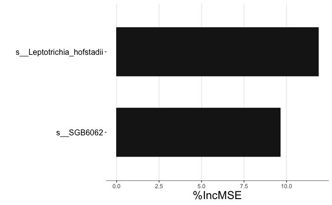


``` r
logistic_regression$plot_feature_imp4
```

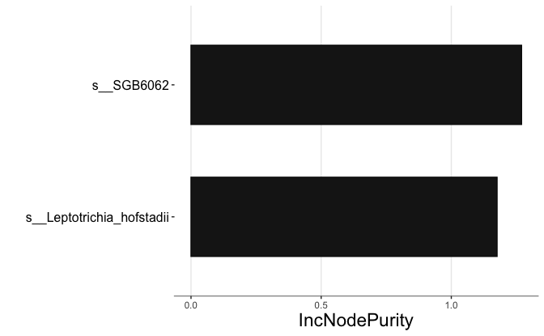


``` r
logistic_regression$res_train
```

```
## Random Forest 
## 
## 30 samples
##  2 predictor
## 
## No pre-processing
## Resampling: Cross-Validated (10 fold, repeated 1 times) 
## Summary of sample sizes: 28, 26, 27, 27, 27, 27, ... 
## Resampling results:
## 
##   RMSE       Rsquared   MAE      
##   0.3399389  0.3074723  0.3021925
## 
## Tuning parameter 'mtry' was held constant at a value of 2
```

# Random forest:

## TP1 Plaque


``` r
ps_up %>% 
  phyloseq::subset_samples(Time == "TP1" & 
                             Sample == "Plaque" & 
                             Inflamation_response %in% c("High", "Low")) %>% 
  speedyseq::filter_tax_table(Kingdom != "UNCLASSIFIED_UNCLASSIFIED") %>% 
  microbiome::transform(transform = "compositional") %>% 
  phyloseq_classifier(y_response = "Inflamation_response", 
                      x_predictors = "All",
                      boruta_pValue = 0.001,
                      seed = 456) -> tp1_plaque
```

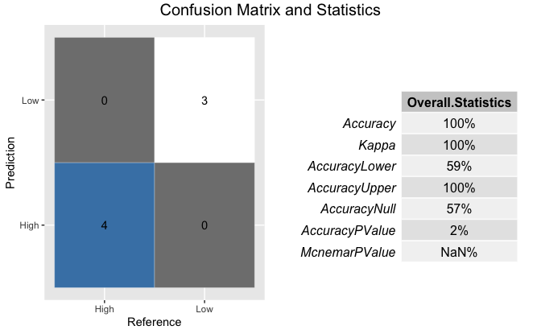


``` r
tp1_plaque$res_train
```

```
## Random Forest 
## 
## 16 samples
##  6 predictor
##  2 classes: 'High', 'Low' 
## 
## No pre-processing
## Resampling: Cross-Validated (10 fold, repeated 1 times) 
## Summary of sample sizes: 14, 14, 15, 15, 14, 14, ... 
## Resampling results:
## 
##   Accuracy  Kappa    
##   0.7       0.2857143
## 
## Tuning parameter 'mtry' was held constant at a value of 2
```


``` r
tp1_plaque$res_train$trainingData
```

```
##         .outcome
## S_11566     High
## S_11578     High
## S_11583     High
## S_11597     High
## S_11613     High
## S_11616     High
## S_11619     High
## S_11627     High
## S_11638     High
## S_11639     High
## S_11564      Low
## S_11568      Low
## S_11600      Low
## S_11601      Low
## S_11604      Low
## S_11614      Low
##         k__Bacteria|p__Candidatus_Saccharibacteria|c__Candidatus_Nanosyncoccalia
## S_11566                                                             0.000000e+00
## S_11578                                                             1.320229e-03
## S_11583                                                             4.784344e-04
## S_11597                                                             5.916150e-03
## S_11613                                                             4.832463e-05
## S_11616                                                             0.000000e+00
## S_11619                                                             0.000000e+00
## S_11627                                                             2.924324e-06
## S_11638                                                             6.315021e-05
## S_11639                                                             0.000000e+00
## S_11564                                                             0.000000e+00
## S_11568                                                             0.000000e+00
## S_11600                                                             0.000000e+00
## S_11601                                                             0.000000e+00
## S_11604                                                             0.000000e+00
## S_11614                                                             0.000000e+00
##         k__Bacteria|p__Candidatus_Saccharibacteria|c__Candidatus_Nanosyncoccalia|o__Candidatus_Nanogingivales
## S_11566                                                                                          0.000000e+00
## S_11578                                                                                          1.320229e-03
## S_11583                                                                                          4.784344e-04
## S_11597                                                                                          5.916150e-03
## S_11613                                                                                          4.832463e-05
## S_11616                                                                                          0.000000e+00
## S_11619                                                                                          0.000000e+00
## S_11627                                                                                          2.924324e-06
## S_11638                                                                                          6.315021e-05
## S_11639                                                                                          0.000000e+00
## S_11564                                                                                          0.000000e+00
## S_11568                                                                                          0.000000e+00
## S_11600                                                                                          0.000000e+00
## S_11601                                                                                          0.000000e+00
## S_11604                                                                                          0.000000e+00
## S_11614                                                                                          0.000000e+00
##         k__Bacteria|p__Candidatus_Saccharibacteria|c__Candidatus_Nanosyncoccalia|o__Candidatus_Nanogingivales|f__Candidatus_Nanogingivalaceae|g__GGB12785|s__GGB12785_SGB19827
## S_11566                                                                                                                                                           0.000000e+00
## S_11578                                                                                                                                                           1.320229e-03
## S_11583                                                                                                                                                           4.784344e-04
## S_11597                                                                                                                                                           5.916150e-03
## S_11613                                                                                                                                                           4.619266e-06
## S_11616                                                                                                                                                           0.000000e+00
## S_11619                                                                                                                                                           0.000000e+00
## S_11627                                                                                                                                                           2.924324e-06
## S_11638                                                                                                                                                           6.315021e-05
## S_11639                                                                                                                                                           0.000000e+00
## S_11564                                                                                                                                                           0.000000e+00
## S_11568                                                                                                                                                           0.000000e+00
## S_11600                                                                                                                                                           0.000000e+00
## S_11601                                                                                                                                                           0.000000e+00
## S_11604                                                                                                                                                           0.000000e+00
## S_11614                                                                                                                                                           0.000000e+00
##         k__Bacteria|p__Candidatus_Saccharibacteria|c__Candidatus_Nanosyncoccalia|o__Candidatus_Nanogingivales|f__Candidatus_Nanogingivalaceae|g__GGB12785|s__GGB12785_SGB19827|s__SGB19827_group
## S_11566                                                                                                                                                                             0.000000e+00
## S_11578                                                                                                                                                                             1.320229e-03
## S_11583                                                                                                                                                                             4.784344e-04
## S_11597                                                                                                                                                                             5.916150e-03
## S_11613                                                                                                                                                                             4.619266e-06
## S_11616                                                                                                                                                                             0.000000e+00
## S_11619                                                                                                                                                                             0.000000e+00
## S_11627                                                                                                                                                                             2.924324e-06
## S_11638                                                                                                                                                                             6.315021e-05
## S_11639                                                                                                                                                                             0.000000e+00
## S_11564                                                                                                                                                                             0.000000e+00
## S_11568                                                                                                                                                                             0.000000e+00
## S_11600                                                                                                                                                                             0.000000e+00
## S_11601                                                                                                                                                                             0.000000e+00
## S_11604                                                                                                                                                                             0.000000e+00
## S_11614                                                                                                                                                                             0.000000e+00
##         k__Bacteria|p__Firmicutes|c__Bacilli|o__Lactobacillales|f__Streptococcaceae|g__Streptococcus|s__Streptococcus_sanguinis
## S_11566                                                                                                            4.785786e-03
## S_11578                                                                                                            5.714125e-04
## S_11583                                                                                                            8.084375e-05
## S_11597                                                                                                            3.021473e-03
## S_11613                                                                                                            1.723608e-03
## S_11616                                                                                                            1.161404e-03
## S_11619                                                                                                            2.997637e-03
## S_11627                                                                                                            3.683562e-03
## S_11638                                                                                                            2.190410e-04
## S_11639                                                                                                            2.491147e-03
## S_11564                                                                                                            0.000000e+00
## S_11568                                                                                                            4.920457e-03
## S_11600                                                                                                            8.867090e-03
## S_11601                                                                                                            1.230133e-04
## S_11604                                                                                                            1.555253e-02
## S_11614                                                                                                            2.063403e-03
##         k__Bacteria|p__Firmicutes|c__Bacilli|o__Lactobacillales|f__Streptococcaceae|g__Streptococcus|s__Streptococcus_sanguinis|s__SGB8047_group
## S_11566                                                                                                                             4.785786e-03
## S_11578                                                                                                                             4.735002e-04
## S_11583                                                                                                                             8.084375e-05
## S_11597                                                                                                                             3.021473e-03
## S_11613                                                                                                                             1.723608e-03
## S_11616                                                                                                                             1.161404e-03
## S_11619                                                                                                                             2.997637e-03
## S_11627                                                                                                                             3.683562e-03
## S_11638                                                                                                                             2.190410e-04
## S_11639                                                                                                                             2.491147e-03
## S_11564                                                                                                                             0.000000e+00
## S_11568                                                                                                                             4.920457e-03
## S_11600                                                                                                                             8.867090e-03
## S_11601                                                                                                                             1.230133e-04
## S_11604                                                                                                                             1.555253e-02
## S_11614                                                                                                                             2.063403e-03
```


``` r
tp1_plaque$plotROCpred
```

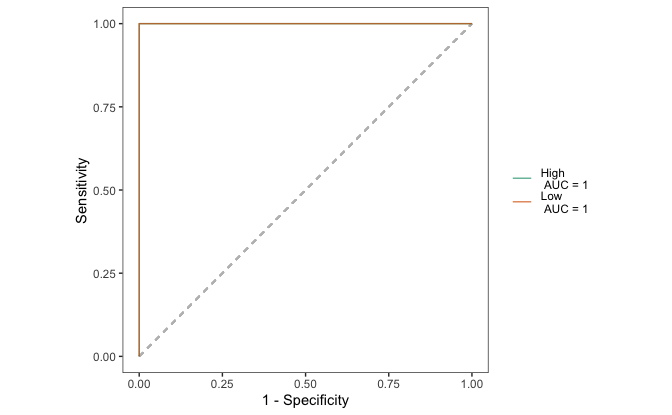


``` r
tp1_plaque$plotPRpred
```

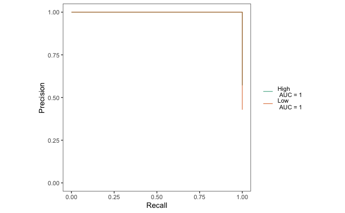


``` r
tp1_plaque$plot_feature_imp2
```

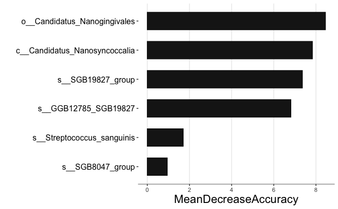


``` r
tp1_plaque$plot_feature_imp4
```

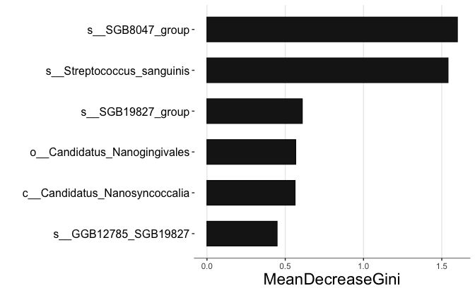


``` r
tp1_plaque$res_feature_imp %>% 
  rownames_to_column("feature")
```

```
##                                                                                                                                                                                    feature
## 1                                                                                    k__Bacteria|p__Candidatus_Saccharibacteria|c__Candidatus_Nanosyncoccalia|o__Candidatus_Nanogingivales
## 2                                                                                                                 k__Bacteria|p__Candidatus_Saccharibacteria|c__Candidatus_Nanosyncoccalia
## 3 k__Bacteria|p__Candidatus_Saccharibacteria|c__Candidatus_Nanosyncoccalia|o__Candidatus_Nanogingivales|f__Candidatus_Nanogingivalaceae|g__GGB12785|s__GGB12785_SGB19827|s__SGB19827_group
## 4                   k__Bacteria|p__Candidatus_Saccharibacteria|c__Candidatus_Nanosyncoccalia|o__Candidatus_Nanogingivales|f__Candidatus_Nanogingivalaceae|g__GGB12785|s__GGB12785_SGB19827
## 5                                                                  k__Bacteria|p__Firmicutes|c__Bacilli|o__Lactobacillales|f__Streptococcaceae|g__Streptococcus|s__Streptococcus_sanguinis
## 6                                                 k__Bacteria|p__Firmicutes|c__Bacilli|o__Lactobacillales|f__Streptococcaceae|g__Streptococcus|s__Streptococcus_sanguinis|s__SGB8047_group
##        High  High.pval       Low   Low.pval MeanDecreaseAccuracy
## 1 7.9046683 0.03296703 7.1793601 0.02397602            8.4488317
## 2 7.3185486 0.04795205 6.5209481 0.03796204            7.8311378
## 3 6.5003690 0.08091908 6.9771797 0.03896104            7.3545970
## 4 5.7525199 0.10189810 6.6753434 0.03896104            6.8098436
## 5 1.9506514 0.42057942 1.1282996 0.29470529            1.7037995
## 6 0.6225205 0.51148851 0.9166488 0.30269730            0.9473098
##   MeanDecreaseAccuracy.pval MeanDecreaseGini MeanDecreaseGini.pval
## 1                0.02197802        0.5664947             0.3636364
## 2                0.03296703        0.5622514             0.3806194
## 3                0.03896104        0.6082774             0.2547453
## 4                0.05094905        0.4476205             0.7972028
## 5                0.34365634        1.5394102             0.8671329
## 6                0.38061938        1.5992075             0.8021978
```

## TP1 Saliva


``` r
ps_up %>% 
  phyloseq::subset_samples(Time == "TP1" & 
                             Sample == "Saliva" & 
                             Inflamation_response %in% c("High", "Low")) %>%
  microViz::ps_mutate(Inflamation_response = as.factor(Inflamation_response)) %>% 
  speedyseq::filter_tax_table(Kingdom != "UNCLASSIFIED_UNCLASSIFIED") %>% 
  microbiome::transform(transform = "compositional") %>% 
  phyloseq_classifier(y_response = "Inflamation_response", x_predictors = "All",                       boruta_pValue = 0.01,
                      seed = 456) -> tp1_saliva
```

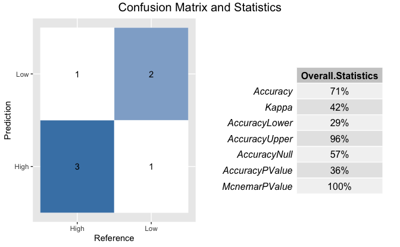

``` r
tp1_saliva$plotROCpred
```

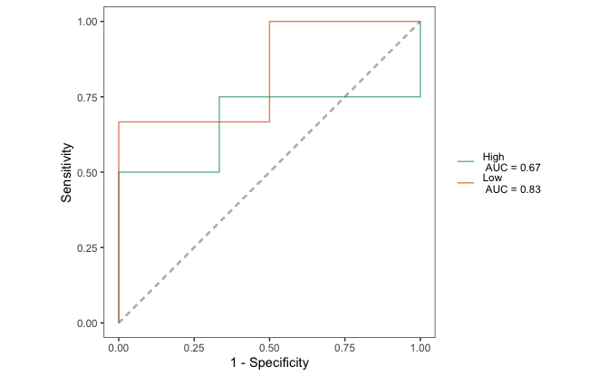


``` r
tp1_saliva$plotPRpred
```

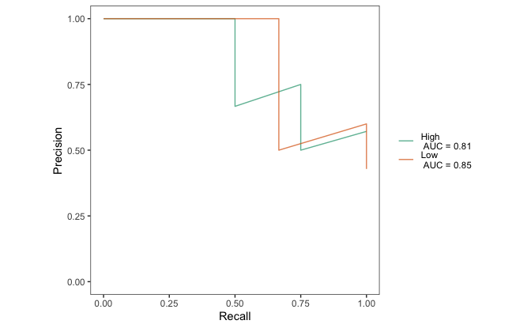


``` r
tp1_saliva$plot_feature_imp2
```

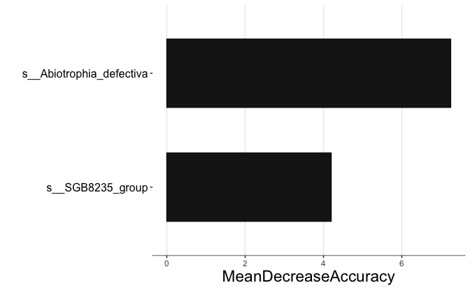


``` r
tp1_saliva$plot_feature_imp4
```

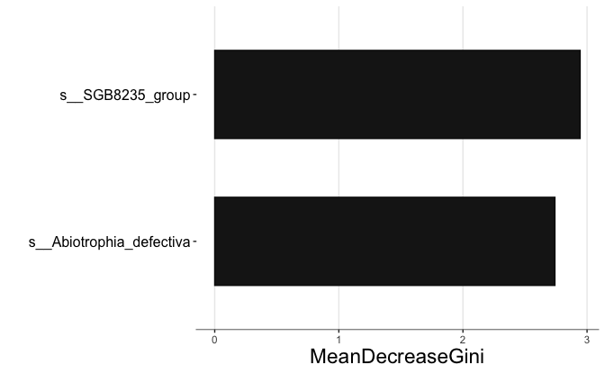


``` r
tp1_saliva$res_feature_imp %>% 
  rownames_to_column("feature")
```

```
##                                                                                                                             feature
## 1                  k__Bacteria|p__Firmicutes|c__Bacilli|o__Lactobacillales|f__Aerococcaceae|g__Abiotrophia|s__Abiotrophia_defectiva
## 2 k__Bacteria|p__Firmicutes|c__Bacilli|o__Lactobacillales|f__Aerococcaceae|g__Abiotrophia|s__Abiotrophia_defectiva|s__SGB8235_group
##       High High.pval      Low   Low.pval MeanDecreaseAccuracy
## 1 6.040399 0.2387612 7.603744 0.04895105             7.246833
## 2 3.511861 0.4125874 5.193390 0.10689311             4.196409
##   MeanDecreaseAccuracy.pval MeanDecreaseGini MeanDecreaseGini.pval
## 1                 0.1178821         2.741162             0.3576424
## 2                 0.2437562         2.944343             0.1288711
```


``` r
sessionInfo()
```

```
## R version 4.4.0 (2024-04-24)
## Platform: aarch64-apple-darwin20
## Running under: macOS 15.2
## 
## Matrix products: default
## BLAS:   /Library/Frameworks/R.framework/Versions/4.4-arm64/Resources/lib/libRblas.0.dylib 
## LAPACK: /Library/Frameworks/R.framework/Versions/4.4-arm64/Resources/lib/libRlapack.dylib;  LAPACK version 3.12.0
## 
## locale:
## [1] en_US.UTF-8/en_US.UTF-8/en_US.UTF-8/C/en_US.UTF-8/en_US.UTF-8
## 
## time zone: Europe/Zurich
## tzcode source: internal
## 
## attached base packages:
## [1] stats     graphics  grDevices utils     datasets  methods   base     
## 
## other attached packages:
##  [1] file2meco_0.9.1      microeco_1.12.0      microViz_0.12.4     
##  [4] speedyseq_0.5.3.9021 phyloseq_1.50.0      readxl_1.4.3        
##  [7] lubridate_1.9.4      forcats_1.0.0        stringr_1.5.1       
## [10] dplyr_1.1.4          purrr_1.0.2          readr_2.1.5         
## [13] tidyr_1.3.1          tibble_3.2.1         ggplot2_3.5.1       
## [16] tidyverse_2.0.0     
## 
## loaded via a namespace (and not attached):
##   [1] pROC_1.18.5             gridExtra_2.3           permute_0.9-7          
##   [4] rlang_1.1.4             magrittr_2.0.3          ade4_1.7-22            
##   [7] furrr_0.3.1             e1071_1.7-16            compiler_4.4.0         
##  [10] mgcv_1.9-1              vctrs_0.6.5             reshape2_1.4.4         
##  [13] pkgconfig_2.0.3         crayon_1.5.3            fastmap_1.2.0          
##  [16] XVector_0.46.0          labeling_0.4.3          rmarkdown_2.29         
##  [19] prodlim_2024.06.25      tzdb_0.4.0              UCSC.utils_1.2.0       
##  [22] xfun_0.50               randomForest_4.7-1.2    zlibbioc_1.52.0        
##  [25] cachem_1.1.0            GenomeInfoDb_1.42.1     jsonlite_1.8.9         
##  [28] biomformat_1.34.0       recipes_1.1.0           rhdf5filters_1.18.0    
##  [31] Rhdf5lib_1.28.0         parallel_4.4.0          cluster_2.1.8          
##  [34] R6_2.5.1                bslib_0.8.0             stringi_1.8.4          
##  [37] rsample_1.2.1           RColorBrewer_1.1-3      boot_1.3-31            
##  [40] swfscMisc_1.6.5         rpart_4.1.24            parallelly_1.41.0      
##  [43] jquerylib_0.1.4         cellranger_1.1.0        Rcpp_1.0.14            
##  [46] iterators_1.0.14        knitr_1.49              future.apply_1.11.3    
##  [49] zoo_1.8-12              multiROC_1.1.1          IRanges_2.40.1         
##  [52] nnet_7.3-20             Matrix_1.7-1            splines_4.4.0          
##  [55] igraph_2.1.2            timechange_0.3.0        tidyselect_1.2.1       
##  [58] rstudioapi_0.17.1       yaml_2.3.10             vegan_2.6-8            
##  [61] timeDate_4041.110       doParallel_1.0.17       codetools_0.2-20       
##  [64] listenv_0.9.1           lattice_0.22-6          plyr_1.8.9             
##  [67] Biobase_2.66.0          withr_3.0.2             evaluate_1.0.3         
##  [70] Rtsne_0.17              future_1.34.0           survival_3.8-3         
##  [73] proxy_0.4-27            Biostrings_2.74.1       pillar_1.10.1          
##  [76] foreach_1.5.2           stats4_4.4.0            generics_0.1.3         
##  [79] rprojroot_2.0.4         S4Vectors_0.44.0        hms_1.1.3              
##  [82] microbiome_1.28.0       munsell_0.5.1           scales_1.3.0           
##  [85] globals_0.16.3          class_7.3-23            glue_1.8.0             
##  [88] tools_4.4.0             data.table_1.16.4       ModelMetrics_1.2.2.2   
##  [91] gower_1.0.2             rhdf5_2.50.2            grid_4.4.0             
##  [94] ape_5.8-1               ipred_0.9-15            colorspace_2.1-1       
##  [97] nlme_3.1-166            GenomeInfoDbData_1.2.13 cli_3.6.3              
## [100] lava_1.8.1              gtable_0.3.6            sass_0.4.9             
## [103] digest_0.6.37           BiocGenerics_0.52.0     caret_7.0-1            
## [106] farver_2.1.2            rfPermute_2.5.2         htmltools_0.5.8.1      
## [109] multtest_2.62.0         lifecycle_1.0.4         hardhat_1.4.0          
## [112] httr_1.4.7              here_1.0.1              MASS_7.3-64
```
